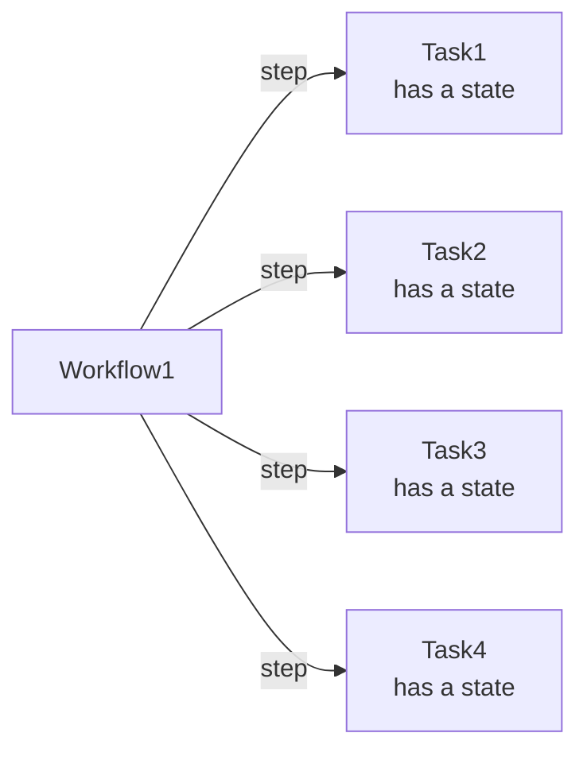

# Amazon Web Services

## AWS Infra, and Access

**AWS Global Infrastructure** - AWS provides various services on the cloud which can be used to build these systems. It is PaaS. AWS Global Infrastructure has multiple **servers**, which are in multiple **data centers**, which are in multiple **availability zones**, and they are in multiple **regions**. This is how AWS makes data available and disaster-proof. Regions are geo bound. Pick a region based on

- Compliance - the app might be restricted to region or global
- Latency - server should be close to the end-user or business
- Pricing - due to tax price varying in different regions.
- Availability - not all services are in all regions.


**Interacting with AWS**

- as it is Virtual, on the cloud, hence you need API to manage services. API is available as:

- **AWS Console**
  - a GUI, web-based to login and manage the services. Click based. Region-based. Interactive forms to use services. Login with `username`, `password` and `MFA`

- **AWS CLI**
  - a Command Line Interface that is scriptable.

- **AWS SDKs**
  - Software Development Kits, eg Python, Java, etc. Useful if you want to stay in dev language env. Eg, if your app is using Python and Flask, then you can use Python to interact with AWS services and host the app.


**Security and the AWS Shared Responsibility Model**

- _AWS secures the cloud, and you secure things in the cloud_. You secure your data, firewalls, access by users, encryption, etc. Each AWS service has its own security model.

- As a best practice
  - do not use the root user (AWS email ID) for the day-to-day task. Protect the AWS Root User as it has unrestricted access to everything in the account. Also add **Multi-Factor Authentication** MFA, which enables added security like RSA.

  - Use **IMA Account** to do actions as it has restricted access.


## AWS Compute

**Compute as a Service**

- Web server, batch job, ML; all need compute. Compute maintenance needs time.

- AWS offers compute as:
  - Virtual Machines Instances - `EC2`.
  - Containers - `ECS` Elastic Container Service, `EKS` Elastic Kubernetes Service
  - Serverless - `AWS Fargate` is serverless compute engine for containers
  - Function as a Service - `AWS Lambda`


**What AWS Compute service to choose?**

- Prototype on premise app - EC2
- Once a quarter or month file data wrangling - Lambda
- Microservices that need regular updates - ECS or EKS


## AWS Networking

Networking within the cloud infra.

### Amazon VPC - Virtual Private Cloud

- `Amazon VPC - Virtual Private Cloud` is a _network configuration_, the same as a **modem and router** in the physical world.

- Example, in Amazon EC2, instead of the default config, we can use a custom VPC configuration
  - to add `more security`, like only allowing HTTP on a certain port. Hence, no SSH on 22.
  - to give different `access control` to different resources, like public/intranet/private.
  - to achieve `high availability` and fault tolerance by associating different AZs. Compute is replicated. We will have more than one EC2 hence more than one VM.

**Amazon VPC Configuration**

- CIDR notation is used to provide the variable IP address or range of IP addresses. Eg, `192.168.1.0/24`. /16 is more, /24 is less.
- `VPC` gives you a range of IPs. `10.1.0.0/16`. You need to create VPC in the AWS management console - GUI.
- Then you can use these IPs to create `subnets`, which use some IPs of VPC-IPs to make a private or public network. Subnets are associated with AZs - Availability Zones. Say in Zone-A
  - **Public resources**, or internet-facing resources, are added to the `public subnet` with a sub-range of the VPC IP range, eg, `10.1.1.0/24`. like web-app
  - **Private resources** are kept in a `private subnet` with a sub-range of the VPC IP range, eg `10.1.3.0/24`. like database.

- To expose the public subnet to the internet, we need `Internet Gateway`, this is just like a **modem**. Create an internet gateway and attach it to your VPC.

- To only expose the subnet to the **corporate intranet** or VPN, create `VGW - Virtual Private Gateway`. This will expose AWS to an on-premise data center.

- To make it always available, duplicate the subnets and add to another AZ.
  - 

**Amazon VPC Routing**

- When a user reached Internet Gateway, it needs to be routed to the correct subnet. For this, we need a **routing table**.
- AWS creates default `main route table`. This provides local traffic only.
- GUI - each VPC has routes.
- We have called subnet public/private, however, that is implemented by routes, which controls the exposure of the subnets.
- Edit route table, add a new route, and add destination `0.0.0.0/0` that takes and servers all IPs. Then add an internet gateway to it. Finally, associate it with public subnets.
- Later add a firewall for extra security.
- 

**Amazon VPC Security**

- Subnets can be made more secure, like only allowing HTTPs to inbound and outbound traffic on port 443.
- To do this create rules in `Network ACLs - access control lists`. Like firewalls.
- Secondly, `security groups` can provide more security to EC2 instances.
- 


_**below to be cleaned**_

## AWS STORAGE

Storage Types

- we need to store
  - OS - application files, ubuntu
  - Static Data - files - employee photo - write once, read many WORM
  - Structured Data - database tables

- Block Storage - data is split into chunks - one char change in 1 GB file is simple - System File, Log File.
- Object Storage - single unit - one char change in 1GB file, whole file is rewritten - WORM, Video

Amazon EC2 Instance Storage and Amazon Elastic Block Store EBS

- EC2 has `instance` storage like internal HDD. This is block-level storage. attached physically, hence fast but tied to the lifecycle of EC2.
- EBS is like an external HDD
- EBS can be linked to one EC2 or multiple EC2s can read-write.
- EBS can be HHD or SSD
- EBS can be snap shotted to keep backup.

Object Storage with Amazon Simple Storage Service S3

- EBS is not fit for all as
  - they are mostly 1-1 with EC2
  - have a size limit.
- S3 is scalable, standalone, not tied to EC2, not mounted
- access by URL
- max 5TB file
- is object storage
- has a flat structure
- unique bucket name
- it is region constrained
- is durable and available as it is auto-distributed in a region
- objects are: buckets/folders/files
- Demo
  - Search s3 - create bucket - region specific - bucket has a URL
  - upload objects - files
  - files have URL

- bucket/folder/files are private and not public to the world.
- can be made public using actions, but only in a public bucket
- for access control use
  - IAM, and
  - `S3 bucket policies`, has the same JSON format and are attached to buckets
- actions allowed or denied. can be read-only, another acct write.
- Uses: static websites, data lakes, media, backup, and storage.
- [AWS S3 permissions](https://explore.skillbuilder.aws/files/a/w/aws_prod1_docebosaas_com/1661436000/8wO7QUlpnj0--chB_E8Evg/tincan/d03722b85f9d2b3a05e4c74bd586ea9b1f52f81a/assets/tdqWRVkjrqaKcAF3_0M9ExB6uo3T8oZq0.png)

Choose the Right Storage Service

- EC2 Instance store is generally well-suited for the temporary storage of information that is constantly changing, such as buffers, caches, and scratch data
- Amazon EBS, block storage, is meant for data that changes frequently and needs to persist through instance stops, terminations, or hardware failures.
- If your data doesn’t change that often, Amazon S3 might be a cost-effective and scalable storage solution for you. Amazon S3 is ideal for storing static web content and media, backups and archiving, and data for analytics. It can also host entire static websites with custom domain names.


## AWS DATABASES

Databases on AWS

- RDS for data.
- The app can connect to DB on your on-premise server. you manage everything. Or
- DB on ec2, then have to install DB s/w, manage updates, and backups and replicate it on instances for high availability. Or
- Managed AWS database service, you only code. AWS manages everything else.

Amazon Relational Database Service RDS

- RDS > create database > easy create
  - select engine > MySQL/MS-SQL-server/Postgres
  - BD instance size > free
  - identifier name
  - username
  - password
  - create a database.
- RDS is in one private subnet. to make it high-availability, create a secondary RDS in another AZ subnet, using `RDS Multi-AZ deployment`. RDS will manage replication.
- one is primary another secondary. failovers handled by RDS.

Purpose-Built Databases

- Relational databases are good to manage complex schemas, which have joins and complex queries and stored procedures. However, this adds overhead to the engine.
- There are other DBs that work best to query single records.
- Also RDS is charged per hour, whether you query or not. weekend
- dynamo, key-value, docs, non-relating, ms latency, usage charge, and amount.
- amazon docDB - content
- social n/w - graph database - az neptune, recommendation, fraud detection ??? todo
- finance, ledger, amazon qldb, immutable, audit, compliance
- these are purpose-built.

Amazon DynamoDB

- fully managed NoSQL database, serverless
- no relations
- scalable, performant, under ms time
- tables, items, and attributes are the core component.  A table is a collection of items, and each item is a collection of attributes.
- access via dynamo database API
- search dynamo
- create table
- unique identifier
- table name, primary kry
- items to view items

Choose the Correct Database Service

Database Type  |Use Cases  |AWS Service
-|-|-
Relational      |Traditional applications, ERP, CRM, e-commerce|Amazon RDS, Amazon Aurora, Amazon Redshift
Key-value       |High-traffic web apps, e-commerce systems, gaming applications|Amazon DynamoDB
In-memory       |Caching, session management, gaming leader boards, geospatial applications|Amazon ElastiCache for Memcached, Amazon ElastiCache for Redis
Document        |Content management, catalogs, user profiles|Amazon DocumentDB (with MongoDB compatibility)
Wide column     |High-scale industrial apps for equipment maintenance, fleet management, and route optimization|Amazon Keyspaces (for Apache Cassandra)
Graph           |Fraud detection, social networking, recommendation engines|Amazon Neptune
Time series     |IoT applications, DevOps, industrial telemetry|`Amazon Timestream`
Ledger          |Systems of record, supply chain, registrations, banking transactions|Amazon QLDB


## AWS MONITORING, OPTIMIZATION, SCALING

Application Management

- how is the app performing, how is it utilizing resources
- scalability - demand not constant, add and reduce sources
- balance traffic

Monitoring

- important to see how services are being used
- Monday morning latency, not good to take tickets
- proactive before end-user notify
- and where is the problem? recent code change, database or ec2?
- metrics, logs, traffic, database connections, CPU usage; need to be monitored
- monitoring tool helps in this by analysing, metrics over time, called statistics. Based on stats there can be triggers.
- all info needs to be on the central console, hence CloudWatch
- all in one place

Amazon CloudWatch

- users can create a `dashboard` from various granular metrics available
- can create `alarms` to be raised on crossing a base value over a time
  - this can trigger `SNS`, Simple Notification Service, which creates a topic. Anyone subscribed to the `topic` will get notified.
  - can trigger an EC2 boot action,
  - can scale up resources
- Users can also send custom app metrics, like 'page load time' which is not AWS metric but app-specific, but can be seen on CloudWatch and can trigger alarms.

Solution Optimization

- we need to optimize infra
  - capacity - storage - s3 - mostly auto-scaled
  - performance - ec2 and  database, database mostly auto-scales, but ec2 has capacity
  - availability - manage traffic and make all services available.
- prevent or respond to avoid bottlenecks.
- to increase availability increase redundancy or replication of services
- `AutoScaling` lets you automatically add and remove instances.
- in horizontal scaling, the problem is that each EC2 has its public IP address and the traffic needs to be sent to one available. To solve this issue, we use a `load balancer`. It removes the need for public IP addresses for each EC2.


Traffic Routing with Amazon Elastic Load Balancing

- now we have multiple ec2 in public subnets.
- request from browser - goes to load balancer - sends to ec2.
- ELB, `Elastic Load Balancer` does the traffic management. Highly available in each zone.
- ALB - `application load balancer`, handles Http or Https.
- ALB needs, `listener`, port, and protocol
  - `target` group - which backend resource to send to, ec2 s3 dynamo
    - it sends the traffic based on the health of the backend
  - `rules` - how to divert traffic. it is default as well as we can define rules for pages, apps, etc.
- Another is `Network Load Balancer` supports TCP, UDP, and TLS protocols.
- 


Amazon EC2 Auto Scaling

- we have 2 instances, but demand may inc.
- instead of adding instances manually, use EC2 autoscaling, more capacity based on a threshold in CloudWatch.
- ec2 CPU goes up, CloudWatch triggers the alarm, and auto scale is asked to give more ec2 instances. each is added to ALB with health checks and thus high horizontal scalability. hence CPU down across the fleet.
- Three main components of EC2 Auto Scaling are as follows:
  - Launch template or configuration: What resource should be automatically scaled?
  - EC2 Auto Scaling Group: Where should the resources be deployed?
  - 'Scaling policies: When should the resources be added or removed?

- 


## Serverless Technology

Serverless builds and runs application without maintaining the underlying infra. Server is but is managed by AWS. It is scalable, cost efficient, simplify development, quick iteration.

Drawbacks - not for long running, always connected.

- there is server, but you pay for operations. not paying for vm. no maintenance of VM. No 24hrs or 7 dy a week payment.
- cost saving, pay for demand only, not readiness for demand.
- separation - executions are secure as all lambda functions are permission controlled in their own sandbox.
- Scalability: - functions will scale on demand, each in their sandbox.
- You will not manage the updates and patches to the server os. Instead, the server is completely **abstracted from you**. You need not care about scalability, updates, or other server management.

- **Risks of Serverless**
  - heavy workload on serverless may be more expensive than vm.
  - debugging is possible but may be difficult. chained lambda function are even more difficult. logging may be effective.
  - testing can be difficult.
  - Sprawl - as you write more factions, it grows and may get unmanageable. Now it is different way of doing things. So think of proper use case.

- **Use Cases**
  - Autoscaling web apps. If request increases, serverless does. If your app becomes popular enough that it is used through out the day move to vm.
  - event streaming - async actions are good to handle in lambda.
  - file manipulation - async actions can be done when file is uploaded or something.
  - connectors - your primary server may throw something to serverless.


## Services -----


## Elastic Beanstalk

Deploy and scale web applications. It is PaaS same as Heroku, Google App Engine.

Upload and deploy web applications in a simplified, fast way.

Use docker image on docker.io to create web app. You need to use following json to tell AWS EB what your app is:

```json
{
  "AWSEBDockerrunVersion": "1",
  "Image": {
    "Name": "dockerusername/catnip",
    "Update": "true"
  },
  "Ports": [
    {
      "ContainerPort": 5000,
      "HostPort": 8000
    }
  ],
  "Logging": "/var/log/nginx"
}
```


## AWS CLI


You need to install AWS CLI on client machine.

**Installation**

To install, follow [AWS CLI Installation](https://docs.aws.amazon.com/cli/latest/userguide/getting-started-install.html).

**Authentication**

Once cli is installed, you need to add your aws credentials, these can be obtained by signing in as a non-root user and click `Command line or programmatic access` then copy `Short-term credentials` and paste into cmd. Something like:

```sh
export AWS_ACCESS_KEY_ID="..."
export AWS_SECRET_ACCESS_KEY="..."
export AWS_SESSION_TOKEN="...
```

Now you should be able to run commands using aws-cli.

```sh
# check
which aws

aws --version
```

## AWS Identity and Access Management - IAM


Each developer can have an **IAM account**, this **authenticates** (access). Then each user needs **authorization** (permission) to different services.

On **sign up** to AWS account a _root user_ is created. It is recommended to create IAM User other than root (default) with less permission. Billing is disable by default for IAM Users.

[ ] To login as IAM-User you need to get a URL. Login as root > IAM Identity Center > Users > Reset Password. Save that URL, it has account ID in it.

**AWS Resources** are different services in AWS like S3, EC2.

**IAM Identities** are _Users_, _Roles_. Users can be grouped to form _Group_ to share common permission.

Use IAM to give _identities_ access to _resources_.

Access is given by _permissions_. Permissions can be grouped.

Permission is defined by _Policy_.


**IAM Users**

- It is identity with specific permission for a single person or application
- They have "Sign-in URL for IAM users in this account", which can be found on dashboard. Eg <https://123456789876.signin.aws.amazon.com/console>
- **Permission** can be given to them using _Roles_
- the example, `EmergencyAccess` IAM user you create is specifically for use only when your user in IAM Identity Center credentials are unavailable. [more](https://docs.aws.amazon.com/IAM/latest/UserGuide/getting-started-iam-user.html)


**IAM Roles**

- It is _similar_ to an IAM user, but is not associated with a specific person. It is identity with specific permission.
- Roles are used by **services to talk** to each other. Eg, you can give a role to the EC2 machine to read and write to the S3 bucket and RDS and DynamoDB. Similarly all services need authentication and _signed API calls_ in each request.
- Instead of being uniquely associated with one person, a role is **intended to be assumable** by anyone who needs it.
- It doesn't have long-term credentials, instead it provides you with **temporary security credentials**.
- IAM Identity Center and other AWS services **automatically create roles** for their services.
- For assuming a role, others need role info. It can be shared by:
  - Role link: Send users a link that takes them to the Switch Role page with all the details already filled in.
  - Account ID or alias: Provide each user with the role name along with the account ID number or account alias. The user then goes to the Switch Role page and adds the details manually.
  - Saving the role link information along with the EmergencyAccess user credentials.
- [more](https://docs.aws.amazon.com/IAM/latest/UserGuide/getting-started-roles.html)


**IAM Policy**

- It can be used to **grant or deny permissions** to IAM entity (IAM user or IAM role) to take actions. Actions are API calls, everything in AWS is API calls.
- It is a **JSON document** that lists the **actions** that the **entity** can perform and the **resources** those actions can **affect**.
- Any actions or resources that are not explicitly allowed are **denied by default**.
- Policies can be created and _attached_ to IAM users, IAM groups of users, IAM roles, and resources.
- The policy is a rule. The policy must have an `effect`, `action`, and `resource`.
- You can attach a policy to a role to provide users who assume that role the permissions associated with this policy.
- The `PowerUserAccess` policy is commonly used to _provide access to developers_.
- [more](https://docs.aws.amazon.com/IAM/latest/UserGuide/getting-started-iam-policy.html)
- Policy JSON Example:

    ```json
    {
    "Version": "2012-10-17",
    "Statement": [{
    "Effect": "Allow",
    "Action": "*",
    "Resource": "*"
    }]
    }
    ```


**AWS IAM Identity Center**

- Portal to create human users (just like employees in company). It also lets users do SSO and map corporate workforce to AWS.
- user can sign in using **AWS access portal** which is URL unique to each AWS Account and can be found by Going to Identity Center > Dashboard > Settings Summary Sidebar > AWS access portal URL. Eg <https://d-12345abcd1.awsapps.com/start>
- **Permission** can be given by creating _permission set_
- [Adding users, Admin](https://aws.amazon.com/getting-started/guides/setup-environment/module-two/)
- You can add users, these are human users with real email and passwords
- You can create user groups.
- You can create permission sets, attach policy to them
- Then add user/group to this permission set.

**Best Practice**

- Access AWS using temporary credentials of human users, instead of using IAM users with long-term credentials. [ ] difference in IAM user and Human User?
- provide access to your resources through identity federation ([ ]roles?) instead of creating IAM users.
- provide access to your resources with AWS IAM Identity Center, not IAM User.
- Using _least-privilege permissions_. The concept of least-privilege permissions is to grant users the permissions required to perform a task and no additional permissions.

## Billing and Cost Management - Budgets

You can create budgets to email you if you cross the limits in budget. It can be crated from template.

**Zero spend budget**: A budget that notifies you after your spending exceeds AWS Free Tier limits.

## Lightsail

Easy VPS Virtual Private Server **hosting**. Quickly launch and manage OS with configured Dev Stack (like Ubuntu with LAMP). Add load balance, firewall, and DNS. Once requirements increase, easily move to EC2 or Lambda. Lightsail provides low-cost, pre-configured cloud resources for simple workloads just starting on AWS. Amazon EC2 is a compute web service that provides secure, resizable compute in the cloud. It has far greater scale and optimization capabilities than Lightsail.

## Batch

Lets you do batch jobs, by giving the right CPU GPU, and memory.

## CodeStar

It is a development tool to develop, build and deploy the app on AWS.

## Amplify

It provides continuous deployment and hosting of static web resources including HTML, CSS, JavaScript, and image files which are loaded in the user's browser.

## AWS Dynamo DB

**DynamoDB** — **storage** The NoSQL amazon database, where you can insert the information of your application on tables (Collections).

It is non relational, managed, fast, document based, flexibility. scalability to 10 trillion requests per day. pay as you go.

## AWS Glue

AWS Glue is a fully managed ETL service that makes it easy for customers to prepare and load their data for analytics.


## Amazon EC2 - Elastic Compute Cloud

- `Amazon EC2` are virtual server instances in the cloud. Amazon EC2 gives you complete **control** over the instance, down to the **root level**. You can manage the instance as you would manage a **physical server**.
- You can use instances for **long-running applications**, especially those **with state** information and long-running computation cycles.

- EC2 provides various types of instances which are for different purposes, like web servers, and graphics servers.
- Amazon Machine Image - AMIs can be installed on EC2 machines.
- EC2 machines can be scaled up in no time.

**Amazon EC2 Instance Lifecycle**

- EC2 is _charged when running or rebooting_. Once terminated, they are deleted forever.
- To update the VM, duplicate the VMv1.0, make updates to clone, the switch the app to VMv2.0, terminate v1.0


## AWS Lambda

- `AWS Lambda` is a Serverless compute for **running stateless code** in response to **triggers**.
- Using AWS Lambda, you can run code **without managing servers**.
- You **pay only for the compute time** you consume. There is **no charge** when your code is not running.
- With Lambda, you can run code for virtually any type of application or backend.Lambda takes care of **everything required to run** and **scale your code** with **high availability**.
- You can set up your code to be **automatically invoked** from other AWS services or call it directly from any web or mobile app.
- Lambda is a suitable choice for any **short-lived application** that can finish running in **within 15 minutes**.

**When to use AWS Lambda**

- Something that can **build fast** and let you **hit the market** so you can analyze and see if it works.
- put the time into - business logic and data processing logic.
- do not waste time on infra concerns like load balancing, scaling, networking; or plumbing code like logging, authentication, caching exceptions so on.
- use serverless architecture using lambda, s3, CloudFront, step functions, Cognito, AppSync, and DynamoDB. They are all scaled, available, and charged per-request basis.
- just define logic as a lambda function, and invoke it via a response to an API call or an event.

- Package and upload code as a lambda function
- Not running all time. runs when triggered.
- Lots of triggers exist, like HTTP, upload of a file, events from other AWS services, or inbuilt activity.
- Runs on managed service, it is scalable.
- You can choose, env, os, size memory, etc.
- all lambda runs in their own env.
- Not for WordPress sites, but for smaller web services or tasks, eg, resizing photos to thumbnails. Lambda is billed only when the function runs, up to 100ms intervals. So you don't need the image-resize service to always run, but only when a photo is uploaded.
- Create a lambda function, and add a role to it, if it needs to access other AWS services.
- Add a trigger to invoke the lambda function.
- Upload code to the lambda function.
- See it invoked in CloudWatch


- What is lambda?
  - Compute technology with multiple language support.
  - Hooks to other lambda functions.
  - Changes is other AWS Services, like S3 or Dynamo can trigger lambda.
  - Lambda can be triggered with requests using API Gateway, CloudFront.
  - Data Stream, SNS, messaging service can be linked to lambda
  - IoT events can integrate to lambda.
  - Function can be monitored, tested (without deployment) and dashboards can be built to see this. Deployment with different ways.


## AWS Fargate

- It is serverless compute engine for containers. Work with both ECS and EKS.


## Amazon ECS - Elastic Container Service

- It is **Container management services**
- It **runs containers** on either customer-managed **Amazon EC2** instances OR as an AWS-managed serverless offering running containers on **AWS Fargate**.


## Amazon EKS - Elastic Kubernetes Service

- run on top of EC2, hence use EC2 as a service.

## Amazon ECR - Elastic Container Registry

- Amazon Elastic Container Registry lets you to store, share, and deploy container images.
- It is a fully managed Docker container registry like docker hub.

## AWS EventBridge

- Event driven applications can be build using this serverless service from AWS.


## AWS Step Functions

Step Functions is based on **state machines** and **tasks**. In Step Functions, state machines are called `workflows`, which are a series of event-driven **steps**. Each step in a workflow is called a `state`. For example, a Task state represents a unit of work that another AWS service performs, such as calling another AWS service or API. Instances of running workflows performing tasks are called `executions` in Step Functions.



You can create a step function and define the state machine in design or code.

State machine can have `state` as

- Action on other AWS service, or
- Flows which are logics.

**Pass** is a _flow_ and can be used to pass the JSON data.

**Map** is a _flow_ and can be used to map a function to set of input, eg Map a lambda function to list of numbers. It can map in batches. So for 10 inputs in batch of 5, it will do 2 executions. It takes in list as input and returns list batches, and each batch having list of mapped result. This output needs to be reduced. Eg

```json
#input
{
  "MyMultiplicationFactor": 7,
  "MyItems":[1,2,3,4,5,6,7,8,9,10]
}

# output
[
  {'multiplied': [7,14,21,28,35]},
  {'multiplied': [42,49,56,63,70]},
]
```

To combine the output, in **Output** of **Map** you can use, "Transform result with `ResultSelector`" and define following JSON to combine multiplied keys into an array.

```json
{
  "multiplied.$": "$..multiplied[*]"
}
```

New Result

```json
# output
{'multiplied': [7,14,21,28,35,42,49,56,63,70]}
```

## AWS CloudFormation

**AWS CloudFormation** - lets you create and manage a collection of Amazon Web Services (AWS) resources by provisioning and updating them in a predictable way.

- it is a service provided by Amazon Web Services that enables users to model and manage infrastructure resources in an automated and secure manner.
- Using CloudFormation, developers can define and provision AWS infrastructure resources using a JSON or YAML formatted Infrastructure as Code template.


## AWS CDK (Cloud Development Kit)

It is AWS service for IaC, Infra as code. Very similar to AWS CloudFormation


## SNS

Amazon Simple Notification Service (Amazon SNS) is a highly available, durable, secure, fully managed pub/sub messaging service that enables you to decouple microservices, distributed systems, and serverless applications.

## Amazon Athena

Amazon Athena is an interactive **query** service that makes it simple to analyze data directly in Amazon **S3** using standard SQL. It is **serverless**.

Athena can be used to query data from AWS resources, eg from Data Catalogue in Glue and tables in S3.

## AWS API Gateway

**Usage Plan and Message Throttling**

Usage plan defines how many call can you do in a time period, eg, 5000 req per month

Message Throttling is limiting the rate at which you can hit the api, eg, max 100 req per second

lets easily create, publish and maintain apis. it is traffic controller, it is gatekeeper for dynamo db. it is scalable. pay as you go.

## Amazon DataZone

Build catalog and make data discoverable. Read more?

## OpenSearch Managed Service

It is open source space.

Image, doc, audio is converted to vector embeddings. Done using ML models. vector embedding is series of numbers and dots.

Neural Search, the search term gets embedded using ML model in AWS Bedrock, then matched with data using KNN.

**Neural Search with OpenSearch Service**

- Embedding model can be in sagemaker/bedrock.
- Hybrid search
  - it will have lexical and vector combined
  - normalize score apply arithmetic mean, gm, hm. then do knn.
- Vector Search
  - let understand semantic meaning of query

- lexical search is exact text match for query in doc. token matching
- [Demo](https://ml-search-opensearch.site/Semantic_Search)

RAG Application Retrieval Augmented Generation

## Gen AI

use pre train llm, foundation model FM

gen ai needs data quality

Value

- enhanced personalisation

[social media demo app](https://aws.amazon.com/blogs/big-data/uncover-social-media-insights-in-real-time-using-amazon-managed-service-for-apache-flink-and-amazon-bedrock/)

Use case: use social media data and build gen ai app to understand that data. Social media data is pulled in real time using managed, kinesis, flink, kafka. Convert to vector using bedrock, query using `opensearch`. Q for app.

## Gen BI

help marketing team by giving generative BI capability to build generated doc, dashboards. Help them automatically generate dashboards.

Add synonyms to data fields so that amazon q helps answer the questions. like region/platform are same.

You can build quicksite dashboard, but customize it using amazon-q. like convert datetime to weekly, add color by dim1. All this can be said in natural language.

Build calculations using amazon-q natural lang questions.

## Boto3

Boto3 is the Amazon Web Services (AWS) **Software Development Kit** (SDK) for **Python**, which allows Python developers to write software that makes use of services like Amazon S3 and Amazon EC2.

## Amazon Redshift

Amazon redshift is managed Data Warehouse. It hyper tuned Postgres for faster reads to build OLAP data warehouse.


## DEMO - Hands on Implementation - Build Employee Directory App

We will create a basic CRUD app, an employee directory app on AWS.

Architecture:

- App is hosted on Private Network using, `VPC - Virtual Private Cloud`.
- Backend on `EC2 - Elastic Compute`, which is VM on AWS. The app code is here without the data or files. hence this can be replicated to achieve high availability.
- Data is stored in the database in the same NW, either `RDS - relational data service` or `DynamoDB - key value`.
- Images in `S3 - simple storage service`.
- Monitoring using `CloudWatch` for health monitoring.
- Scalability using `ELB - Elastic Load Balancer`. This will distribute the load on the available servers (instances). Also `EC2 AutoScaling` will help scale out or in based on demand.
- `IAM - Identity and Access Management` for security and access management.
- `AWS Management Console` - to build all this.


Demonstration: Implement security with AWS Identity and Access Management (IAM)

- Create Groups, then add Policies to them.
- Add Users to the Groups.
- For Eg, create a group to read-only ec2 state, or read-only s3.

Employee Directory Application Hosting

- Create an EC2 machine
  - Use default VPC, this is network. each ec2 has to be in a network
  - Choose a Role for this machine, eg, EC2 to have full access to S3 and Dynamo DB.
  - User Data: Add script to run when this machine boots. This is Linux 'profile/env' info, like exporting variables and setting paths. Additionally, it can have, download code, unzip, install requirements, set the flask app path, and run the app.
  - Configure Security Group - this is to allow HTTP requests to your machine, by adding security groups.
  - Finally, launch. Once launched, you will get a public IP address, which will let you access the app.

EC2

- Use `Amazon Linux 2 AMI`, select `t2.micro` free tier instance.
- Add script, that will:
  - update all
  - install node
  - create app dir
  - download and unzip the app code
  - install dependencies
  - run the app, `npm start`
- add storage, 8 GB is enough.
- security group, acts as a virtual firewall that controls access. we need web traffic for the app and ssh for management. HTTP allows inbound traffic on port 80.
- Connect to instance, select the instance and click connect, and then again connect. you can connect to the EC2 machine from the browser shell ssh.

Networking

- Doing this on the AWS Console
  - Login to Console > EC2 > `Elastic IPs`
    - Allocate Elastic IP for EC2.
  - Search VPC > Wizard > Public & Private `subnets`
    - Add VPC Name > Then add AZs to subnets. Here one zone, AZ-a is selected.
  - VPC > Subnets - you can add `more subnets` by
    - Create Subnet
    - Select VPC ID > Subnet Name > AZ-b > CIDR in range > create.
    - Similarly, create private too.
  - Now `Routing-Tables`
    - Click Route table
    - select route-table for VPC ID
    - click routes - see that internet traffic is going to NAT Gateway.
      - click `subnet-associations` tab
    - Similarly, do for the public.
  - Create a `Security Group` for more security
    - add name
    - add to vpc
    - inbound: HTTP, source: anywhere. Outbound added auto.
  - Create `EC2` > configuration
    - Network: Lab VPC
    - Subnet: public 1
    - auto-assign public IP: enable
    - Config security group, pick the one created
  - Create a second EC2 similarly and add a second public subnet.
- Now the app should work with added security, high availability, and resource restriction.


Storage Demonstration: Create an Amazon S3 Bucket

- S3 bucket is created in the region, not tied to the subnet
- Open Console > search S3 > Create `Bucket`
- Bucket Name: emp-photo-bucket-012
- Region: place in the same region as ec2
- create bucket
- Open Bucket
- Click the `Permission` tab
- Bucket Policy > edit > enter new Policy JSON, `IAM` role to allow the app access to the bucket.
- Add files as objects - click `upload`
- Bucket should be accessible via the app.


Scaling

- demo
  - make a `launch template`, what to launch when scaling
  - console - ec2 - sidebar launch template - create - give a name and desc - check autoscaling
  - AMI - create a mirror image of the web server, and select AMI AND t2 MICRO.
  - SELECT SAME KEY-PAIR, same security group, expand advance
  - IAM same role
  - pass user data.
  - This completes 'what to launch'
  - Now, 'when to launch'
    - sidebar - 'autoscaling group' - create - select template - same vpc, select public subnets
    - attach to the load balancer.
    - define group size.


- demo: ec2 - sidebar - load balancers - create - ALB - give a name
  - scheme
    - Internet-facing - to manage client req
    - internal load balancer (private IP to private IP) - for 3-tier apps
  - listeners - default + HTTPs
  - availability zones - choose vpc, check both availability zone and public subnets
  - security group - all port 80 from anywhere
  - routing - give name - next - choose instances - next - create.
  - find the DNS name in detail, and open it.
  - this is the app being served from two availability zones and the traffic is managed by the load balancer.

Demonstration: Configure High Availability for Your Application

- Database Dynamo and file server S3 are both highly available and scalable within a region. Only EC2 will limit. So we make it available by using a load balancer and scalable using autoscaling, which adds and removes instances based on load.

Employee Directory Application Redesign

- The Architecture
  - the app is hosted across ec2 instances inside VPC, in private subnets.
  - ec2 part of autoscaling, traffic is managed by the app load balancer
  - database on dynamo
  - file in s3
- to ensure this all works, analyze that the auto-scaling policy is working as expected. may need some tweaking to work over time. Also, install security patches and updates for EC2 as they come out.
- Now, we can redesign the app to make it completely serverless using Cloud Native services like AWS Lambda. and explore other architectures possible.
- As of now, the app is a 3-tier app
  - presentation Layer - UI - HTML, CSS, JS, or Mobile
  - application Layer - Business/Application Logic
  - data layer - database
- EC2 is being used for both, the presentation layer and application. To improve this we can separate, these layers.
- Presentation on S3, as static website. Not all sites are static, but JS can help with this, React sites are static and make the content dynamic by using JS to make HTTP requests.
- Application Layer to be hosted as Lambda, each of CRUD as separate Lambda function.
- Amazon API Gateway, can be used to make the front end talk to lambda functions serving different events in the backend.
  - API on API Gateway acts as a front door to trigger the backend code on lambda. We can have one lambda function for all events or separate for each.
- Dynamo for database, s3 for files.
- All the accesses are handled by RBAC via IAM.
- This way we can make the app modular. this can help make changes quickly without making whole infra to change and test. untouched DB, but can update code.
- Further, Amazon RT53 can be used to manage domains name calls
- CloudFront can be used to catch static content and make it available close to end users using the global infra of AWS
- With this serverless architecture, compared to the EC2 solution, we have made the app scalable, and available and thus can reduce cost. VPC and networking are managed.
- Another option is using container services. All service in AWS is API based, thus we can use any of them

## DEMO - Build a Serverless Web Application

with AWS Lambda, Amazon API Gateway, AWS Amplify, Amazon DynamoDB, and Amazon Cognito

Amplify Console provides continuous deployment and hosting of static web resources including HTML, CSS, JavaScript, and image files which are loaded in the user's browser. JavaScript executed in the browser sends and receives data from a public backend API built using Lambda and API Gateway. Amazon Cognito provides user management and authentication functions to secure the backend API. Finally, DynamoDB provides a persistence layer where data can be stored by the API's Lambda function.


Static Web Hosting - AWS Amplify hosts static web resources including HTML, CSS, JavaScript, and image files which are loaded in the user's browser.

User Management - Amazon Cognito provides user management and authentication functions to secure the backend API.

Serverless Backend - Amazon DynamoDB provides a persistence layer where data can be stored by the API's Lambda function.

RESTful API - JavaScript executed in the browser sends and receives data from a public backend API built using Lambda and API Gateway.

## DEMO - AWS RDS DB Standalone

You can create a  standalone RDS DB Instance that can be accessed from any other machine, it can be public machine or another service on AWS within VPC (like EC2 or Lambda).

The database you create, needs following additional configurations:

- Network it will be on - This will be only network (not security), that is, the VPC it will be part of. Also we tell subnets and Availability Zones. For this you need `VPC security groups`.
- Security in Network - Now that DB is on network, you need `Security Group` so that you can define `Rules` that will control inbound and outbound traffic, that is, you can allow certain, or specific IP to access DB.
- Roles and Permission - This is next layer, where from the allowed machines, only specific user can do certain things, like, user1 can only read data but cannot write.

Once done, you can use Endpoint (also called host), port, username and password to connect from any client/app.

Password can be managed using `AWS Secret Manager`, it has a secret associated with instance, that secret is obscured and can be reviled on console or using code.


## AWS Stack for API Development

AWS offers API Gateway and other serverless techniques to build API

**Amazon API Gateway**

It lets build the API by providing front-end to:

- create a resource, like `order`
- create methods on resource, like `GET`
- define integration (how to do get), like, Lambda, HTTP, AWS Service etc.

So, in it basically you define everything in "AWS API Gateway front end", including each resource and it's method. You can handle all request method like GET PUT POST.. in one lambda function or have multiple defined, one to handle each request.

Finally, you need to **deploy** the API.

Next steps, would be to implement **security measures** like API Key.

To **summarize** AWS services are:

- **API Gateway** — **web server / deploy** This service is responsible for deploying and serving HTTP RESTful endpoints. Thus you can trigger actions, when HTTP calls arrives to the generated endpoints. It enables you to create, publish, maintain, monitor, and secure your own REST and Websocket APIs at any scale. It acts as **router** from HTTP request to lambda function.
- **Lambda** — **business logic / compute** This let you run code without provisioning or managing servers.
- **DynamoDB** — **storage** The NoSQL amazon database, where you can insert the information of your application on tables (Collections).

**Using Flask in Lambda** You can add flask app to lambda function and create routes to handle all CRUD requests. More on [Flask on Lambda with CORS and WSGI](https://www.pluralsight.com/resources/blog/cloud/create-a-serverless-python-api-with-aws-amplify-and-flask)

**Links**

- [Building a REST API with AWS Gateway and Python - moesif](https://www.moesif.com/blog/technical/api-development/Building-Rest-API-With-AWS-Gateway-And-Python/)
- [Serverless API with AWS and Python Tutorial](https://medium.com/accenture-the-dock/serverless-api-with-aws-and-python-tutorial-3dff032628a7)
- [Deploying Python Flask microservices to AWS using open source tools](https://aws.amazon.com/blogs/opensource/deploying-python-flask-microservices-to-aws-using-open-source-tools/)


## Links

- <https://explore.skillbuilder.aws/learn/course/1851/play/45289/aws-technical-essentials-104>
- More about compute, how to select between ec2, lambda and container - 40 mins - <https://explore.skillbuilder.aws/learn/course/internal/view/elearning/199/aws-compute-services-overview?dt=tile&tile=fdt>
- Data Analytics, volume, variety, velocity, veracity ETL, value VIZ - 4hr - <https://explore.skillbuilder.aws/learn/course/internal/view/elearning/44/data-analytics-fundamentals?dt=tile&tile=fdt>
- `Heroku` is an alternative PaaS for deploying container-based apps on the cloud.
- Build a Serverless Web Application
with AWS Lambda, Amazon API Gateway, AWS Amplify, Amazon DynamoDB, and Amazon Cognito. Links:
- <https://aws.amazon.com/getting-started/hands-on/build-serverless-web-app-lambda-apigateway-s3-dynamodb-cognito/>
- <https://docs.aws.amazon.com/apigateway/latest/developerguide/http-api-dynamo-db.html>
- <https://medium.com/rahasak/build-serverless-application-with-aws-amplify-aws-api-gateway-aws-lambda-and-cognito-auth-a8606b9cb025>
- <https://trackit.io/aws-api-gateway-create-api-python-cognito-serverless/>
- [AWS Big Data Blog](https://aws.amazon.com/blogs/big-data/)
- [Kinesis dta generator](https://awslabs.github.io/amazon-kinesis-data-generator/web/producer.html)

You don't necessarily need a static server to run a Create React App project in production.
The static web app allows you to host static pages written on frameworks such as Angular, react, vue-js, etc.


