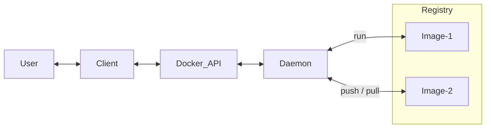

# Dockerizing

_all about docker, docker-compose, images and containers_

## Physical World to Docker

An app, needs files (eg, html) to run with other OS files (eg Ubuntu). Docker lets do this virtually. Docker is virtual engine that lets do all this using things like image, container etc explained below. App may be working on multiple server through network, eg, web-server connects to database-server. This can be done using multiple containers in docker.

### Overview

**Docker Image** is the files required for an app, including system files and binaries.

**Container** is running instance of the image, that is, when the files run.

Now when a service runs it may produce soem other files, these land into area called _scratch space_.

**Scratch Space** is non-persistent, not shared in between containers. Each container has its own space and is destroyed when container ends.

**Named Volume** is volume having name. Volume is a file-system. Volume can be created using docker. Imagine you have created your own hard-disk. Now you can attach it to docker container. Attaching happens by mounting it to a path on container. Volume content can be opened on host machine (orbstack volumes can be found under orb mount).

Above is good to store some data from container. However, you may need to sync data between container and host (specially source code when developing). For this use _bind mounts_.

**Bind Mounts** is volume having _exact mount-point_ on host. When mounting, you may skip copy commant in Dockerfile. This is how _Dev-Mode_ container or _Dev-Container_ is built.

**Container Attributes**

- container name
- container id
- image-tag (name:version) and image-id
- ports: port of container -> port on host
- Volumes: name-on-host -> path mounted on container
- Networks

### Multi-Container Apps

You may run database and web-server in same container but doing one thing in a container and doing it well matters, it lets scale easily. Since container are isolated they cannot talk to other container, there has to be a network setup. To keep things simple _If two containers are on the same network, they can talk to each other. If they aren't, they can't._

Links: [Docker - Get Started Guide](https://docs.docker.com/get-started/)

## ORBStack

_a tool to manage docker and virtual machine on Mac_

After installation, run local docker container with all documentation using below command

```sh
docker run -it -p 80:80 docker/getting-started
```

§

Links:

- [docs](https://docs.orbstack.dev/)
- [discussion](https://news.ycombinator.com/item?id=36668964)


## Docker

_using docker for development_

**What is Docker**

- Docker is a platform that helps separate application from infrastructure by using isolated environments called _containers_.
- it  is a set of platform as a service products that use OS-level virtualization
- It lets you put everything you need to run your application into a box that can be stored and opened when and where it is required.
- Docker-Image is template that defines layout of container, container is runtime instance of image, and runs on docker-engine, which is software that runs containers.
- Docker containers are defined by docker-image (template) and are run on docker-engine (runtime on host).

**How Docker works**

- It is built in Go language and uses Linux kernel features for isolation, functionality like `namespaces` lets it possible.

**Docker Architecture & Overview**

- **Docker Objects** are items you create and use in docker. They are images, containers, networks, and volumes.

- **Docker Image** is read-only immutable _template_ that defines the layout of container. They are based on other images (kinda inheritance), like your `app-image` can be build on `ubuntu-image` with added details as installation of python, mssql and configurations to run the application. To define image you create _docker-file_. Each instruction in file is like a layer in image. Each change in statement, update only that layer not the whole image. This makes it fast and lightweight.

- **Docker Container** is runtime instance of Docker Image. Created using `docker run` command. It runs on Docker Engine. You can create, start, stop, move, or delete a container using the Docker API or CLI. Container can connect to network, storage and can be saved as new image in its current state. Containers are mostly isolate from each other but you can control isolation of network/storage/subsystem on host machine. Eg, to run a container with image name _ubuntu_ and then run command _/bin/bash_ use: `$ docker run -i -t ubuntu /bin/bash`. It pulls image from if not available locally, crates container, allocates storage resources, adds network interface, starts container and executes the command _/bin/bash_. `-i` is interactively and `-t` attached to terminal, this lets you interact and see output of container in your terminal.


- **Docker Engine** is the software that hosts (runs) the containers. it is container runtime.

- **Docker daemon** it is background process, `dockerd` that listens to Docker-API requests and manages Docker Objects (image, container, network, volume).

- **Docker client** a process, `docker` that lets users interactions. It sends users commands to daemon. So `docker run` is send from client to daemon `dockerd` which does the job.
- > Docker Desktop is GUI that is easy and has client and daemon, and other helpers.

- **Docker registries** a registry that stores docker-images. It can be yours or a public register _Docker Hub_ that anyonce can use (like GitHub). Commands like `docker pull` or `docker run` read, and `docker push` write docker-image to configured registry.




### Docker Installation

Install using `https://docs.docker.com/engine/install/ubuntu/`

### Build a Dockerfile

A docker file tells how to make an image, which base image to use, what files to copy to that image and what commands to run on it and finally what to execute on it. Here is example of docker-file located at, `./Dockerfile`

```Dockerfile
FROM python:3.7-slim

# set a directory for the app
ENV INSTALL_PATH /home/snakeeyes
RUN mkdir -p $INSTALL_PATH
WORKDIR $INSTALL_PATH

# copy all the files to the container
COPY the_project .

# install dependencies
RUN pip install --no-cache-dir -r requirements.txt
RUN pip install --editable .

CMD gunicorn -b 0.0.0.0:8000 --access-logfile - "snakeeyes.app:create_app()"
```

Here, `FROM` instruction specifies the Parent Image from which you are building. `ENV` defines variable with value. `RUN` to execute container build commands. `WORKDIR` instruction sets the current working directory for subsequent instructions in the Dockerfile. `CMD` runs command on container _after_ build. There can be only one CMD per docker file.

**ARG vs ENV**: `ARG` is set at building, `ENV` while running. `ARG` can't change, `ENV` can.

**RUN vs CMD**: `RUN` is an image build step, the state of the container after a `RUN` command will be committed to the container image. A Dockerfile can have many `RUN` steps that layer on top of one another to build the image. `CMD` is the command the container executes by default when you launch the built image.

### Dockerignore

`.dockerignore` file lets you define what you want docker to ignore when copying, eg, you do not want `.git` folder to be copied.

### Running Container from Image

You can run a container usin 'pre build image' from repo or from a image that is built using your dockerfile.

To run a container from images, `docker run <image_name>`. Example:

```sh
# runs a container on image named busybox
docker run busybox

# runs and passes the command to it
docker run busybox echo "hello from busybox"

# get container shell in "interactive mode"
docker run -it busybox sh

# run in "detached mode"
docker run -d --rm --name mysite_container -p 5000:8000 mysite_img:latest

# other commands
docker run -it --rm yourusername/mysite_img bash
```

Here, `-it` swithc to run gives interactive shell in which we can pass as many commands as we want. `--rm` removes container once it exists. `-d` will detach our terminal, runs in background as daemon. `-P` will publish all exposed ports to random ports. `-p` 8888:80 assign custom ports, 80 on inside container, and exposed externally to 8888. `--name` corresponds to a name we want to give.

### View Images and Containers

To view `images` on your machine

```sh
$ docker images -a

REPOSITORY      TAG       IMAGE ID       CREATED          SIZE
mysite_img      latest    852440f469ff   34 minutes ago   162MB
hello-world     latest    9c7a54a9a43c   3 months ago     13.3kB
```

To view `containers` on your machine

```sh
$ docker ps -a

CONTAINER ID   IMAGE           COMMAND                  CREATED         STATUS         PORTS                                       NAMES
9ea9727388df   mysite_img      "gunicorn -b 0.0.0.0…"   5 seconds ago   Up 4 seconds   0.0.0.0:8000->8000/tcp, :::8000->8000/tcp   mysite_container
```

### Stop Containers

To stop a container

```sh
docker stop mysite_container
```

### Read Commands

You can use following commands to read details on

**Images**

```sh
$ docker images -a
# see all images
```

**Containers**

```sh
$ docker ps
# see all containers that are currently running

$ docker ps -a
# see all containers

$ docker container ls -a
# same as ps -a

$ docker container logs <container-name>
# see logs

$ docker logs -f <container-id>
# watch logs
```

**Networks**

```sh
$ docker network ls
# see network

$ docker port  <container-name>
# to see ports exposed

$ docker network inspect bridge
```

**Volumes**

```sh
$ docker volume ls
# see volumes
```

Here, `inspect bridge` shows details of a network. Bridge network is used by multiple container and lets one container talk to another one. But you can create another newtwork that isolates everything.

### Write Commands

You can use following commands to do write operations on

**Image Build**

```sh
docker build -t snakeeyes:latest .
# builds image from a Dockerfile
```

Here, `.` is location of Dockerfile, an optional tag name with `-t`

**Image Delete**

```sh
docker image rm 39b5025d8e15
docker rmi
```

Here, `.` is location of Dockerfile, an optional tag name with `-t`

**Containers**

```sh
docker rm 305297d7a235 ff0a5c3750b9
# deletes containers

docker system prune
# delete all unused / stopped containers & unlined images
```

**Networks**

```sh
docker network create foodtrucks-net
# creates network

docker run -d --name es --net foodtrucks-net -p 9200:9200 -p 9300:9300 -e "discovery.type=single-node" docker.elastic.co/elasticsearch/elasticsearch:6.3.2
# add newtwork to container

docker run -it --rm --net foodtrucks-net yourusername/foodtrucks-web

docker network rm foodtrucks-net
# delete network
```


**Volumes**

```sh
docker volume rm <volume_id>
# delete volume
```

More easy and auto managed way of adding network in between containers is to use  docker-compose. It will auto create a network for containers in compose script.

### Copying Files from container to host

You can move / copy files between host and container machines using:

```sh
sudo docker cp <container id>:/path/to/package/in/container/package.egg-info /path/to/mounted/package/on/host/package.egg-info
```

## Docker Volumes

Add volume to the docker container, for _persistence_ using **named volumes**

```sh
docker run -dp 127.0.0.1:3000:3000 --mount type=volume,src=todo-db,target=/etc/todos getting-started
```

Add **bind** mount to sync code to docker container from host

```sh
docker run -it --mount type=bind,src="$(pwd)",target=/src ubuntu bash
```

## Docker Network

Every container runs in default bridge network and has an IP. This default Bridge network is shared by all the containers so two different containers can talk to each other If we provide the IP address that is assigned by the default bridge network, but this may not be secure. To make this secure we can create our own Bridge network, which is different from default Bridge network. Our Bridge network can have a name and containers can use that new Bridge network for networking.

```sh
# view networks
docker network ls

# create network
docker network create todo-app
```

## Docker Hub

This is docker repo like GitHub where you will find pre-build images that you can use directly in your dockerfile or, build on top of pre built images.

[Docker Hub](https://hub.docker.com/)

## Docker-Compose

It is a utility for _multi-container_ docker environments management. It is built in _Python_. It is a tool that was developed to help define and share _multi-container_ applications. With Compose, we can create a _YAML_ file to define the services and with a single command, can spin everything up or tear it all down. While this can be done separately by running containers separately and linking with network but this is a better way to build a _cluster of containers_.

### Why and How to use Docker Compose

The **Development Workflow** to make use of docker compose is that while you can start a service from image, the other way is to build an image in docker-compose using Dockerfile and set the volume to map you machine folder to folder in container. This way any change you do in code on your machine, is moved to container and the image is built using compose up or down. This way any change is quickly reflected in the container.

Note: You can do docker up to run the container but also add `--build` whenever there is change is packages of flask so that image is rebuilt.

You define services and within service a name of Service, that name of the Service is name of network alias for that machine.

In docker compose, under service, if you map folders in volume it is bind mount (to sync code changes), if you give volume name and define that under volumes section it is named-volume mount (to persist the data).

You define named volumes in `volumes:` section, this named volume can be mapped in any service. The named volume does not get removed when you tear-down or do `docker compose down`.

### Installing docker-compose

It is separate to docker and can be installed using:

```sh
pip install docker-compose
```

or to install in systen as binary:

```sh
sudo curl -L "https://github.com/docker/compose/releases/download/2.20.2/docker-compose-$(uname -s)-$(uname -m)" -o /usr/local/bin/docker-compose

sudo chmod +x /usr/local/bin/docker-compose
```

### Building docker-compose YAML file

The docker compose file is a list of instructions in yaml that define multi containers as service. Here is an exmple of such file. `.project/docker-compose.yaml`

```yaml
version: '2'

services:
  website:
    build: .
    command: >
      gunicorn -b 0.0.0.0:8000
        --access-logfile -
        --reload
        "snakeeyes.app:create_app()"
    environment:
      PYTHONUNBUFFERED: 'true'
    volumes:
      - './the_project:/home/snakeeyes'
      - '/home/snakeeyes/SnakeEyes_CLI.egg-info'
    ports:
      - '8000:8000'
```

Here you define version, services and volumes. `version:` is version of compose. `services:` defines containers, with a name as `website` and then image and properties. `build: .` tells to build the image for this container using the Dockerfile located at `.`.

`volumes:` lets mount host-folder to container-folder. It is useful when doing development, as you make changes to host-folder the changes are made on container-folder without re-building the image. This may sometime *override* some folders that are generated by commands and may not exist on host-folder, in that case you can _whitelist_, some files. just write path without colon to whitelist `- '/home/snakeeyes/SnakeEyes_CLI.egg-info'`


### Commands of Docker-Compose

Some common commands to build, start, pause and stop containers

```sh
$ docker-compose up --build
# builds image and runs

$ docker-compose up -d
# to run in background

$ docker-compose pause
# pause the environment execution without changing the current state of your containers

$ docker-compose unpause
# resume the execution

$ docker-compose stop
# terminate the container execution, but it won’t destroy any data associated with your containers

$ docker-compose down
# remove the containers, networks, and volumes associated with this containerized environment
```

### Execute commands inside Container machine

You can execute commands in container by passing them after term `exec` then `<service>` which is the service in which you want to run the command, here it is `website`. Then the command.

Note: The relative path you give here are w.r.t the path in container not where you are running these commands. This is usually defined in `Dockerfile` as `WORKDIR /home/snakeeyes`.

Below are some examples

```sh
# execute pytest
sudo docker-compose exec website py.test sakeeeyes/tests

# execute pytest wtih coverage
sudo docker-compose exec website py.test --cov-report term-missing --cov snakeeyes

# excute flake8 linter
sudo docker-compose exec website flake8 . --exclude __init__.py
```


## Dockerized Project Commands

Once you have "dockerized" your development, you usually will use following commands once everything is set up.

```sh
# run the containters
sudo docker-compose up

# stop the containers
sudo docker-compose stop

# run a command in docker-container, eg running pytest.
sudo docker-compose exec <service> <cmd>

# rebuild images and run containers
sudo docker-compose up --build

# Once a week, to clean up
sudo docker system prune

# show images
sudo docker images -a

# delete images
sudo docker rmi bf4d41ae6382

# show containers
sudo docker container  ls -a
```

This lets do basic development work.

## Multi Stage Build

Multistage build lets build the image in different stages using `AS` and `FROM`. There can be build stage which need env and other tools, and a prod stage which has just the final built part or the compiled code. This reduces image size and lowers build time. 

## Dev Containers

"Dev Containers" is term used to let developers do development inside a container. The container can run in docker installed locally or on remote (like github). Dev Containers provide isolated, production ready infra to work on.

Links:

- <https://containers.dev/>

## Issues

Fix ARM and AMD issue because of Mac

`WARNING: The requested image's platform (linux/arm64/v8) does not match the detected host platform (linux/amd64/v3) and no specific platform was requested`

ARM - is for Mac
AMD - is for Linux

You need to build image for a specified platform it you need to run the image on it. So build image for AMD platform if you want to run it on a linux box. More on (stackoverflow - The requested image's platform (linux/arm64/v8) does not match the detected host platform (linux/amd64))[https://stackoverflow.com/questions/71000707/docker-get-started-warning-the-requested-images-platform-linux-arm64-v8-doe]

## Links - Dockerize

- [Docker Tutorial by Prateek - with AWS](https://docker-curriculum.com/)
- [SO - docker compose overwrite fix](https://stackoverflow.com/a/50273660/1055028)


