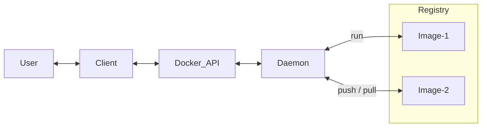

# Dockerize

_all about docker, docker-compose, images and containers_

## Physical World to Docker

An app, needs files (eg, html) to run with other OS files (eg Ubuntu). Docker lets do this **virtually**. Docker is virtual engine that lets do all this using things like image, container etc explained below. App may be working on multiple server through network, eg, web-server connects to database-server. This can be done using **multiple containers** in docker.

## Overview

**Docker Image** is the files required for an app, including system files and binaries.

**Container** is running instance of the image, that is, when the files run.

Now when a service runs it may produce some other files, these land into area called _scratch space_.

**Scratch Space** is non-persistent, not shared in between containers. Each container has its own space and is destroyed when container ends.

**Named Volume** is volume having name. Volume is a file-system. Volume can be created using docker. Imagine you have created your own hard-disk. Now you can attach it to docker container. Attaching happens by mounting it to a path on container. Volume content can be opened on host machine (orbstack volumes can be found under orb mount).

Above is good to store some data from container. However, you may need to sync data between container and host (specially source code when developing). For this use _bind mounts_.

**Bind Mounts** is volume having _exact mount-point_ on host. When mounting, you may skip copy commant in Dockerfile. This is how _Dev-Mode_ container or _Dev-Container_ is built.

**Container Attributes**

- container name
- container id
- image-tag (name:version) and image-id
- ports: port of container -> port on host
- Volumes: name-on-host -> path mounted on container
- Networks

**Multi-Container Apps**

You may run database and web-server in same container but doing one thing in a container and doing it well matters, it lets scale easily. Since container are isolated they cannot talk to other container, there has to be a network setup. To keep things simple _If two containers are on the same network, they can talk to each other. If they aren't, they can't._

Links: [Docker - Get Started Guide](https://docs.docker.com/get-started/)


## Docker Architecture

_docker inner working_

**What is Docker**

- Docker is a platform that helps separate application from infrastructure by using isolated environments called _containers_.
- it  is a set of platform as a service products that use OS-level virtualization
- It lets you put everything you need to run your application into a box that can be stored and opened when and where it is required.
- Docker-Image is template that defines layout of container, container is runtime instance of image, and runs on docker-engine, which is software that runs containers.
- Docker containers are defined by docker-image (template) and are run on docker-engine (runtime on host).

**How Docker works**

- It is built in Go language and uses Linux kernel features for isolation, functionality like `namespaces` lets it possible.

**Docker Architecture & Overview**

- **Docker Objects** are items you create and use in docker. They are images, containers, networks, and volumes.

- **Docker Image** is read-only immutable _template_ that defines the layout of container. They are based on other images (kinda inheritance), like your `app-image` can be build on `ubuntu-image` with added details as installation of python, mssql and configurations to run the application. To define image you create _docker-file_. Each instruction in file is like a layer in image. Each change in statement, update only that layer not the whole image. This makes it fast and lightweight.

- **Docker Container** is runtime instance of Docker Image. Created using `docker run` command. It runs on Docker Engine. You can create, start, stop, move, or delete a container using the Docker API or CLI. Container can connect to network, storage and can be saved as new image in its current state. Containers are mostly isolate from each other but you can control isolation of network/storage/subsystem on host machine. Eg, to run a container with image name _ubuntu_ and then run command _/bin/bash_ use: `$ docker run -i -t ubuntu /bin/bash`. It pulls image from if not available locally, crates container, allocates storage resources, adds network interface, starts container and executes the command _/bin/bash_. `-i` is interactively and `-t` attached to terminal, this lets you interact and see output of container in your terminal.

- **Docker Engine** is the software that hosts (runs) the containers. it is container runtime.

- **Docker Daemon** it is background process, `dockerd` that listens to Docker-API requests and manages Docker Objects (image, container, network, volume).

- **Docker Client** a process, `docker` that lets users interactions. It sends users commands to daemon. So `docker run` is send from client to daemon `dockerd` which does the job.
- > Docker Desktop is GUI that is easy and has client and daemon, and other helpers.

- **Docker Registries** a registry that stores docker-images. It can be yours or a public register _Docker Hub_ that anyonce can use (like GitHub). Commands like `docker pull` or `docker run` read, and `docker push` write docker-image to configured registry.




## Docker Installation

Install using <https://docs.docker.com/engine/install/ubuntu/>

## Dockerfile

A docker file tells how to make an image, which base image to use, what files to copy to that image and what commands to run on it and finally what to execute on it. Here is example of docker-file located at, `./Dockerfile`

```Dockerfile
FROM python:3.8

# set a directory for the app
WORKDIR /usr/src/app

# copy all the files to the container
COPY . .

# install dependencies
RUN pip install --no-cache-dir -r requirements.txt

# define the port number the container should expose
EXPOSE 5000

# run the command
CMD ["python", "./app.py"]
```


Here, `FROM` instruction specifies the Parent Image from which you are building. `ENV` defines variable with value. `RUN` to execute container build commands. `WORKDIR` instruction sets the current working directory for subsequent instructions in the Dockerfile. `CMD` runs command on container _after_ build. There can be only one CMD per docker file.

**ARG vs ENV**: `ARG` is set at building, `ENV` while running. `ARG` can't change, `ENV` can.

**RUN vs CMD**: `RUN` is an image build step, the state of the container after a `RUN` command will be committed to the container image. A Dockerfile can have many `RUN` steps that layer on top of one another to build the image. `CMD` is the command the container executes by default when you launch the built image.


## Build Image

```sh
# builds image from a Dockerfile
docker build -t snakeeyes:latest .
docker build -t :<tag> <path-dockerfile>
```

Here, `.` is location of Dockerfile, an optional tag name with `-t`


## Run Container from Image

You can run a container using 'pre build image' from repo or from a image that is built using your dockerfile. Examples:

```sh
docker run <image_name>

# runs a container on image named busybox
docker run busybox

# runs and passes the command to it
docker run busybox echo "hello from busybox"

# get container shell in "interactive mode"
docker run -it busybox sh

# detached mode
docker run -d --rm \
  --name mysite_container \
  -p 5000:8000 \
  mysite_img:latest

```

Here, `-it` swithc to run gives interactive shell in which we can pass as many commands as we want. `--rm` removes container once it exists. `-d` will detach our terminal, runs in background as daemon. `-P` will publish all exposed ports to random ports. `-p` 8888:80 assign custom ports, 80 on inside container, and exposed externally to 8888. `--name` corresponds to a name we want to give.

## View Images

To view `images` on your machine

```sh
$ docker images -a

REPOSITORY      TAG       IMAGE ID       CREATED          SIZE
mysite_img      latest    852440f469ff   34 minutes ago   162MB
hello-world     latest    9c7a54a9a43c   3 months ago     13.3kB
```

## View Containers

To view `containers` on your machine

```sh
# view all containers
$ docker ps -a

CONTAINER ID   IMAGE           COMMAND                  CREATED         STATUS         PORTS                                       NAMES
9ea9727388df   mysite_img      "gunicorn -b 0.0.0.0…"   5 seconds ago   Up 4 seconds   0.0.0.0:8000->8000/tcp, :::8000->8000/tcp   mysite_container

# view currently running containers
$ docker ps
$ docker container ls
```

## Stop Containers

To stop a container

```sh
docker stop mysite_container
docker stop <container-id>
```

## Logs of Container

```sh
# view logs
$ docker container logs <container-name>

# watch logs
$ docker logs -f <container-id>
```


## Remove Containers

```sh
docker rm 305297d7a235 ff0a5c3750b9
# deletes containers
```

## Remove Image

```sh
docker image rm 39b5025d8e15
docker rmi
```

Here, `.` is location of Dockerfile, an optional tag name with `-t`


## System Prune

```sh
docker system prune
# delete all unused / stopped containers & unlined images
```

## Copying Files from container to host

You can move / copy files between host and container machines using:

```sh
sudo docker cp <container id>:/path/to/package/in/container/package.egg-info /path/to/mounted/package/on/host/package.egg-info
```

## Docker Volumes

```sh
# delete volume
docker volume rm <volume_id>
```

**Named Volumes** - Add volume to the docker container, for **persistence**. This keeps data after container stops or is removed.

```sh
docker run -dp 127.0.0.1:3000:3000 --mount type=volume,src=todo-db,target=/etc/todos getting-started

docker run -dp 127.0.0.1:3000:3000 --mount type=volume,src=<vol-name>,target=<path in container> 
```

**Bind Volumes** - Add bind mount to **sync** code to docker container from host.

```sh
docker run -it --mount type=bind,src=<host path>,target=<path in container>  <cmd>

docker run -it --mount type=bind,src="$(pwd)",target=/src ubuntu bash
```

## Docker Network

Every container runs in default bridge network and has an IP. This default Bridge network is shared by all the containers so two different containers can talk to each other If we provide the IP address that is assigned by the default bridge network, but this may not be secure. To make this secure we can create our own Bridge network, which is different from default Bridge network. Our Bridge network can have a name and containers can use that new Bridge network for networking.

```sh
# view networks
docker network ls

# create network
docker network create todo-app
docker network create <nw-name>

# to see ports exposed
$ docker port  <container-name>

# inspect a network by name
$ docker network inspect bridge
$ docker network inspect <nw-name>
```

Here, `inspect bridge` shows details of a network. Bridge network is used by multiple container and lets one container talk to another one. But you can create another newtwork that isolates everything.

## Dockerignore

`.dockerignore` file lets you define what you want docker to ignore when copying, eg, you do not want `.git` folder to be copied.

## Docker Hub

This is docker repo like GitHub where you will find pre-build images that you can use directly in your dockerfile or, build on top of pre built images.

View more at: [Docker Hub](https://hub.docker.com/)

To push an image to docker hub do following:

```sh
# build image on local
docker build -t yourusername/catnip .

docker login

docker push yourusername/catnip
```

If you build image name with `/` then it will create it with docker.io prefix as `docker.io/yourusername/catnip`

**Note:** This makes all your files in docker image public, so if you copied code of project it will be available to public.

Alternative registry host is [AWS ECR](https://aws.amazon.com/ecr/) - Elastic Container Register.

## Docker-Compose

All what you do in terminal for images, container, volume, network, like build, pull, run, and their dependecies on each other, and adding env var, commands etc. can all be written in a yaml file so that it is not in terminal but in file as a code. This makes it version controlled and sharable.

It is a utility for **multi-container** docker environments management. It is built in **Python**. It is a tool that was developed to help define and share **multi-container** applications. With Compose, we can create a **YAML** file to define the services and with a single command, can spin everything up or tear it all down. While this can be done separately by running containers separately and linking with network but this is a better way to build a **cluster of containers**.

### Why and How to use Docker Compose

The **Development Workflow** to make use of docker compose is that while you can start a service from image, the other way is to build an image in docker-compose using Dockerfile and set the volume to map you machine folder to folder in container. This way any change you do in code on your machine, is moved to container and the image is built using compose up or down. This way any change is quickly reflected in the container.

Note: You can do docker up to run the container but also add `--build` whenever there is change is packages of flask so that image is rebuilt.

You define services and within service a name of Service, that name of the Service is name of network alias for that machine.

In docker compose, under service, if you map folders in volume it is bind mount (to sync code changes), if you give volume name and define that under volumes section it is named-volume mount (to persist the data).

You define named volumes in `volumes:` section, this named volume can be mapped in any service. The named volume does not get removed when you tear-down or do `docker compose down`.

### Installing docker-compose

It is separate to docker and can be installed using:

```sh
pip install docker-compose
```

or to install in systen as binary:

```sh
sudo curl -L "https://github.com/docker/compose/releases/download/2.20.2/docker-compose-$(uname -s)-$(uname -m)" -o /usr/local/bin/docker-compose

sudo chmod +x /usr/local/bin/docker-compose
```

### Building docker-compose YAML file

The docker compose file is a list of instructions in yaml that define multi containers as service. Here is an exmple of such file. `./docker-compose.yaml`

```yaml
version: '2'

services:
  
  website:
    build: .
    command: >
      gunicorn -b 0.0.0.0:8000
        --access-logfile -
        --reload
        "snakeeyes.app:create_app()"
    environment:
      PYTHONUNBUFFERED: 'true'
    volumes:
      - './the_project:/home/snakeeyes'
      - '/home/snakeeyes/SnakeEyes_CLI.egg-info'
    ports:
      - '8000:8000'
```

Here you define version, services and volumes. `version:` is version of compose. `services:` defines containers, with a name as `website` and then image and properties. `build: .` tells to build the image for this container using the Dockerfile located at `.`.

`volumes:` lets mount host-folder to container-folder. It is useful when doing development, as you make changes to host-folder the changes are made on container-folder without re-building the image. This may sometime *override* some folders that are generated by commands and may not exist on host-folder, in that case you can _whitelist_, some files. just write path without colon to whitelist `- '/home/snakeeyes/SnakeEyes_CLI.egg-info'`


### Commands of Docker-Compose

Some common commands to build, start, pause and stop containers

```sh
# builds image and runs
$ docker-compose up --build

# to run in background
$ docker-compose up -d

# pause the environment execution without changing the current state of your containers
$ docker-compose pause

# resume the execution
$ docker-compose unpause

# terminate the container execution, but it won’t destroy any data associated with your containers
$ docker-compose stop

# remove the containers, networks, and volumes associated with this containerized environment
$ docker-compose down
```

### Execute commands inside Container machine

You can execute commands in container by passing them after term `exec` then `<service>` which is the service in which you want to run the command, here it is `website`. Then the command.

Note: The relative path you give here are w.r.t the path in container not where you are running these commands. This is usually defined in `Dockerfile` as `WORKDIR /home/snakeeyes`.

Below are some examples

```sh
# execute pytest
sudo docker-compose exec website py.test sakeeeyes/tests

# execute pytest with coverage
sudo docker-compose exec website py.test --cov-report term-missing --cov snakeeyes

# excute flake8 linter
sudo docker-compose exec website flake8 . --exclude __init__.py
```


## Dockerized Project Commands

Once you have "dockerized" your development, you usually will use following commands once everything is set up.

```sh
# run the containters
sudo docker-compose up

# stop the containers
sudo docker-compose stop

# run a command in docker-container, eg running pytest.
sudo docker-compose exec <service> <cmd>

# rebuild images and run containers
sudo docker-compose up --build


# --------- Docker only cmds ----------- #

# Once a week, to clean up
sudo docker system prune

# show images
sudo docker images -a

# delete images
sudo docker rmi bf4d41ae6382

# show containers
sudo docker container  ls -a
```

This lets do basic development work.

## Multi Stage Build

Multi **stage** build lets build the image in different stages using `AS` and `FROM`. There can be build stage which need env and other tools, and a prod stage which has just the final built part or the compiled code. This reduces image size and lowers build time.

## Dev Containers

"Dev Containers" is term used to let developers do **development** inside a container. The container can run in docker installed locally or on remote (like github, calls it codespace). Dev Containers provide isolated, production ready infra to work on.

Dev Containers are made available in VS Code. It basically runs a docker container in docker enginer. Then VS Code connects to it using remote connection. Anything you run on the container, is exposed via a port. This can then be accessed via host, if you add `"remote.localPortHost": "allInterfaces",` to vs code settings, you can access this host and port on you lan via any other device.

**Caution...!** Anything that is saved outside `workspaces` folder will be deleted if the container is removed. This is because only `workspaces` folder persists as volume.

- 'Epic Swartz' was a ubuntu container, that has mounted volumne.
  - Ubnutu (epic swartz) is name and alias, its same thing.
  - `/workspaces/ubuntu` has repos. This is volume on host.
  - `/home/vscode/code/repo` has different repos. This is on host at `/Users/vab/OrbStack/docker/containers/epic_swartz/home/vscode/code/repo/microblog-api/microblog-api`. This got deleted on removing container.

**Ways to use dev container**

- New dev container - opens new container based on config selected. Maps a new volume.
- Open a folder in container - opens new container for first use. Binds folder to volume. Useful for continued development.
- Attach to running Container - open the home dir of container user, `/home/vscode`

### New Dev Container

Opening a repo in its own vscode window

- on the termial, cd to the repo and do code .

Useful when you have to test something new once. Anything you do will get deleted if container is removed, only workspaces folder is left as volume

### Open Folder in Container

Opens a host folder in container. Container has only this folder under `/workspaces/`

For first time, it asks container config and takes a while. For next runs, its starts in seconds.

Steps

- Click remote explorer
- Open Folder in Container...
- Select folder on host. `/path-to/folder-in-cntnr-1`
- Add user config file.
- Select tools/frameworks.
- Done

What happends in background by VS Code:

- Downloads the image based on tools you selectd
- Build the image
- Attaches volume, bind mount with folder on host. Attaches volume mount `vscode` fro vscode-server stuff.
- Starts the container
- Connects VS code to container
- Opens host folder in container
- Click 'Remote Explorer' extension to see all these details in vscode.

User Owner and Permissions in Container

- On terminal, user is `vscode`.
- Folder is located in `/workspaces/folder-in-cntnr-1`

Git Configs

- By default config from host are copied to container.
- You will need to [setup the SSH configurations](../1-Software-Engineering/git.md#ssh-authentication-to-push-to-remote) if you want to push from inside container. Else you can do from host.

Extensions

- can be configured in `.devcontainer/devcontainer.json`

Ports

- can be configured in `.devcontainer/devcontainer.json`

Files location

- File saved on container is saved on host as well.
- File saved on host is reflected on container.

Opening other folders

- Opening other folder with same framework selected was fast. That is repeated the same thing for another folder on host, selected python as framework for container, then it opened in seconds.

Closing Tear Dow

- Closing the vscode window, stops the running container. Does not delete it.

### Opening Source Tree in Container

Same as opening a folder in container. Instead of one project repo, you can open a parent folder that has all your repos. This will have all repos in container. Now you can simply open any folder under parent folder (which will be a repo) in a new vscode window. You can also see this on the remote expolorer extension sidebar.

More on this can be found on [Configure separate containers](https://code.visualstudio.com/remote/advancedcontainers/configure-separate-containers)

Binded volume can be slow compared to mounted volume. You can do the same thing above (open source tree) by mounting a volume to container, and Clone your entire source tree inside of a named volume rather than locally (on host). More on [Use a named volume for your entire source tree](https://code.visualstudio.com/remote/advancedcontainers/improve-performance#_use-a-named-volume-for-your-entire-source-tree)

Links:

- <https://containers.dev/>

## ORBStack

_a tool to manage docker and virtual machine on Mac_

After installation, run local docker container with all documentation using below command

```sh
docker run -it -p 80:80 docker/getting-started
```

Links:

- [docs](https://docs.orbstack.dev/)
- [discussion](https://news.ycombinator.com/item?id=36668964)


## Issues

Fix ARM and AMD issue because of Mac

`WARNING: The requested image's platform (linux/arm64/v8) does not match the detected host platform (linux/amd64/v3) and no specific platform was requested`

ARM - is for Mac
AMD - is for Linux

You need to build image for a specified platform it you need to run the image on it. So build image for AMD platform if you want to run it on a linux box. More on (stackoverflow - The requested image's platform (linux/arm64/v8) does not match the detected host platform (linux/amd64))[https://stackoverflow.com/questions/71000707/docker-get-started-warning-the-requested-images-platform-linux-arm64-v8-doe]


## Eg - Food Truck

```sh
# creates network
docker network create foodtrucks-net

# run container with network
docker run -d \
  --name es \
  --net foodtrucks-net \
  -p 9200:9200 -p 9300:9300 \
  -e "discovery.type=single-node" \
  docker.elastic.co/elasticsearch/elasticsearch:6.3.2

# run web_container with network
docker run -it --rm --net foodtrucks-net yourusername/foodtrucks-web

# delete network
docker network rm foodtrucks-net
```

More easy and auto managed way of adding network in between containers is to use  docker-compose. It will auto create a network for containers in compose script.

## Eg - Snake Eyes


```Dockerfile
FROM python:3.7-slim

# set a directory for the app
ENV INSTALL_PATH /home/snakeeyes
RUN mkdir -p $INSTALL_PATH
WORKDIR $INSTALL_PATH

# copy all the files to the container
COPY the_project .

# install dependencies
RUN pip install --no-cache-dir -r requirements.txt
RUN pip install --editable .

CMD gunicorn -b 0.0.0.0:8000 --access-logfile - "snakeeyes.app:create_app()"
```

## Links - Dockerize

- [Docker Tutorial by Prateek - with AWS](https://docker-curriculum.com/)
- [SO - docker compose overwrite fix](https://stackoverflow.com/a/50273660/1055028)


