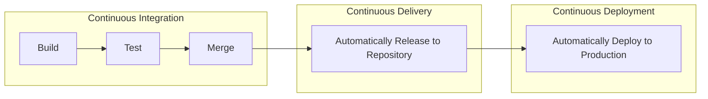

# DevOps

It is a methodology that brings, development, QA and IT operations close together, automated and test driven, container based to have isolated similar environment so that the changes are minimal and are tested and hence don’t break.

## CI/CD Pipeline

- CI/CD stands for Continuous Integrationa and Continuous deployment.
- it is DevOps methodology to being IT and Ops together.
- It is a series of steps to deliver new version of software. Improves delivery throughout SDLC (software development life cycle) which is development, testing, production and monitoring. These steps can be automated to make it error free and fast.
- Steps may include - compiling code, unit tests, code analysis, security and binaries creations. And/or packaging code into container image.
- benefits, includes early integrating and testing, enhancing developer productivity, accelerating delivery, and finding/fixing bugs faster.
- commit to production is continuous and automated.
- CI/CD pipelines are completely tailor-made based on the needs and requirements and could have multiple stages and jobs, and could be complex and comprehensive.



- CI-CD has increased over years because on cloud-native development it is much more efficient way and is more required way. Compared to traditional Virtual-Machine deployment where it could had been left to be done manually

- CI-CD Implementation
  - Typically building a CI/CD pipeline consists of the following phases/stages.
    - Code: Checked into the repository.
    - Build: Build is triggered and deployed in a test environment.
    - Test: Automated tests are executed.
    - Deploy: Code is deployed to stage, and production environments.

## Containers

- Containers are **packages of code** together with **necessary elements** (like runtimes, libraries) required to run a software on any environment.
- application is **abstracted** from environmant on which they run. It makes software run anywhere, be it on-prem, cloud or personal-laptop. container is packaged in a way that it can run on any OS and it makes **shared use** of resources like CPU, Memory, Storage and Network at OS level.
- **Separation** of Responsibilities - if you use containers, developers only code and containerize without worrying about deploment env, IT-Ops only deploy container without worrying about version, dependencies, OS-requirements.
- Compared to Virtual-Machines, Containers are **lightweight**, use less resource and virtualize at the **OS level** while VMs virtualize at the hardware level, use more resouse and are heavy.


- [Cloud Google - Learn What Are Containers](https://cloud.google.com/learn/what-are-containers)

## Kubernetes

- lets you **manage containers**
- automated container orchestration project
- manages containers, machine and services
- improves reliability and reduces time on devops
- `Google Kubernetes Engine` (GKE) - Is Google cloud kubernetes **service**
- `Kubernetes cluster` is a **set of nodes** that run containerized applications.
- `Edge computing` is a distributed computing paradigm that brings **computation and storage closer** to the sources of data. Often called 'The Edge' or 'at the edge'. Good for time-sensitive data.

## Docker

- **What is Docker**
  - Docker is a platform that helps separate application from infrastructure by using isolated environments called _containers_.
  - it  is a set of platform as a service products that use OS-level virtualization
  - It lets you put everything you need to run your application into a box that can be stored and opened when and where it is required.
  - Docker-Image is template that defines layout of container, container is runtime instance of image, and runs on docker-engine, which is software that runs containers.
  - Docker containers are defined by docker-image (template) and are run on docker-engine (runtime on host).

- **How Docker works** - It is built in Go language and uses Linux kernel features for isolation, functionality like `namespaces` lets it possible.

- **Docker Architecture & Overview**
  
  - **Docker Objects** are items you create and use in docker. They are images, containers, networks, and volumes.
  
  - **Docker Image** is read-only immutable _template_ that defines the layout of container. They are based on other images (kinda inheritance), like your `app-image` can be build on `ubuntu-image` with added details as installation of python, mssql and configurations to run the application. To define image you create _docker-file_. Each instruction in file is like a layer in image. Each change in statement, update only that layer not the whole image. This makes it fast and lightweight.
  
  - **Docker Container** is runtime instance of Docker Image. Created using `docker run` command. It runs on Docker Engine. You can create, start, stop, move, or delete a container using the Docker API or CLI. Container can connect to network, storage and can be saved as new image in its current state. Containers are mostly isolate from each other but you can control isolation of network/storage/subsystem on host machine. Eg, to run a container with image name _ubuntu_ and then run command _/bin/bash_ use: `$ docker run -i -t ubuntu /bin/bash`. It pulls image from if not available locally, crates container, allocates storage resources, adds network interface, starts container and executes the command _/bin/bash_. `-i` is interactively and `-t` attached to terminal, this lets you interact and see output of container in your terminal.

  - **Docker Engine** is the software that hosts (runs) the containers. it is container runtime.

  - **Docker daemon** it is background process, `dockerd` that listens to Docker-API requests and manages Docker Objects (image, container, network, volume).

  - **Docker client** a process, `docker` that lets users interactions. It sends users commands to daemon. So `docker run` is send from client to daemon `dockerd` which does the job.
  - > Docker Desktop is GUI that is easy and has client and daemon, and other helpers.

  - **Docker registries** a registry that stores docker-images. It can be yours or a public register _Docker Hub_ that anyonce can use (like GitHub). Commands like `docker pull` or `docker run` read, and `docker push` write docker-image to configured registry.

    ```mermaid
    graph LR;

    User <--> Client <--> Docker_API <--> Daemon

    subgraph Registry
      Image-1
      Image-2
      
    end

    Daemon <--push / pull--> Image-2
    Daemon <--run--> Image-1

    ```

## Jenkins

- open source **automation server** that facilitates **automating CI** (Continuous Integration) and DevOps by automating build, test, deploy.
- it is orchestration tool, that manages 'chain of actions' to acieve CI.
- it is used to implement CI/CD workflows as pipelines.
- it is written in Java
- automation reduces time, minizes error, makes release frequent.

- CI - on commit, code is build, then tested. if test is passed, build is tested for deployment. if deployment is successful on UAT, code is pushed to PROD.
- Jobs (collection of steps) is called stages.
- Alternatives - `Github Actions`

## Github Actions

- GitHub Actions is a continuous integration and continuous delivery (CI/CD) platform that allows you to automate your build, test, and deployment pipeline.
- You can create workflows that has jobs, and its trigger.
- on an event, job(s) gets triggered, that has steps, which can be actions or script to execute.

- [Docs Github - Actions Learn Github Actions Understanding Github Actions](https://docs.github.com/en/actions/learn-github-actions/understanding-github-actions)

## Chef DevOps

- for Automating Infrastructure Management
- Chef is an automation tool that provides a way to define infrastructure as code. Infrastructure as code (IC) simply means that managing infrastructure by writing code.

## AWS CloudFormation

- it is a service provided by Amazon Web Services that enables users to model and manage infrastructure resources in an automated and secure manner. Using CloudFormation, developers can define and provision AWS infrastructure resources using a JSON or YAML formatted Infrastructure as Code template.

