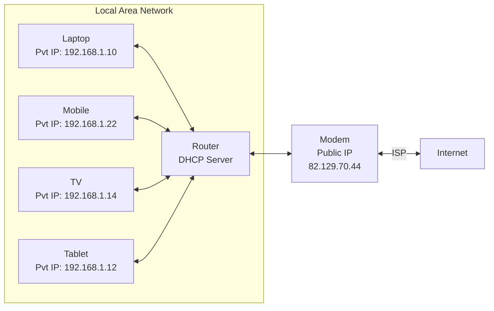

# Networking

Modem connects to internet. Router connects devices to modem.

Router lets you connect multiple devices together to share internet connection. It gives each device a private IP address like `192.168.1.xxx`. The router (or modem) itself has a public IP address like `82.129.70.xxx` which is given by ISP. So your device requests are uniquely addressed on internet by the comnination of both public and private addresses.

No two routers on the internet can have the same Public IP address.

Eg, Your flat has a wifi network `Wifi-Flat-101` has public IP `82.123.123.101` and has two devices connected, a laptop with private IP address `192.168.1.10` and a mobile with private ip address `192.169.1.14`. You neighbour's flat will a separate network with say wifi name `Wifi-Flat-105` and may have public IP address `82.123.123.205` and has a TV connected to wifi having private IP address `192.168.1.10`. Notice, how in separate networks private IP can be same and how two public IP address on separate router can't be same.

Now these private IP address are not magically made available to any new device connecting to router. It is done by DHCP Server on the routers. "A DHCP Server is a network server that automatically provides and assigns IP addresses, default gateways and other network parameters to client devices". If you do not enable DHCP on router, then only one machine can connect to internet.

localhost or `127.0.0.1` is the IP address of local computer that is the one you are working on and is used by machine to connect and communicate with itself.

A machine can have more than one IP address and can be done using multiple network card.

Starting a server means it can listen to requests. It will listen to a particular Address and Port. So if a server is started at `127.0.0.1:5000` it listens to request from local machine only.

if a server is started at `0.0.0.0:5000` it listens to request from all IP addresses a machine has. Usually machine has a private IP address if connected to router and an address of itself. So this server will listen to requests on `127.0.0.1:5000` and say `192.168.1.15`.
