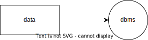

# Software Diagrams

Diagrams are often used for plannig and sharing ideas and understanding in a group. Software engineering you can have following

## Type of diagrams

- Flowcharts / Process Diagrams - Process Flow Diagram
- UMLs - Unified Modeling Language. This general-purpose modeling language helps you visualize a system’s design. Can show:
- structural information (such as class diagrams),
- behavioral information (like use case diagrams), or
- display interactions (a sequence diagram).
- ORG Charts - herarchal organization mapping in parent-child form.
- ER Diagram - shows an entity–relationship model which describes interrelated things of interest in a specific domain of knowledge. A basic ER model is composed of entity types (tables) and specifies relationships that can exist between entities.

## Methodology / Generalization

- C4model is a technique to stucturize your diagrams. It is an "abstraction-first" approach to diagramming software architecture. What are the 4C’s?
- Context - people and system, user and app
- Container - containers in a system. app has front end, middle, db and api.
- Component - components in a container. middle has user management and loggin system.
- Code - code or physical view of components. Class diagram, ER diagram.

## Tools to build

- Draw.io
- Visio
- LucidChart
- [Excalidraw](https://excalidraw.com/) - [Article](https://dev.to/dm8ry/excalidraw-the-tool-for-creating-diagrams-and-sketches-1o12)

## Excalidraw

You can draw sketches, it is web based PWA.

VS Code extension can be used to build png svg that are editable.

- [Animate](https://github.com/dai-shi/excalidraw-animate)
- [Slide show and GIF](https://github.com/dai-shi/excalidraw-claymate)

## Draw io

On the web <https://draw.io/>.

VS Code extension can be used to build png svg that are editable.

**Animations**

- can be enabled on web app, on extension you can change property.
- to make all arrows animate
  - go to `Extras > Edit Diagram...`
  - Find, `entryX`, Replace with `flowAnimation=1;entryX`

**Mermaid**

- diagram can me imported using `Arrange > Insert > Advanced > Mermaid...`.
- However, in extension, mermaid is imported as image.

**Examples**

## Entity Relationship Diagrams

ER Diagrams show relationship between entities. Entities are usually table / view in database.

It is often good to show, at minimum:

- table name
- primary keys
- foreign keys

Type of relationships

- 1-1
- 1-m
- m-m

In addition to relationships, it can alos be _mandatory_ or _optional_ (that relates to null and not null). These are shown with different notations on the line, as shown below:

- 1 - perpendicular
- mandatory - perpendicular
- many - crow foot
- optional - o
- 0 - nothing

So two perpendiculars on a line means 1 mandatory. More on notations on [Vertabelo - Blog Crow S Foot Notation](https://vertabelo.com/blog/crow-s-foot-notation/).

Examples can be found at [Vertabelo - Blog How To Use Er Diagram](https://vertabelo.com/blog/how-to-use-er-diagram/)

[Drawsql - Beautiful database diagrams](https://drawsql.app/)

## Links

- <https://c4model.com/>

