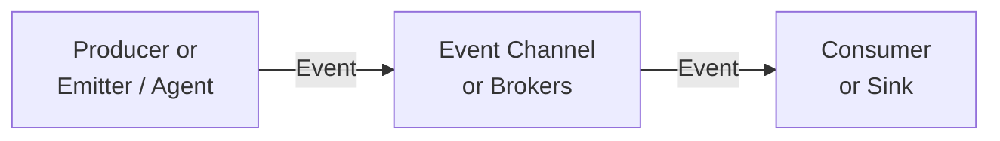

# Apache Kafka

No processing, only storing


## Event Driven Architecture

Is a modern application design pattern that is based on concept of loose-coupling and message-driven interaction. It is useful in large real-time dataasets.

**What is an Event?**

An event is any **change in state** for system hardware or software. It can be generated from web-UI, IoT sensors, or system jobs monitoring. Eg, new GPS coordinates of moving vehicle. A user clicking a button. The leading technologies for event-driven architecture are built to support trillions of events per day.

**Event Driven Architecture**



Here, **loosely coupled** or decoupled means that producer just sends event to sink and does not care if there is any consumer at all or how many consumers, or what happens with an event.

**Sinks** are responsible for **transforming** event as needed.

Link: [scylladb EDA](https://www.scylladb.com/glossary/event-driven-architecture/)

Streming architecture is form of EDA. It is built on technology like Apache Kafka.

It is based on pub-sub model. Where publisher produces events, and consumers consume events.

Event straming services like kafka publish stream of events to broker.

**Types of EDA**

There are two main kinds of event-driven architectures

- Message Queues
- Stream Processing

## Apache Nifi with Kafka


- distributed event store and _stream-processing_ platform
- stream processing compared to batch processing
- architecture it supports is scalable and makes data distributed, replicated and fault-tolerant, hence, allowing stream processing in real-time.
- it is based on pub-sub (publishing and subscribing) messaging system.
- kafka sends data in real-time to `topics`. data may be infinite and incomplete at time of query.
- consumers who process data can read topics.
- works on 3-nodes cluster.
  - use IP of three servers in configuration.

- **how it works**
  - kafka uses logs to store data and calls it topics. it is saved to disk as log file. they are horizontally scaled and partitioned.
  - producer can write to partitions as fire-and-forget, or synchronous, or asynchronous
  - consumers can read and be part of a consumer group, so that they consume from different partitions at fast rate.

- **configuration**
  - configuration connects zookeeper and kafka together, it is where you define the server and port to connect and data and log directories.
  - `zookeeper.properties` file has info on configs for zookeeper `dataDir`, `servers`, `clientPort`
  - kafka configs are in `server.properties` file, like, `log.dirs=`, `zookeeper.connect=`.

- **hello test**
  - create a topic, a producer, some messages, a consumer to read them.

  - create topic called 'dataengineering'
    - `bin/kafka-topics.sh --create --zookeeper localhost:2181,localhost:2182,localhost:2183 --replicationfactor 2 --partitions 1 --topic dataengineering`

  - list all topics
    - `bin/kafka-topics.sh –list --zookeeper localhost:2181,localhost:2182,localhost:2183`

  - write messages to topic
    - you can use console to add messages to a topic
    - `bin/kafka-console-producer.sh --broker-list localhost:9092,localhost:9093,localhost:9094 -topic dataengineering`

  - read messages from topic
    - you can read from beginning or define an offset if already read.
    - `bin/kafka-console-consumer.sh --zookeeper localhost:2181,localhost:2182,localhost:2183 --topic dataengineering –from-beginning`

  - whatever you write in producer appears on consumer after a lag. this shows the connectivity between two no you can use Python, Airflow/NiFi to build a pipeline.

- **Kafka data pipeline using NiFi**
  - use NiFi to build processors that act as producer and consumer.
  - Consumer can have multiple consumers in consumer-group.
  - later you can add it to prod pipeline as normal that is, read kafka -> staging, transformation, validation, loading, etc.

- **Batch vs Streaming**
  - if streaming data is unbounded (infinite), then you need to rethink of validating it for completeness, recalculate min, max and avg.
  - you can use `time-window` to make unbounded data bounded, that is, if 2022 records are fetched then avg for that year is calculated and will not change, however, new data for 2023 can still be unbounded and keep coming.
    - `fixed` - like 1 min, no overlapping
    - `sliding` - of 1 min, slides 10s, has overlapping
    - `session` - no time bound but event based, like log in to log out activity.
    - also the time can be `event-time`, `ingest-time` or `processing-time`

- **Producing and consuming with Python**
  - use library
  - import producer and consumer
  - add servers and topics, collect recept as callback.
  - `from confluent_kafka import Producer`

    ```python
    from confluent_kafka import Producer
    def receipt(err,msg):
        ...

    p=Producer(..)
    p.produce('users',m.encode('utf-8'),callback=receipt)

    from confluent_kafka import Consumer
    c=Consumer({... : ...})
    c.list_topics().topics
    t.topics['users'].partitions
    c.subscribe(['users'])
    while True:
      msg=c.poll(1.0)
      ...

    c.close()

    ```

