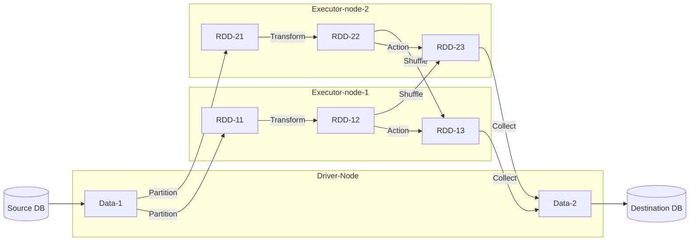

# Apache Spark

No storing, only processing

- **Apache Spark**
  - allows distributed parallel execution.
  - external data -> loaded to -> data frame -> which is -> RDD -> runs on -> different nodes within the cluster.
  - large-scale data processing as pandas.
  - InMemory to avoid diskwrites slowness  of mapreduce
  - Data Structure is RDDs
  - Interactive analytics are faster, just like we do in Jupyter where next step is based on prev.
  - Transformations - `filter()` map groupByKey union - give RDD
  - Actions - count first collect reduce - give single result
  - PySpark - Python API for spark, RDD as DataFrame so makes similar to Pandas.


## Spark Architecture and Execution

- Driver Node connects to DB-Source, reads Data-1
- Data-1 is broken into partitions (RDDs) and distributed to executors nodes for parallel execution.
- In each Executor, Transform operation happens locally, that is, no movement.
- Action operation, crates shuffle and data has to move. This may cause bottleneck.
- Drive Node collects back results.



## Parallelism

- Parallelism is required in all activities, else it becomes bottleneck.
- Spark supports parallelism out of the box
- Reads
  - JDBC - it lets read partitioned column values simultaneously
  - Kafka - each spark executor reads from subset of Kafka partitions
- Processing
  - Spark can do transformation, parallely on different executors.
  - Spark alo implements **predicate pushdown** which understands any filter during execution plan, and filter that data at the read itself, that is, it does not even read the data that is to be filtered out.
- Writes
  - Writing data to sinks is parallel out-of-the-box, each Spark executor can write to JDBC sinks in parallel. Similarly, Spark executors can write to Kafka topics in parallel too.

## Execution Plan

- Spark has Lazy Execution - only an action triggers execution.
- Spark Optimizer comes up with a physical plan. This plan optimizes for:
  - Reduced I/O
  - Reduced Shuffling
  - Reduced Memory Usage

## Spark Core

- The foundation of the overall project, it provides basic I/O functionalities, distributed task dispatching, scheduling, and fault recovery.
- It supports a wide range of data sources including HDFS, HBase, Cassandra, and S3.

## Spark Streaming

Enables scalable and fault-tolerant stream processing of live data streams. Data can be ingested from many sources like Kafka, Flume, and HDFS, and can be processed using complex algorithms.

In stream processing it is important to maintain the current state. It can help to resume a halted pipeline or restart on faliure.

- Checkpoints
  - Saves the job-state to persisted location (HDFS/S3)
  - recover job state on faliure and restart
  - save metadata and RDDs, like Kafka Offsets, state tracking by Keys, RDDs requiring transformation across multiple batches.

- Watermarking - It lets manage late data arrival in even-time window operations. Spark waits for data to arrive, keeps trak of events and ordering

- Keys Tracking - Keys can let track current state, key is modified if state changes.


## Spark SQL - Spark Analytics with Spark SQL

- Spark SQL is part of Spark whcih lets use SQL interface to interact with data.
- It supports batch and streaming.
- It lets analyse data in same pipeline.

## Spark ML Lib - Machine Learning with Spark

- it make easy to do, feature extraction, transformation, dimensionality reduction.

## Spark GraphX

- A distributed graph processing framework.
- It supports graph computation and provides an API for expressing graph analytics.


## Processing

**Batch Processing**

- Process data in batches with defined sizes and windows
- Source data does not change during processing
- Dataset is bounded
- High latency (data lags), creating output at the end of processing
- Easy to reprocess and get outputs

**Real Time Processing**

- Process data as they are created at source
- Source data may change during processing - it can be added, modified or deleted during processing
- Unbounded datasets
- Low-latency requirements (data is processed as it is generated)
- State Management - Need to keep track of things.

## Spark Installations

- Standalone Mode
  - download the spark, install it. This makes `bin/pyspark` available locally and you can do pyspark things.
  - simple and lightweight deployment mode for Apache Spark.
  - you set up spark-home, start master-node and worker-nodes.
  - They contact on TCP-IP, and then you can use spark.

- Cluster Mode

- Local Mode
  - local on single machine. without a cluster, is on a single thread.
  - eg, just install py package pyspark and you can build a sparksession and play with it. eg <https://gist.github.com/iYadavVaibhav/2f282e8fc34488ba150542033c9f2c82>


## Databricks

- It is managed spark service on cloud. You do not have to do cluster management, server setup, tuning and backup.
- You can spin up a new cluster from easy UI.
- Community edition is free with 6gb size.
- It lets you use cluster, execute notebook, lets persist data in files/tables.


## LL - Apache Spark Essential Training: Big Data Engineering

Link: [Apache Spark Essential Training: Big Data Engineering](linkedin.com/learning/apache-spark-essential-training-big-data-engineering-14259237)

Spark jobs are java classes with function doing specific work.

Spark splits data into RDDs based on key, they do single operation in one executor, multirecord-operation by swapping the data in between executors.

Spark can read and write to muptiple databases like rdbms, file, kafka etc.

Spark comesup with execution plan by analysing the whole code.

Spark lets maintain the state of job by IDs.

You can build hybrid of real-time and batch job using spark.

The code is java jobs, docker containers for source and sinks.

### Hands On

- Link [Apache Spark Essential Training: Big Data Engineering - Kumaran Ponnambalam](linkedin.com/learning/apache-spark-essential-training-big-data-engineering-14259237)

- Spark framework, here is a local JVM code, this is only for demo and testing purpose. Master/node/executors all are running on single JVM code. All you need to do is import the package and create a session with local master and node.

```java
import org.apache.spark.sql.Dataset;
import org.apache.spark.sql.Row;
import org.apache.spark.sql.SaveMode;
import org.apache.spark.sql.SparkSession;
```

- Docker images and containers
  - `maria db` - Just a MySQL RDBMS to store simple tables, exposing 3306
  - `redis` - For log?, exposing 6379
  - `kafka` - container running kafka on sigle node and exposing ports 9092, 29092
  - `zookeeper`, exposing 2181

- Install `Jdk 17` on ubuntu, setup `JAVA_HOME`.
- Install Java Extension, it builds all packages using `Maven`.

- Run the Setup file
  - Creates 3 database in maria db, create tables, and grants permission. Basically it does sql-init.
    - `warehouse_stock` DB
    - `global_stock` DB
    - `website_stats` DB
  
  - Setts up Kafka
    - create Kafka topic `spark.streaming.website.visits`
    - create Kafka topic `spark.streaming.carts.abandoned`
    - create Kafka topic `spark.exercise.lastaction.long`
- Setup file uses Kafka clients in Java to create topics

```java
import org.apache.kafka.clients.admin.AdminClient;
import org.apache.kafka.clients.admin.NewTopic;
```

- Setting local db
  - The fake generator, `rawStockDataGen` generates data for three warehouse, it puts in three database instances in Maria DB.

- Load from local-warehouse to central DB
  - now load to central parquet data file storage
  - a folder for each date, then folder for each warehouse, this has the parquet file. This is due to partition by stock-date and partition-id.

- Stock Aggregator Job
  - Now lets aggregate the jobs to know stock information for products across the globe.
  - This is computed on raw parquet files, using spark session, the spark-df is written back to RDBMS Maria-DB using multiple JDBC connectors for parallelism.

- Stock View from DB
  - lastly, we simply run a java code, to connect to MariaDb and display total count of grpup-summary table (no spark code here).

- To use mysql client
  - do `docker exec -it mariadb bash` where 'mariadb' is the container name.
  - once in container, do `mysql -u spark -p`, where spark is username and then enter password, which is spark as can be seen in `docker-compose.yml` file.

## Links

- [LL - Apache Spark Essential Training](https://www.linkedin.com/learning/apache-spark-essential-training)
