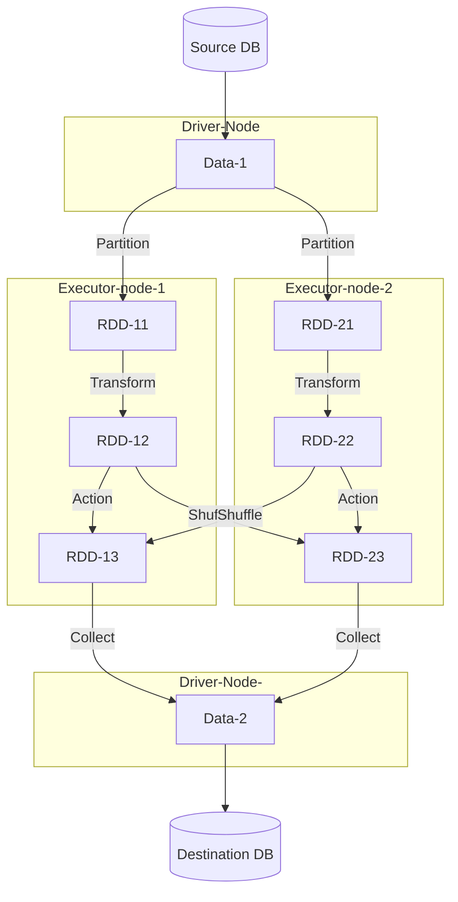
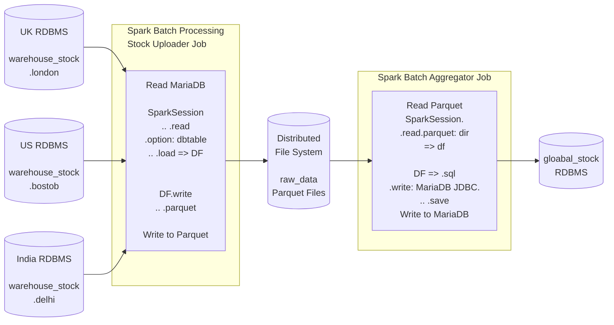
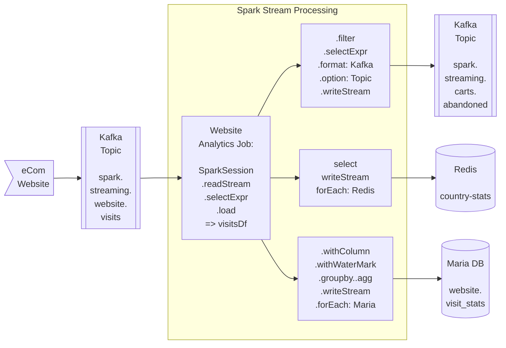
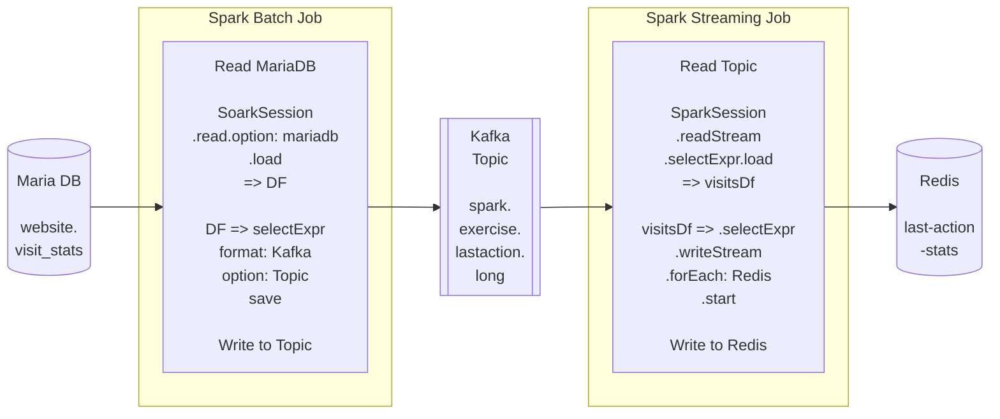

# Apache Spark

No storing, only processing

- **Apache Spark**
  - allows distributed parallel execution.
  - external data -> loaded to -> data frame -> which is -> RDD -> runs on -> different nodes within the cluster.
  - large-scale data processing as pandas.
  - InMemory to avoid disk-writes slowness  of map reduce
  - Data Structure is RDDs
  - Interactive analytics are faster, just like we do in Jupyter where next step is based on prev.
  - Transformations - `filter()` map groupByKey union - give RDD
  - Actions - count first collect reduce - give single result
  - PySpark - Python API for spark, RDD as DataFrame so makes similar to Pandas.


## Spark Architecture and Execution

- Driver Node connects to DB-Source, reads Data-1
- Data-1 is broken into partitions (RDDs) and distributed to executors nodes for parallel execution.
- In each Executor, Transform operation happens locally, that is, no movement.
- Action operation, crates shuffle and data has to move. This may cause bottleneck.
- Drive Node collects back results.



## Parallelism

- Parallelism is required in all activities, else it becomes bottleneck.
- Spark supports parallelism out of the box
- Reads
  - JDBC - it lets read partitioned column values simultaneously
  - Kafka - each spark executor reads from subset of Kafka partitions
- Processing
  - Spark can do transformation, parallelly on different executors.
  - Spark alo implements **predicate push down** which understands any filter during execution plan, and filter that data at the read itself, that is, it does not even read the data that is to be filtered out.
- Writes
  - Writing data to sinks is parallel out-of-the-box, each Spark executor can write to JDBC sinks in parallel. Similarly, Spark executors can write to Kafka topics in parallel too.

## Execution Plan

- Spark has Lazy Execution - only an action triggers execution.
- Spark Optimizer comes up with a physical plan. This plan optimizes for:
  - Reduced I/O
  - Reduced Shuffling
  - Reduced Memory Usage

## Spark Core

- The foundation of the overall project, it provides basic I/O functionalities, distributed task dispatching, scheduling, and fault recovery.
- It supports a wide range of data sources including HDFS, HBase, Cassandra, and S3.

## Spark Streaming

Enables scalable and fault-tolerant stream processing of live data streams. Data can be ingested from many sources like Kafka, Flume, and HDFS, and can be processed using complex algorithms.

In stream processing it is important to maintain the current state. It can help to resume a halted pipeline or restart on failure.

- Checkpoints
  - Saves the job-state to persisted location (HDFS/S3)
  - recover job state on failure and restart
  - save metadata and RDDs, like Kafka Offsets, state tracking by Keys, RDDs requiring transformation across multiple batches.

- Watermarking - It lets manage late data arrival in even-time window operations. Spark waits for data to arrive, keeps track of events and ordering

- Keys Tracking - Keys can let track current state, key is modified if state changes.


## Spark SQL - Spark Analytics with Spark SQL

- Spark SQL is part of Spark which lets use SQL interface to interact with data.
- It supports batch and streaming.
- It lets analyse data in same pipeline.

## Spark ML Lib - Machine Learning with Spark

- it make easy to do, feature extraction, transformation, dimensionality reduction.

## Spark GraphX

- A distributed graph processing framework.
- It supports graph computation and provides an API for expressing graph analytics.


## Processing

**Batch Processing**

- Process data in batches with defined sizes and windows
- Source data does not change during processing
- Dataset is bounded
- High latency (data lags), creating output at the end of processing
- Easy to reprocess and get outputs

**Real Time Processing**

- Process data as they are created at source
- Source data may change during processing - it can be added, modified or deleted during processing
- Unbounded datasets
- Low-latency requirements (data is processed as it is generated)
- State Management - Need to keep track of things.

## Spark Installations

- Standalone Mode
  - download the spark, install it. This makes `bin/pyspark` available locally and you can do pyspark things.
  - simple and lightweight deployment mode for Apache Spark.
  - you set up spark-home, start master-node and worker-nodes.
  - They contact on TCP-IP, and then you can use spark.

- Cluster Mode

- Local Mode
  - local on single machine. without a cluster, is on a single thread.
  - eg, just install py package pyspark and you can build a `SparkSession` and play with it. eg <https://gist.github.com/iYadavVaibhav/2f282e8fc34488ba150542033c9f2c82>


## Databricks

- Lake formation tool. More on [Databricks Notes](./databricks.md)


## LL - Apache Spark Essential Training: Big Data Engineering

Link: [Apache Spark Essential Training: Big Data Engineering](https://linkedin.com/learning/apache-spark-essential-training-big-data-engineering-14259237)

**Learnings**

- Spark jobs are java classes with class-methods doing specific work.
- Spark splits data into RDDs based on key, they do single operation in one executor, multi-record-operation by swapping the data in between executors.
- Spark can read and write to multiple databases like rdbms, file, kafka etc.
- Spark comes up with execution plan by analysing the whole code.
- Spark lets maintain the state of job by IDs.
- You can build hybrid of real-time and batch job using spark.
- The code is java jobs, docker containers for source and sinks.
- Spark can consume from Kafka in real time.
- Spark can publish a Kafka queue in real time.
- Spark can read write to S3, parallelly
- Spark can read write to RDBMS, parallelly

**Project Architecture**

- RDBMS Maria DB
  - Runs in docker as MariaDB. Change it to Postgres. `image: mariadb`, `ports: 3306`
  - has different data warehouse as databases
  - Three different databases, represent different purposes
    - `warehouse_stock` DB - has different schemas which have data from different regional warehouse data.
    - `global_stock` DB - has combined worldwide processed stock numbers
    - `website_stats` DB - has processed stats
  - Schemas in `warehouse_stock` DB, represent warehouses
    - `UK-warehouse`
    - `US-warehouse`
    - `IN-warehouse`

- Kafka
  - Runs in docker. `image: 'bitnami/kafka`, `ports: 9092`.

- Spark

- Redis

- Zoo Keeper

- Docker
  - runs 4 container for `mariadb`, `kafka`, `redis` and `zookeeper`.

- Java
  - need to be installed on system to run the project. Also needs build tools.

- Ch 3 - batch processing
  - An enterprise has warehouse across the globe. Each has local data center.
  - Stock data for each each item, each day
    - Opening Stock - number of items in warehouse
    - Receipts
    - Issues
  - Do Batch Processing to
    - Build Global Database with information from each country warehouse.
    - Gather and upload data to central cloud storage like S3.
    - Scalable to hundreds of warehouse.



- Ch 4 - Real time processing
  - eCom website like Amazon
  - Publisher publishes stream of website events like
    - visit date
    - last event - Catalog/FAQ/ShoppingCart/Order
    - duration
    - country
  - Do real time processing to
    - Aggregate Five Second summary by last action - each 5s, compute summary and store in RDBMS
    - Count number of visits by country - Running Counter
    - Store data of event Abandoned Shopping Cart for further downstream processing - like send email that we have save it for you and it is awaiting checkout.



- Ch 6 - End to End project - Hybrid Pipeline



**Project Hands On**

- run docker compose to start containers
  - Run using `docker compose -f spark-docker.yml up`
  - It runs following containers
    - `maria db` - Just a MySQL RDBMS to store simple tables, exposing 3306
    - `redis` - For log?, exposing 6379
    - `kafka` - container running kafka on single node and exposing ports 9092, 29092
    - `zookeeper`, exposing 2181

- Java Installation
  - Install `Jdk 17` on ubuntu, setup `JAVA_HOME` to `export JAVA_HOME=/usr/bin/java`.
  - Install Java Extension on vscode, it builds all packages using `Maven`.

- run project setup `SetupPrerequisites.java`
  - Build Database Structure, DDL Only
    - For each warehouse database
      - Check databases, create if not created to avoid dupes
      - create databases using schema
      - create table using schema
      - grand privileges
      - flush privileges
  - creates kafka topics
    - Create 3 new kafka topics
      - `spark.streaming.website.visits`
      - `spark.streaming.carts.abandoned`
      - `spark.exercise.lastaction.long`
      - For each topic, check present topic list, if not exists, create it.
      - [ ] read more on what/how to create kafka topics.

- Ch 3 Setting local db, run `rawStockDataGen.java`
  - It generates data for three warehouse, it puts in three database instances in Maria DB.
  - `generateData(warehosue="")` function, for each warehouse, it inserts fake data.
    - executes insert statement to generate 3 days data.

- Ch 3 - Spark Read then Upload - using `DailyStockUploaderJob.java`
  - Read Daily Stock from RDBMS to FileStorage
  - The function `uploadStock(String startDate, String endDate, String warehouseId)`
    - Runs query to find min and max id, in between dates in a warehouse. This gives binds.
    - Create SparkSession
      - define host, partition, parallelism, job-name etc.
      - everything is done using this session object, `spark`
    - Read from RDBMS using Spark Session Object into Spark-DataFrame
      - create a query to read from RDBMS
      - pass this query to `spark.read().option()`
      - it returns Spark DataFrame, `stockDF`
    - Write Spark-DF to File-Storage (normal file/HDFS/S3 logic is same, config change)
      - `stockDF.write()` add `partitionBy()` and `parquet(path:)`
      - a folder for each date, then folder for each warehouse, this has the parquet file. This is due to partition by stock-date and partition-id.
    - Close Spark Session
      - `spark.close()`

- Ch 3 - Spark Processing - using `StockAggregatorJob.java`
  - Aggregate uploaded Stocks Data by reading from file-storage
  - This is computed on raw parquet files, using spark session, the spark-df is written back to RDBMS Maria-DB using multiple JDBC connectors for parallelism.
  - In function, `aggregateStock(String sourceDir)`
    - Create spark session
    - Read parquet files at sourceDir to get SparkDF
    - Load from spark-df to view using `stockDF.createOrReplaceTempView("GLOBAL_STOCK");` Adds view `GLOBAL_STOCK` to RDBMS.
    - Read loaded data using `spark.sql("query").show()`.
      - Group by items, date and aggregate all measure values. You loose, country information.
      - This is only to print grouped results.

- Ch3 - Browse RDBMS data, using `GlobalStockDBBrowser.java`
  - lastly, we simply run a java code, to connect to MariaDb and display total count of group-summary table (no spark code here).
  - alternatively, you can directly run query on RDBMS using various methods.
  - To use mysql client
    - do `docker exec -it mariadb bash` where 'maria-db' is the container name.
    - once in container, do `mysql -u spark -p`, where spark is username and then enter password, which is spark as can be seen in `docker-compose.yml` file.

- Ch 4 - Solution
  - `spark.streaming.websites.visit` is publisher that has events data pushed from website whenever user exists the website.
  - Spark Job 'website analytics job' is consumer for this queue. Now it runs 3 actions on the data received
    - Compute 5 sec summary and insert in RDBMS Maria DB, `website.visit_stats`
    - Running Counter in Redis Socket Set `country-stats`
    - Filters event having abandoned shopping cart and publishes them to Kafka Queue `spark.streaming.carts.abandoned`

- CH 4 - Generate Kafka Stream
  - Code generates Kafka events, this is JSON data that tells lastAction, duration, country, datetime.
  - Loop 100 times, to generate 100 events, in each loop
    - Using `KafkaProducer` you can create producer.
    - Using `ProducerRecord` you can make a JSON record in a topic, to add to producer.


    ```java
    import org.apache.kafka.clients.producer.KafkaProducer;
    import org.apache.kafka.clients.producer.ProducerRecord;

    ...
    for 1...100:
        Producer<String,String> myProducer
                        = new KafkaProducer<String, String>(kafkaProps);
        ...
        ProducerRecord<String, String> record =
                                    new ProducerRecord<String, String>(
                                            topic,
                                            recKey,
                                            value );

        RecordMetadata rmd = myProducer.send(record).get();
        sleep(1000);
    end For;
    ```

- Ch 4 - Spark Stream Processing
  - Now that we have kafka events in a topic, we can consume them using spark streaming.
  - reads a real time website visits stream from kafka
    - Updates 5 second summaries in MariaDB
    - Updates a Country scoreboard in Redis
    - Updates a Kafka topic, when shopping cart is the last action.

  - You create a spark session `spark = SparkSession.....getOrCreate();`
  - Read into data frame using, `df = spark.readStream().format("kafka")......load();`. you subscribe to topic here.
  - Next, use query to read data as required from this broker, into DF
  - Use DF.writeStream().foreach(ForeachWriter( open.. process.. close.. )) to write. open, process, close - are implemented in `RedisWriter.java` and `MariaDBWriter.java`.
    - Filter from df to find `action: Shopping Cart` and then publish this to a kafka topic, `spark.streaming.carts.abandoned`.
    - Filter, from df, to filter country info and write it to redis counter.
    - Use, **WaterMark** feature of spark to group by and aggregate the data every 5 seconds, and write to RDBMS MariaDB.
  
  - Now our Spark-Streaming Pipeline is writing to 3 different places, RDBMS, Redis, Kafka-Topic.

  - Browse the written data
    - Display the published abandoned shopping cart event using,`ShoppingCartTopicBrowser.java`. Reads by subscribing to topic using Spark Session.
    - Display Redis counter data using, `CountryStatsBrowser.java` every 5 seconds. No spark, connect to Redis and print.
    - Browse Stats DB using, `VisitStatsDBBrowser.java` every 5 seconds. No spark, connect to MariaDB and print.

- Ch 6 - Exercise to make Hybrid pipeline having Spark Batch Processing and Stream Processing
  
  - Spark batch Processing
    - Read from MariaDB every night and save to Kafka Topic, use `LongLastActionExtractorJob.java`
      - Create session
      - connect to mariaDB
      - execute Query
      - get DF
    - Write to kafka Topic
      - DF, selectExpr
      - create topic, `spark.exercise.lastaction.long`
      - save to topic
  - Spark Streaming Processing
    - Subscribe to Topic
      - create sparkSession
      - readStream to read from topic, `spark.exercise.lastaction.long`
      - load it to DF
    - Write to redis counter
      - DF, selectExpr
      - writeStream using foreach and process data to write to redis.

**Java Classes**

- Kafka
  
  ```java
  import org.apache.kafka.clients.admin.AdminClient;
  import org.apache.kafka.clients.admin.NewTopic;
  ```

- `Spark`
  - framework, here is a local JVM code, this is only for demo and testing purpose. Master/node/executors all are running on single JVM code. All you need to do is import the package and create a session with local master and node.

  ```java
  import org.apache.spark.sql.Dataset;
  import org.apache.spark.sql.Row;
  import org.apache.spark.sql.SaveMode;
  import org.apache.spark.sql.SparkSession;
  ```

## Links

- [LL - Apache Spark Essential Training](https://www.linkedin.com/learning/apache-spark-essential-training)
