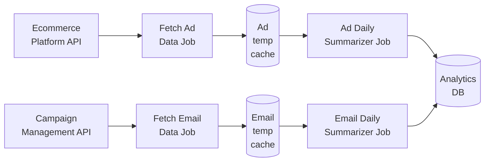
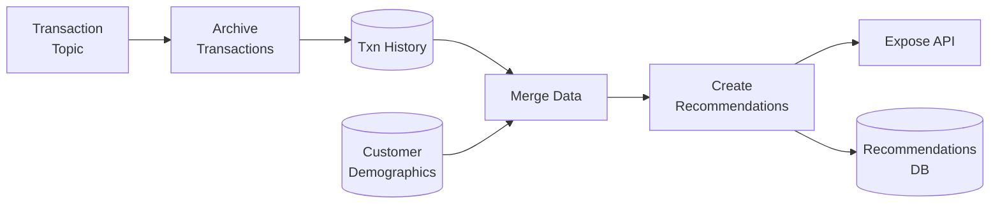

# Big Data

## HDFS

Cheap large scale distributed data storage, that can scale horizontally. Alternatives are S3, Azure Blob. It is only storage, not a processing thing.

## Map Reduce

Processing algorithm.

As of 2022, it has better alternatives, like Apache Spark and Flink. MR is slow as it keeps cache in disk while new technologies keep cache and processing in memory. New technologies also have better connectors and more libraries.

## Big Data Applications Architecture

**Single vs Multi Record Operations for Parallelism**

Records involved | Operation | Method to allocate in cluster
-- | -- | --
Single record processing | Filter, transform, Map | Round robin to available nodes
Multi record in group processing | Group based processing | Using a key to distribute across nodes
Multi record in group processing | Aggregation by key | Distribution based on aggregation key
All record processing | Global Aggregation | Multistep aggregation to reduce load on single node

Here, Filter map and transform can be on a record, hence on different node but aggregation needs all records, hence would need to be done on multiple nodes, so should be done after above operations.

These should be individual jobs, like job 1 does filter, job 2 enrich, job 3 aggregate. So each job can be tweaked to run on single vs multiple nodes and hence can be provided different compute power. If your all process in etl need same scalability then all of them can be in one job.

**Key based Parallelism for Concurrency**

Key based distribution ensures, all records of one key is executed on single node, but different keys can work on different nodes. Eg, total sales by customer. This can be distributed by customer-key, one customer-key is executed on one node, so that it gets all sale records of that customer, and then other customer-keys can be processed by other nodes on cluster, this ensures parallel execution in multi-records processing.

Note that, **Selecting key is critical** to ensure all nodes are used, and all data is **evenly distributed** on all nodes.

**Batch Processing**

- Job should be scheduled such that there is gap if job overruns. There is no peak on one job, jobs should divide data in a good way. Job have balance between latency and resource usage.
- Minimize the data at source. Do not use same data for multi pipelines, minimize the data. Use, where clause, select less, use partition in parquet file.

**Clustering in Big Data Technologies**

Big Data technologies are deployed in **Cluster**, be it

- `Spark` for processing
- `HDFS` for storage, `Impala` to query this stored data.
- `Kafka` for queuing

As the load increases, we simply **add more nodes** to the cluster to **scale horizontally**.

**Data Caching**

- Can be done on static or near static data, eg gender, demography; these data are static and rarely change.
- Is much faster than database query
- Eg, get category name for category code, it is much faster from cache, like Redis cache.

**Reprocessing**

- You may need to reprocess when a batch fails, or new data comes while processing or other circumstances. In any of it, the pipeline should ensure:

  - batch is repeatable, based on time or key.
  - processing logic should not double count the records

### Use Case: Audit Trail Data

Consider a use case, where you an ecom website generates user activity log data, which is about 3GB per day. It is stored in Oracle DB. In 15 days the size reaches about 30GB. Oracle DB only keeps last 15 days audit data to keep size about 30GB.

The analytics team, need at leasy 3 years of audit trail data, so that they can find patterns and take decisions. This will need 10 terabyte scalability.

Evaluate the functional / non-functinoal requirements.

You need to create an ETL job that can read new data from Oracle DB in hourly batches, do the transformation to remove customer name and load it.

The hourly batch ETL job should be designed so that it can concurrently read, transform parallely and concurrently and load it parallely, so that the ETL is fast.

The load db technology should be such that is can scale, is cheap, is mature, can be queries by SQL.

Evaluate load technologies like, MySQL / MongoDB / HDFS+Impala. MySQL might get difficuly to scale, MongoDB is preferred for documents. HDFS+Impala seems ideal choice for this.

Evaludate ETL technologies like, Apache Pig / Apache Spark. Both can let read from RDBMS using ODBC, Both can let write to HDFS, both allow concurrent processing. However, in performance Pig is slow as it uses map-reduce on disk, while spark is fast as it uses in-memory processing. Hence, we can pick spark for ETL job.

**Considerations**

- Spark lets concurrent processing, the ETL task is divided into multiple spark-tasks in spark cluster.
- Use hashing-algorithm on audit-ids, so that each tasks can pick certain records.
- Each thread can write to different HDFS partitions concurrently based on hashing algo.
- Organise HDFS folder by dates, this gives natural indexing for querying.
- If required, you can add more nodes for horizontal scaling of ETL/Load, as Spark/HDFS support horizontal scaling.

The scaling also depends on how often Orcale DB (source), allows to read. Also, how much load can you put on DB to read, as it would be used by other applications. Oracle does allow concurrent reading with multiple connections and hence spark can make use of spark tasks.

### Use Case: Advertising Analytics

Consider an ecom website using email and ads for marketing. They want to know the effectiveness of both the channels. They send 1 million email each day using an enterprise tool. Ads generate revenue of 0.75 million per day.

The data for both these channels is not at one place. The analytics team need both data sets for last 3 years for proper analysis.

The data channel offer API based access, whcih has limitation like can call api in 15 mins, API only gives JSON dumps or CSV downloads.

**Functional Requirements**

- aquire data daily, build temp-cache
- aggregate data and compute summaries
- store summary to analytical db
- provide sql access to db

**Non-functional Requirements**

- Scalability - 1m email, .75m revenue, 3 year data
- Availability - downtime of 1 hr is okay
- Latency - day summary within 24 hours
- Security - authenticated access only

There will be two pipelines, each dump the data in local file-temp-catch, then this is aggregated and loaded to analytics db.

**Imp:** The ETL jobs for big data are different in a way that they should scale horizontally. This has to be thought when designing the job, is the technology you are using ready scale horizontally, can it read, process and load concurrently.

**Scaling Opportunities**

- Work can be divided among nodes using composite key on name-age-gender-etc.
- summarizers can run parallel task based on this key.
- analytical db can provide concurrent write based on this key.

**Scaling Limitation**

- API rate limiting, you cannot make concurrent calls to API at unlimited rate
- temp-file-caching has write limit, choose this tech as required.

**Tech Stack**

- For API extraction you can use SDK by API provider but this may not scale. You can build API call, by making con-current threads or process using Java/Python.
- For Cache, since it will be granular, it will be huge, use HDFS for scaling.
- Summarization, use apache spark.
- Analytics DB, need cocurrent writes, good SQL analytics capability, here MySQL wins over Mongo and HDFS+Impala.

### Use Case: Product Recommendations

Consider e-com company XYZ with 20m users and 200k txns a day. XYZ wants to scale by recommending products based on user behaviour.

- create a pipeline that recommends products based on user transactions. Pipeline has a ML model that can give recommendation via API.

- Goals
  - scale to user base
  - consider user recent history
  - daily updates
  - recommend in real time with low latency

- Inputs
  - user age, demographics via RDBMS SQL Query
  - Transactions via Kafka Topic

- Output
  - recommended items avilable in db, with ranking by customer id.
  - real time query
  - scale beyond 10m user base.

Scaling should support to do these concurrently.

**Scaling Limitations**

- Recommendation model API capacity may limit concurrency.
- RDBMS read for demographics may limit, but can be cached.
- Recommendation DB should be update friendly.

**Tech Stack**

- **Txn History DB** - we pick MongoDB as it support concurrent IO/ nested docs / scaling and high availability. HDFS has no out of the box support for nested / m-m relationship requirement.
- **Recommendations DB** - Cassandra as it supports update, fast query by id, scalability and availability. HDFS has no fetch by ID, RDBMS has no high  scaling and availability.
- **Processing Jobs** - Spark.

**Link:** [LL - Architecting Big Data Applications: Batch Mode Application Engineering](https://www.linkedin.com/learning/architecting-big-data-applications-batch-mode-application-engineering-22882694)

