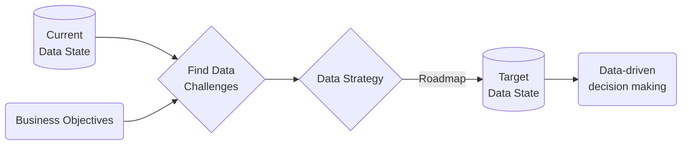
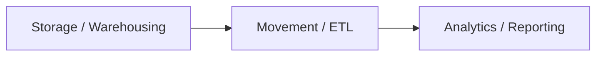

# Data Solutions

*Here are all the "conceptual" notes related to data soulutions, archirecture and engineering. It can have links to practical notes.*

## Data Strategy

To meet medium or long term business objectives, many aspect of organisation need to work in harmony - all in same direction. **Data Strategy** underpins business strategy and sets agenda for IT delivery **roadmap**. Basically, it defines where and how data supports orgs critical business process. It includes **data challenges** and **unlocks opportunities** by using right strategy and solution in place, thus achieve the business objectives. Eg, if all tables have key to trace back?; all row have identifier; data is being captured; data can be tied up at all hierarchies and dimensions.

**Steps to build a Data Strategy**

- understand the business objectives. Eg, how often are email responded. why the money is going?
- assess how data is stored and consumed in org.
- understand current data challenges. Eg, not being captured. isolated availability with no link up or down. non traceble data. stale data. not connected to pipeline or lake.
  - how can you collect data, apply data
- work with business to define optimum target state to meet business objectives, incorporating
  - data architecture and engineering
  - data management and operating model
  - data analytics, reporting and visualization - or business intelligence
- build a road map for data journey, define actionable data strategy.

## Data Architecture

*Now that you have a strategy with known challenges and a roadmap to target state, it is time to build the architecture and do the engineering work aligned to roadmap to rach the target state.*

Data Architecture defines the **blueprint** for managing data from **collection** to **storage** and **transformation** to **consumption**. It is base foundation to support business objectives. It is essential to determine the sharp and quick tools that solve the purpose.

**What to Architect**

- determine cloud architecture or on premise.
- if required how can data be scalable, avilable and fault tolerant
- big data architecture

**Parts of Data Architecture** - Aim is to achieve below safely

- E - extract / connect - have automated connectors and access permissions, to sharepoint, salesforce, sharedrive, etc. Int and ext.
- L - load / store - all in one place, MSSQL, DVS, Hive, so you can build mart and combine.
- T - transform / transport - integrate, transform, clean, aggregate, filter. Determine the best tool to do the job. Python, SQL, Prep, Alteryx?
- P - present - right viz tool, dash, tableau. Keeping the end user in mind.
- Analogy - Load:HTML :: Transform:JavaScript :: Present:CSS

## Data Transformation

### ETL & Data Pipeline

**ETL - Data Pipeline** - Help move data from source to target with transformations in between. Challenge and skill is to build an efficient, reliable and automate pipeline that can help connect sources to lake/warehouse/mart. Big Data pipelines. Batch and Event Driven or real-time.

- Big part of design of warehouse.
- usually a weekly or nightly batch job that updates data warehouse.

### Data Virtualization

- It is used to connect and query different data sources, transform it. It **does not store** or move the data. Query goes down to source systems.
- Eg, Tibco Data Virtualization.
- Link - [Difference in ETL & Virtualization](https://community.denodo.com/kb/en/view/document/Data%20Virtualization%20and%20ETL)

## Data Analytics, Reporting & Visualization

Flat data, denormalized is best to query for visualization.

**Steps to follow**

- understand
  - requirement gathering,
  - data dicovery
- design and develop
  - tool selection - correct tool for need, right tool for viz/reporting, tableau, Plotly, D3, OBIEE, self-serve;
  - data modelling - reporting view prep, what needs to be shown should be a row of data, add hierarchy to roll up and down.
  - story telling - art of making data easy to understand, animations, live?
  - test - numbers help make decision
  - distribution - mobile, pdf, interactive, embed (portal),
  - actionable insight - (optional) let user do actions right from report. (write-back)
  - usage analytics - (optional) but really useful in determining ROI

## Links

- [Oracle - Data Warehousing Concepts](https://docs.oracle.com/en/database/oracle/oracle-database/21/dwhsg/introduction-data-warehouse-concepts.html#GUID-452FBA23-6976-4590-AA41-1369647AD14D)
- [Data Company - Dufrain](https://www.dufrain.co.uk/)
- [Ralph Kimball - Data Warehousing and BI Author](https://en.wikipedia.org/wiki/Ralph_Kimball)

## ToDo

- [ ] - link this with project management notes to have a road map to follow when starting a new data solutions project.
- [ ] - align <https://careers.dufrain.co.uk/jobs/2225356-senior-data-engineer>
- [ ] - Experience working with one or more of - Spark, Hadoop, Kafka, Snowflake, airflows
- [ ] - Experience building Data Modelling, ETL / ELT pipelines, Data Lakes, Data Warehousing, Master Data
- [ ] - A solid understanding of key processes in the engineering delivery cycle including Agile and DevOps, Git, APIs, and Data Pipelines.

