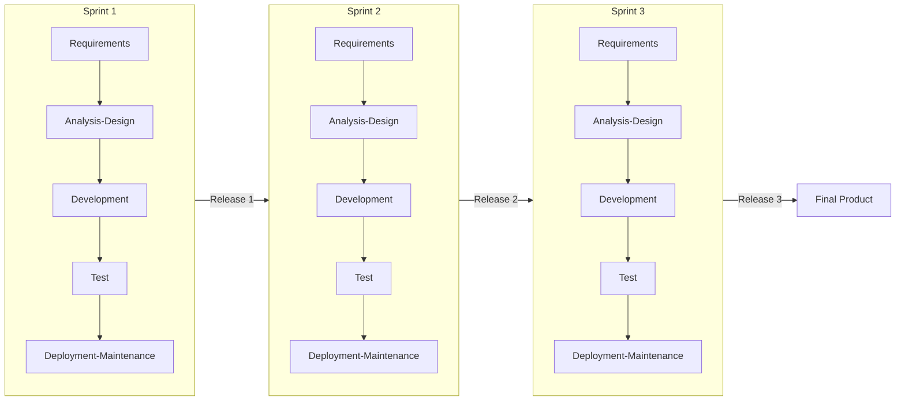
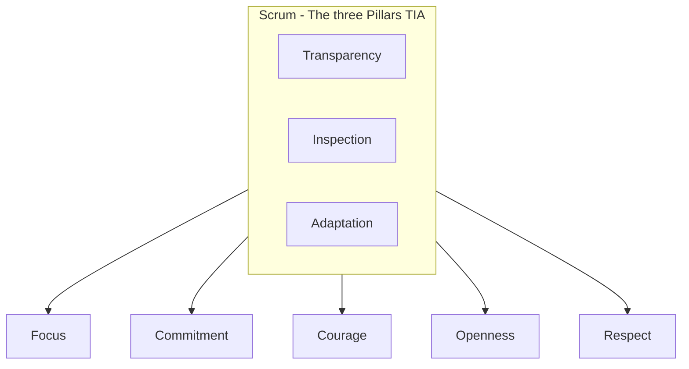
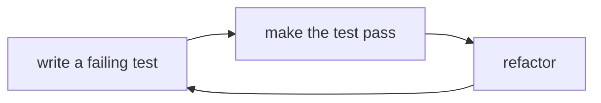
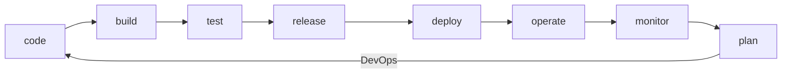

# Agile, Scrum and Sprints

_all about agile, scrum, sprints_

Agile is **methodology** that helps you move away from waterfall methodology of software development. Agility is a **mindset**. It helps **adapt** to changes which are inevital in software development.

## Agile Approach

It is **interactive** and **incremental**, it not that you need to develop like manufacturing unit. It lets you develop interactivily with business users and lets you do incremental developments with entire development cycle involved in each increment and using **best practices** like TDD, XP, CI CD. Making flat structure and having a **collective ownership**. Having **customer satisfaction** as top priority. Keeping **people over process**, and always **welcome change** as it is inevitable. **Frequent feedback** from business people and developer is required and they **work daily together**. The measure is working software and **value** it brings. All this can be facilitated by Scrum.

Following shows small batch of development lifecycle

## Scrum

Scrum is a framework that facilitates development in an agile way, it is not a methodology. Scrum has three pillars on which Scrum values are defined. Empiricism – don't predict but keep adjusting based on situations. Scrum makes it possible. Feature over document.

The three pillars are:

- Transparency - be transaparent with work and team members. share progress and artifacts
- Inspection - have boards, dashboards ready to inspect
- Adaptation - adapt to change based on inspection, what needs to be corrected.

## Scrum Roles

Three team roles – product owner, scrum master, developers

- **Product Owner**
  - A person who created backlog and shows vision of stakeholder
  - Build backlog and prioritise

- **Development Team** – 3-9 members, flat structure, all own everything, collective ownership

- **Scrum Master** – make product owner and developers align to scrum practise, solves conflicts, coaches individuals to implement scrum

## Scrum Events

- **Sprint** – is time bound container event

- **Sprint Planning** – what to work on and how
  - Ahead of our sprint planning:
    - Please update your capacity for the next sprint. link
    - Please create, estimate and assign tasks with "definition of done" DoD
    - Update tasks in current sprint.
  - Meeting for 2-4 hours for 2 week sprint
  - Know Memebers, their role, capacity and leaves. Ideally tabular.
  - In Last Sprint
    - Ensure all tasks are updated - in review, done or whatever
    - End the sprint and move all unfinished tasks to backlog or new sprint
  - Start & End Date - know and update it
  - Sprint Goal(s) - have predefined and refine at end
  - Tasks to have
    - Acceptace Criteria
    - Definition of Done - covers product coming out of the sprint
    - Estimated and assigned
    - Reestimate tasks carried forward

- **Daily Scrum** – keep on track

- **Sprint Review** – reviews work

- **Sprint Retrospective** – discuss to be more effective
  - What did we do well?
  - What should we have done better?
  - actions to take based on "What should we have done better"
  - actions taken from last retro actions? else carry them
  - Learnings
    - don't under estimate tasks
    - keep buffer capacity for meetings/PR-requests

- **Backlog Grooming / Refinement** (unofficial event) – break large items into small implementable items
  - Break stories into smaller **tasks**
  - Tasks have "Definition of Ready" DoR - covers requirements coming into the sprint
  - Tasks are **prioritized**, estimated
  - Tasks may get assigned
  - 1-2 hour productive meeting
  - [link](https://www.productplan.com/glossary/backlog-grooming/)

- **Backlog Grooming vs Sprint Planning**
  - Scope - BG looks at entire project for months, SP looks at near future for weeks
  - Grain - BG breaks into tasks, SP breaks in to sub-tasks
  - Detail - BG adds DoR, SP adds DoD

## Scrum Artifacts

They are either done or not done

- **Product backlog** – has large and small tasks, small can be picked, large are broken in grooming
  - Requirements
  - Enhancement requests
  - Defects
  - User stories
  - New feature

- **Sprint backlog**

- **Product increment** – done version, product itself, has value and is usable, not necessarily a release but is polished enough to be shippable.

## Excellence in Development

Excellence in development help align with scrum principles like flat structure, collaborative ownership, welcoming change and frequent releases. One such methodology is **Extreme Programming** (**XP**) . It is standards that lets program effectively. Agile team combine XP programming with scrum to be highly productive. It has following ways of working:

- **Execution** – small tasks in scrum, whole team is accountable, readily changeable

- **Incremental Design** – not all at once, by one by one, refactoring code. Code 10 mins and run test – it gives quick feedback on quality.

- **Pair Programming** – two individual on one machine,  one types another reviews and suggested and they swap
  - Instant peer review, improved code quality
  - Knowledge sharing – helps become T-shape knowledge than I-shaped
  - Inclusiveness, more interactions, less distractions.  

- **Test Driven Development** - TDD
  - do not code until you fail a test
  - First write a test to fail, then code to pass the test, then improve the test to fail and complete the code to pass. Repeat it.
  - Think of test before implementation
  - There are tools to mock dependencies to function, it makes tests easy.
  - Coverage is good to be 100%.
  - Removes bugs in monolithic code, in early stage

- **DevOps**
  - Problem – release bringing changes that can break prod. Agile brings frequent releases, hence frequent break in prod.
  - Solution – a methodology that brings, development, QA and IT operations close together, automated and test driven, container based to have isolated similar environment so that the changes are minimal and are tested and hence don’t break.
  - Continuous integration – commit frequently, trigger build and test automatically to identify risks
  - Continuous delivery and deployment – code is delivered and deployed continuously in prod
  - Devops and Agile are mindset shift that remove hand-off in teams and bring them together with collective responsibility using automation in tests and builds.

## User Story / Tasks

- **User Story** - it is user requirement in sticky note – having requirement in form "As a … I want… so that I .. . Done when..", where
  - `As a..` - user role who will be benefited
  - `I want...` - what feature or outcome
  - `So that I...` – reason why this needs to be done
  - `Done when...` - acceptance criteria
  - User story is a promise, not a contract. It can be small or large task or an epic.

- **Epic** – large user story, a process to large to be estimated

- **Themes** – groups epic with tags

- **Estimations**
  - absolute it days, hours
  - relative is estimating based on story relative to other stories. Use fibrinocci – 1,2,3,5,8,13. or exponential scale. 1,2,4,8,16. Or t-shirt size. Xs,s,m,l,xl.
  - Planning poker – lets users share a score. Have discussion based on score, why 3 or 8. Play again to get closer score. Discuss again, until you get same score from team members

## Agile reports

- **Burndown** – work left and time to do

- **Burnup** – work done and time to do

- **Cumulative  Flow Diagram** – CFD – shows work done by state – to-do, in progress, done. Mostly used in Kanban, show bottleneck like acceptance is taking more time or developing, or delivering.

## Kanban

- Kanban – lean manufacturing principles like cars. Work process management methodology
  - Little’s law = work in progress L = completion rate ($\lambda$) X cycle time (W)
  - $L = \lambda \times W$
  - Visual mode to track.
  - WIP is limited as we are not good multi-taskers. Every stage has a WIP limit. Like you can have on 2 tasks in progress, or 4 in review, the other tasks can come in only if the previous ones are done.

- [ ] How to use Kanban or Agile for personal management.

## Jira - Atlassian

Jira is a work management tool. We can create `Project`, which can have `issues`. Issues can be in `backlog` or can be part of `sprint`.

**Issues** mostly have:

- Summary - one liner
- Type - task / story / subtask / bug / epic
- Description - As a.. I want to.. so that.. - has definition of done
- Reporter - Person who creted this
- Assignee - Person who will do this
- Status - Backlog / ToDo / In Progress / In Review / Done
- Epic Link - Broader work
- Story points - Estimate of duration
- Linked Issue - Dependencies / blocker
- Priority - Trivial / Critical / High / Medium / Low
- Version/Release

Issues can be arranged and managed by versions / epics / sprints. **Hierarchy** is by portfolio outcome, business outcome, epic, task, sub-task.

**Boards** are used to displays issues and to track progress of project(s). **Kanban** is simple board, shows tasks on board with swimlanes and state. Also

- Scrum is Ajile board concentrated on backlog and Sprints.
- Dashboards can display activity, filters, boards etc
- Filters can be created and shared. They have search criteria, can add JQL (Jira Query Language) to it.
- Project - can have confluence page to have documentation of project

## Links

- [Your step-by-step guide to running a Sprint Planning meeting effectively](https://www.getclockwise.com/blog/effective-sprint-planning-meeting)
- [Gantt Charts in PowerPoint - simple easy](https://www.officetimeline.com/gantt-chart/how-to-make/powerpoint)

