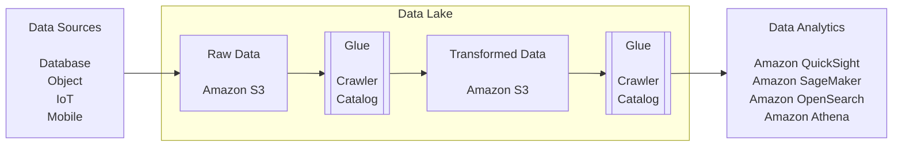

# AWS DEA-C01 Preparation

## Exam Parts and Weighting

- 34% [Data Ingestion and Transformation](./dea-c01-u1-data-ingestion-and-transformation-ps.md)
- 26% [Data Store Management](./dea-c01-u2-data-store-management-ps.md)
- 22% Data Operation and Support
- 18% Data Security and Governance

## Exam Details

- 130 minutes (2hr 10 minutes)
- 64 MCQ
- Ask additional time as English is second language

## DE Fundamentals

- Data from Sources lands on to AWS Data Lake
- AWS Data Lake is object file storage like S3.
- Data landed as is is called RAW Data.
- Then it is read by AWS Glue using Crawler.
- Crawler crawls and builds Catalog.
- Catalog is meta-data which lets do more operations and is schema-on-read.
- Then data is `processed` and `stored` as **Transformed Data** back into **AWS Data Lake**.
- Again `crawler` is built on **Transformed Data**, and then it can be used for **Data Analytics** by `QuickSight`, `SageMaker`, `Athena` or `OpenSearch`

## Data Lake vs Data Warehouse

Why Data Lake?

- **Cost**: DL is cheap as it is file storage whereas DW being RDBMS is expensive.
- DL is central repo for raw data, DW is central repo for historical data.
- Structure - DL supports any format, DW store organised and structured.
- Schema - DL is schema-on-read; DW is schema-on-write
- Type - DL can store text, images, videos; DW is good for transactional, CRM, ERP etc.
