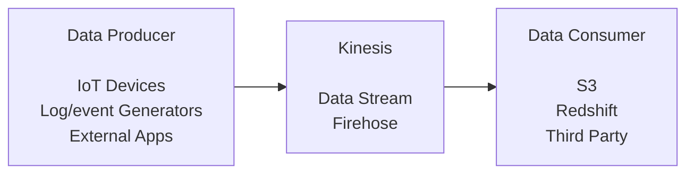
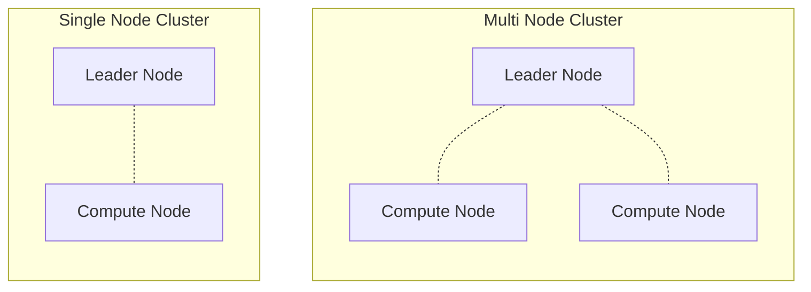
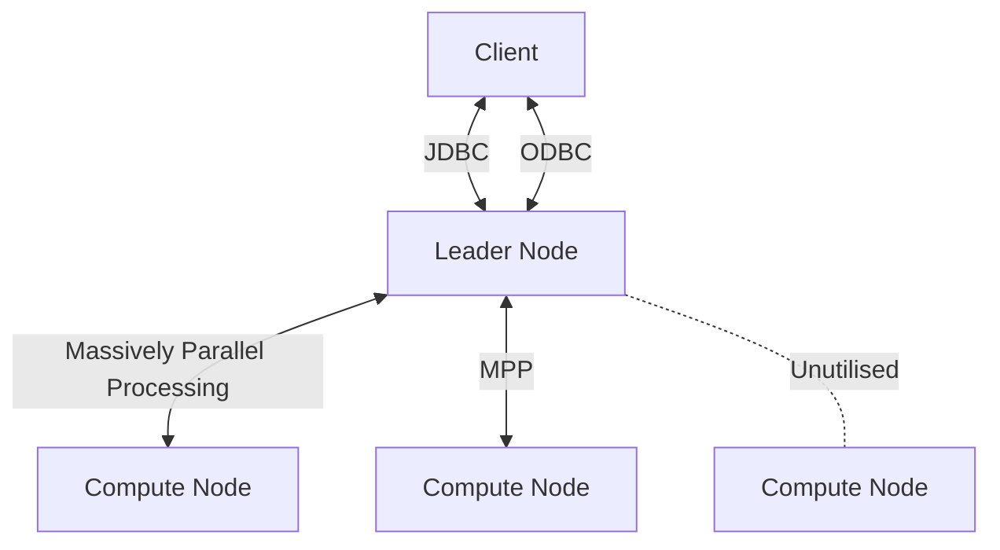
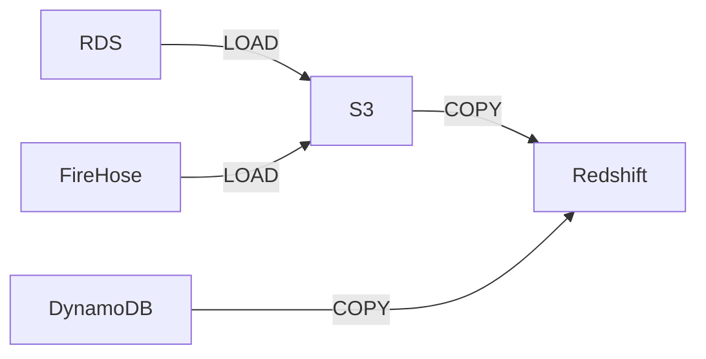
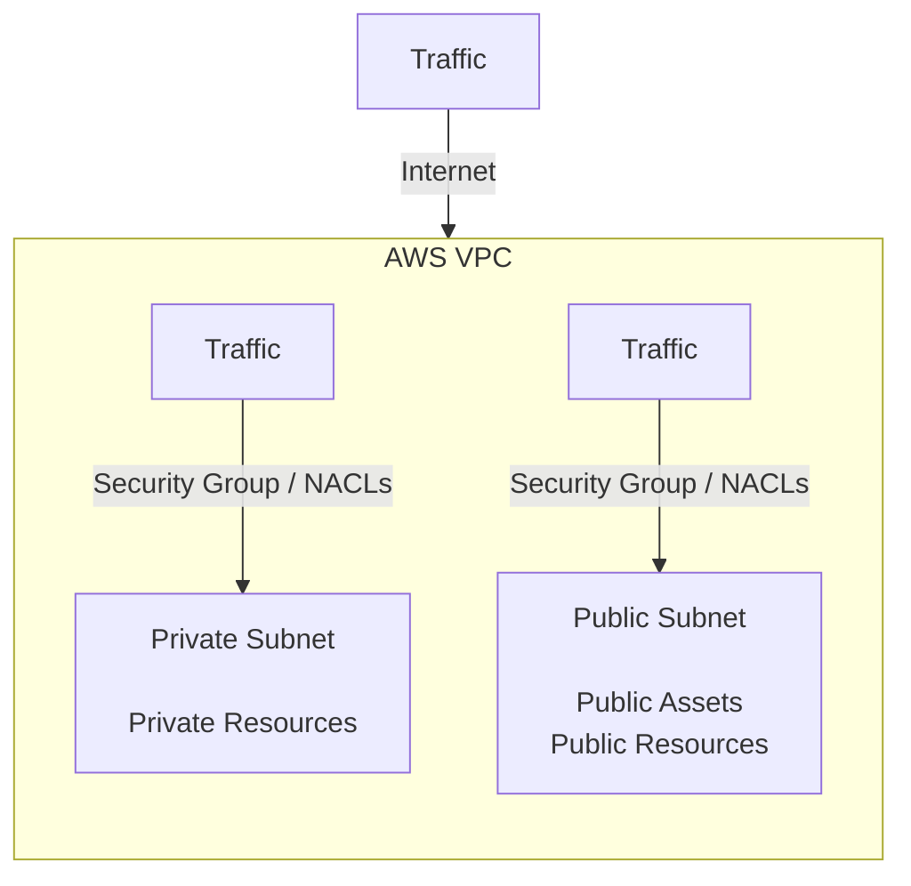
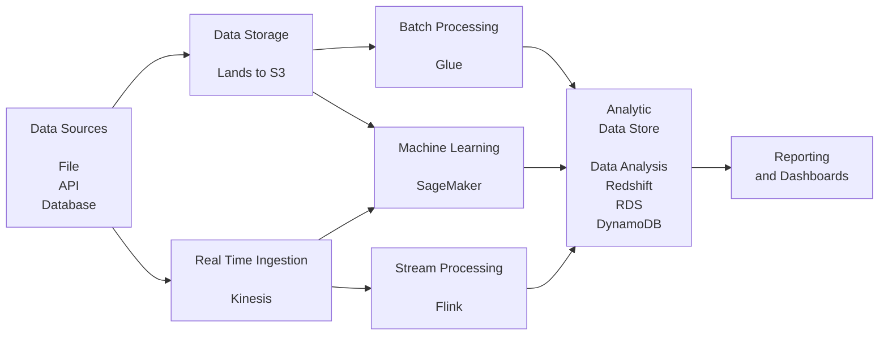

# U1 Data Ingestion and Transformation

Tools to ingest and transform the data.

## AWS Glue

- **Serverless** solution to discover, prepare/combine data.

- Collection of
  - **ETL Jobs**
  - **Data Catalog**
  - **Glue Studio**
  - **Data Quality**
  - **Data Brew**

- Can **read** from **S3, RDS, DynamoDB** etc.
- Lets **build ETL job** using **Python Shell, Glue Streaming, Cloud Studio**
- DPU s - **Data Processing Units**
  - **G.1X** - for memory intense workloads
  - **G.2X** - for ML transformations
  - **G.0.25X** - for low volume data

**AWS Glue: Data Catalog**

- Creates **MetaData** for assets
- **Active Table Definition** including **Columns Names**, **data types** and other attributes.
- Automatically **infer the schema** of data.

**AWS Glue: Glue Studio**

- **GUI** to **build ETL Jobs**
- Drag and Drop **Transformations**
- GUI for Job **Orchestration** and **Monitoring**
  - Job can be scheduled, trigged on event or manual start.
- **Use Case**: **Getting, Storing and Transforming Data**.

**AWS Glue: Data Brew**

- Visual Data Preparation Tool, do **build Data Profiling**
- Use **SQL or Programming Language** to process data.
- Provide **built-in transformation functions**.
- **Use Case**: Gain **insight** and **trends** in data.

## Amazon Kinesis

- Fully managed, **serverless**.
- **Data Streaming Service**.
- Used to **manage** and **process** streaming data.
- Built in auto-scaling.

- **Family of Services**, to let us do collection, delivery and analytics of streaming data, :
  - Data Streams
  - Firehose - delivery system - connects to stream and delivers to destination
  - Video Streams
  - Managed Apache Flink - allows processing

- **Kinesis Use Cases**
  - Anomaly detection in IoT
  - Log processing for ML
  - Pattern Detection
  - Click Stream Analytics


**Amazon Kinesis : Data Streams**

- Stream is **sequence of shards** containing data records

- **Data records** contains
  - **sequence number** - to order the shards
  - **partition key** - to group the shards
  - **data blob** - up to 1MB - this is actual data

- Data Flow sides: There are **two sides**
  - Data Producers
  - Data Consumers

- **Producers**
  - application that **ingests** data in near real time.

- **Consumers**
  - Application that **collect** then **process** or **store** the data.



**Amazon Kinesis: Data Firehose**

- It is a **Delivery System**.
- Lets **collect** from AWS service like Kinesis or from Third Party
- Allows to Store data to **send** to other services like Flink to process.

**Amazon Kinesis: Apache Flink (Managed Service)**

- use Programming Lang or SQL to process.
- Run notebook commands against data.


**Kinesis vs Amazon SQS (Simple Queue Service)**

- Storage Time: 24 hr to 7 days; 1 minute to 14 days
- Number of Consumers: Multiple; Single, once message is read it is deleted from queue.
- Ordering: More support for ordering with shards; no ordering, but can implement FIFO programmatically.
- Routing: Related records can be routed; no support.

**Kinesis vs Kafka**

- Configuration: Limited as it is serverless, auto-scaled and aws managed; Highly configurable in how it writes the data, as it is self hosted.
- Cost: less with pay-as-you-go model on cloud; more as it needs sophisticated engineering.
- Use Case: easy to start, sets up in few clicks; heavy lifting to start and setup.

### Lab: Performing Real-Time Data Analysis with Amazon Kinesis

Can be found under projects. [Link](https://github.com/iYadavVaibhav/personal_notes/blob/main/drafts/project-aws-gpt-pipeline.md)


## Amazon RedShift

- Supports **distributed workloads** for `Petabyte` scale.
- Store **data in columns** instead of rows.

- **Querying** can be done using
  - Redshift Query Editor
  - Console
  - Redshift HTTP API

- Ready for both **Structured and Semi-Structured** data.
- Runs within a VPS, supports **Multi AZ** and offers **serverless** deployment option.

- It is **PostgreSQL** and hence all commands of postgres work.

- **Connectivity**: You can connect using similar ways you use to connect to any PostgreSQL DB
  - CLI using `pgcli` or `psql`
  - Python adapter using `psycopg2`
  - JDBC or ODBC
  - or use any other method that you that lets you connect to postgres database.

- **Use Cases**
  - OLAP - you can load data from traditional warehouse in to it for scalable analytics.
  - Log Analysis - It lets you analyse logs. It can help understand user behaviour.

### Redshift Architecture

- Redshift uses **Cluster** architecture. Clusters have nodes.

- **Nodes**
  - They are **computing resources**.
  - **Max 128** computing nodes can be in a cluster.
  - There are two **type of nodes** in each cluster:
    - Leader Node
    - Compute Node

- **Single Node Cluster**
  - It has only one **Compute Node** with a **Leader Node**.
  - Used for small dataset / testing.

- **Multi Node Cluster**
  - It has **at least two Compute Node** with a **Leader Node**.
  - Used for large dataset / production.




**Leader Node**

- **Receives query** from Client applications.
- **Parses query** and **prepares Query Execution Plan**.
- Coordinates **parallel execution of plan**.
- **Aggregates results** of the queries and **returns to client**.

**Compute Node**

- Partitions jobs into **slices** (using slice management)
- **Runs query execution plan**.
- **Sends intermediate data** back to the leader node.



**Type of Compute Nodes**

- **Dense Compute (DC)** For compute intensive tasks. Eg, analytics
- **Dense Storage (DS)** For large warehouse. Has slower performance but huge capacity.
- **RA3**
  - Scales compute and Storage independently.
  - Automatically off-loads the data to S3 if it outgrows local SSD.
  - Recommended over DS node.

**Scaling Options**

- You can scale by changing cluster, nodes or storage to S3. Lets explore then.
  - **Add Redshift Clusters (Concurrency Scaling)**
  - **Query Data from S3 via Redshift Spectrum**
  - **Resizing Cluster by Updating Nodes**

- **Add Redshift Clusters (Concurrency Scaling)**
  - Automatically **adds more compute power temporarily** based on high demand.

- **Query Data from S3 via Redshift Spectrum**
  - Ability to query large dataset **directly from S3**
  - **Avoids ETL** from lake to database.

- **Resizing Cluster by Updating Nodes**
  - Scaling horizontally by adding/removing nodes.
  - Scaling vertically by upgrading node type.

**Resizing Options**

- You can resize using
  - **Classical resize**
  - **Elastic resize**

- **Classical resize**
  - **Copies table and metadata** from **old source cluster** to **new target cluster**.
  - Cluster is in read-only mode, can't be edited.
  - **Takes more time** to complete
  - **Does not retain the sys log** of old cluster.
  - Eg, you change compute node type from DS2 to RA3 then all data from DS2 nodes is copied to RA3 nodes in new cluster.

- **Elastic resize**
  - **Resize an existing cluster** by adding/removing nodes **in-place**.
  - Cluster is **unavailable during resize**.
  - **Only upgrading node** is allowed within a cluster, **can't downgrade**.
  - Completes in minutes **is fast**
  - **Retains system logs**.

### Loading Data Commands

- Data can be loaded into Redshift from
  - S3
  - Kinesis
  - EMR
  - DynamoDB
  - RDS
  - DMS

Below diagram shows an option to load data from different services to Redshift using the `COPY` command of PostgreSQL.



**Loading from S3 to Redshift Table**

- Split the file into multiple chunks, this will let COPY command to load in parallel and hence leverage MPP architecture.
- Create IAM role with S3 read permission and attach it to cluster.

```sh
# on pgcli or psql
COPY my_table
from "s3://my_bucket/my_table/table1.txt"
iam_role 'arn:aws:iam::342341323:role/my_role_read_s3'
```

Here, `my_table` is the target table in redshift to which data will be copied from S3 source bucket.

**Unload to S3 from Redshift**


```sh
# on pgcli or psql
UNLOAD ('SELECT * FROM my_table')
TO "s3://my_bucket/my_table"
iam_role 'arn:aws:iam::342341323:role/my_role_write_s3'
FORMAT PARQUET ;
```

**Sorting Data in Redshift**

- Use `VACUUM` command to sort and save space.

```sh
# Reclaim space and re-sort rows based on default threshold
VACUUM FULL sales_table ;

# Re-sort rows only if less than 75% of rows are already sorted
VACUUM sort only sales_table to 75 percent ;

# Reindex and then vacuum
VACUUM reindex listing;
```

### Lab: Loading Data into a Redshift Cluster

Can be found under projects. [Link](https://github.com/iYadavVaibhav/personal_notes/blob/main/drafts/project-aws-gpt-pipeline.md)

## AWS Lambda

It has two parts:

- **Lambda Functions**
- **Lambda Service**

- **Lambda Functions**
  - Code and **function** to complete tasks when event happens that match the trigger you set for the function.

- **Lambda Service**
  - Lets you handle the **incoming calls** to the functions
  - Handles **routing** to and from the functions.
  - **Runs Lambda functions** as and when needed and **scales automatically**.

- **Use Cases**
  - IoT devices analysis - keep track
  - Serverless websites - click stream analysis, where people are looking
  - small event driven architecture

- **Benefits**
  - **Self managed**, need not worry for hardware
  - Operating System and **security is managed**
  - **Pay** only for **compute time** measured in **milliseconds**.
  - Highly **customisable**
  - You can **persist the data** as required.

- **Workflow**
  - **create** a function, you get a **unique ARN**
  - write the **code**
  - specify the **trigger**

- **Requirements**
  - **IAM Role** to access **services** Lambda needs access to
  - **Memory size limit** (RAM)
    - Specify memory size you think lambda would be consuming.
    - Range allowed is 128 MB to 10,240 MB.
  - **Execution Time**
    - You can specify from **1 second to 15 minutes**. Max is 15 minutes
    - After this time the **function terminates** regardless of its execution state.
  - **Event Source Mapping**
    - These are **triggers** that will **invoke** the Lambda **function**.


### Lab: Using AWS Lambda with Amazon Kinesis Data Stream

In drafts.

## Triggering Data Ingestion

- **Trigger**
  - Trigger is an event that is generated from one service and **invokes another service** in AWS
  - Eg, S3 Events, Redshift Events, EventBridge

- **EventBridge Triggers**
  - Triggers are based off of event patterns that are defined within rules.
  - It an **event** happens, it will be matched again **pattern** defined in **rule**. If it **matches a pattern**, it will be **sent to other service** and the **action** will be takes **as defined**.

- **Redshift Events**
  - Log of things that happen within a cluster.Eg, table change, table update, cluster change, almost anything.
  - Events can have notifications subscription and can be help for several weeks.
  - Events have `date`, `description`, event `source`, and `source id`.

**Event Driven Action - Example with Kinesis EventBridge and Lambda**

- **Kinesis** - DataStream can be configured as an event source for a trigger. Eg, Data being pushes to _singular mapped destination_ can trigger lambda (or any other service).
- **EventBridge** - It follows the event _patterns_ defined in rule, and on a match it triggers an action on one or more services.
- **Lambda** - It can get triggered and Lambda provides most configurable actions and can pass on to _one mapped destination_ (another service) for specific action.

## Consuming Data APIs

_accessing Redshift via HTTP API_

- **Four ways** APIs work
  - **SOAP**
  - **RPC**
  - **REST**
  - **WebSocket**

- **SOAP**
  - **Simple Object Access Protocol**
  - Client Server exchange message using **XML**

- **RPC**
  - **Remote Procedure Calls**
  - Client **completes a function** (procedure) on server and server sends back the output.

- **REST**
  - **Representational State Transfer**
  - **Most flexible** architecture
  - Client sends **request** to server as data and server sends back **response**.

- **WebSocket**
  - **Two way communication** between client and server
  - Client can get update from server **without requesting**
  - Uses **JSON object** to pass data

**AWS Data Exchange API**

- **Requesters** can **access data via Subscriptions**.
- **Providers** can create and manage your data before you **publish** it.

- Two Parts
  - **Data Set**
  - **Asset**

- **Data Set**
  - **Collection of data** that can changes over time

- **Asset**
  - Any **piece of data**. The data itself, like image, file, record etc.

**Accessing Redshift via Data Exchange API**

- The Data Exchange API **allows** you to access Amazon Redshift.
- **Doesn't require a persistent connection** to your database.
- Provides a **secure HTTP endpoint** and **integration with AWS SDK**.


**Working with Amazon Redshift Data API**

1. Make sure you (The caller) are **authorized** to call on the database
1. Determine if you have the **authentication credentials**, whether temporary or via Secrets Manager
1. (Best Practice) Setup a **secret** using Secrets Manager
1. Check your **limitation** while using the data API
1. Call the API using the **Command Line Interface** (AWS CLI) from code or using the query editor in the Amazon Redshift console

**Lambda API**

- It is **best practice to use SDKs** instead of calling an API from the Application (that is use Python SDK for Lambda and then write you lambda function)
- Lambda API is used with **serverless applications** (simply said, your lambda function).
- It **uses the API gateway** which supports: API routing, serving HTML pages or binary files, issuing redirects, and much more.


## Security and Connections

Two basic ways of controlling security:

**`NACLs`** or **Network Access Control Lists**

- They are **serverless**, means they inspect all the **traffic** in n/w that is coming and going from **VPC and subnets**.
- Configurable to **allow or deny** on number of **protocols** and **port ranges**.
- This acts as a **firewall in your VPC**.

**Security Groups**

- They also help filter out traffic coming into VPC.
- They are state-full, means they inspect packets with context you built into it. This lets create complex rules, and lets log in detail.
- You can allow/deny by using IP address or block of IPs.

**Architecture**

- Within VPC you have subnets.
- Subnets are secured by "Security Groups" and NACLs.



**Best Practices for RDS Security**

- RDS should be **in Private Subnet**, so that it **cannot be accessed using Internet**.
- You can let other resources **access this RDS using NAT Gateway**.
- Ensure developers come from a **singular IP address** (or IP Group), and you only allow access to RDS via that IP Address.
- **Limit the number of resources that use this particular subnet** within the VPC.
- Set **NACLs** so that they **only allow least necessary traffic** to the subnet.


## ETL Pipelines

- It is being done from old pen and paper time.
- It is process of converting data in to meaningful information.

**EMR vs Glue**

- EMR is designed for Integration and ETL; Glue is designed with big data in mind.
- More customisable options; more built-in capabilities
- You need to load the data connectors as needed; in-built migration and ETL providers.
  
**`AMWAA`** or **Amazon Managed Workflows for Apache Airflow**

- Apache Airflow - Open Source tool used to build, schedule and monitor batch workflows.
- AMWAA is managed Airflow offering for managed orchestration.
- It lets you build your cluster, having your web server, scheduler and worker.
- You can upload DAG folder to S3.
- Then run DAG in Airflow.

**AWS Step Functions**

- These provide serverless orchestration (AWS build functionality similar to Airflow).
- GUI to let you see application workflow as event-driven steps.
- Standard workflow execute each step exactly once.
- Express workflow have an at-least-once step execution but will run for at least five minutes.

**AMWAA vs Step Functions**

- AMWAA lets auto scale with integration with AWS Fargate; Step Functions allow to scale to meet demand.
- Parses query and develops query execution plan; Pay-as-you-go model with first 4000 steps free per month.
- Allows managing complex code based workflows; Suitable for simplifying complex workflows.

**Glue Workflow Options**

- Allows you to create and see complex ETL jobs. These jobs can have crawlers, triggers and other jobs.
- Workflows can be built using blueprint or can be created from scratch using one component at a time.

## Containers in Data Pipelines

- Containers help making Data Processing in data pipeline more efficient.
- Monolith data pipeline will have everything on one machine and tightly coupled together.
- By using containers, we can make each part of pipeline isolated in a container.
- You can tweak individual pieces, slow them down or scale up to make it more efficient.

**Container Types**

- **Amazon Elastic Container Service** or **ECS**
- **Amazon Elastic Kubernetes Service** or **EKS**

**Amazon Elastic Container Service** or **ECS**

- Orchestrates the deployment of containerised applications and mapping of resources.
- It lets launch, manage and scale as app grows.

- There are three layers:
  - **Capacity**: the infrastructure layer on which the containers run.
  - **Controller**: the deployment layer where you can manage container and applications.
  - **Provisioning**: the layer which lets interact with schedulers for deploying and managing containers.


**Amazon Elastic Kubernetes Service** or **EKS**

- Managed service that let you interact with control panel of Kubernetes.
- It allows you to create cluster in which Kubernetes will run.
- Cluster can be made using Fargate containers or EC2 workers.

**ECS vs EKS**

- AWS Orchestration Engine; EKS lets manage Kubernetes experience.
- Fine tune auto scalability; Allows multi-cloud deployments.
- Microservice architecture; Easy integration with other AWS services.

## Data Coming from Everywhere

Out tech stack should be ready to ingest data from multi-sources. For this AWS offers two solutions

- **EMR Multi-Source** and **Redshift Multi Warehouse** let handle incoming data.

**EMR**

- Big Data Solution, for data processing and ML.
- Uses Open Source Frameworks like Hive, Spark and Pesto.
- It can run the app (with above frameworks) on ECS, EKS, Fargate or EC2.
- It can build cluster with primary, core and task nodes.
  - primary - manages running the cluster, distributing the data across nodes.
  - core nodes - run the frameworks. They can be one or more.
  - task nodes - don't store data, only transport/transform it. They are optional.
- Multi Source setup has multiple primary nodes. So that it can take data simultaneously from many nodes.

**Redshift Multi Warehouse**

- It is multi data warehousing on Redshift.

- It needs **connection to a DataShare**
- Can be setup on three **clusters**, `serverless workgroup` or `ra3.4xl` and `ra3.16xl`
- You need to have **metadata** discovered in data-share. It can be seen using view catalog data.
- You need to have **encryption** set up correctly.

- You need a **data warehouse**, **loaded data** from S3, or using query editor.

- **Limitations**:
  - It **cannot** be accessed via **Data API**. You need to connect via dataShare.
  - Auto Operations are not available, user needs to run queriers for auto-analysing.
  - Users cannot see permission granted by data share.

## Cost Optimisation in Data Transformation

- In context of Glue Python Shells, PySpark Jobs and Spark Jobs.
- All these jobs use DPU on AWS (Data Processing Units)
- DPU is attached to CPUs. More DPUs can be added to CPU and they will offload the task from CPU hence can process more data.
- The more DPU your job uses the more you pay.

- Spark
  - It lets run batch job in Glue
  - Script can be run at ETL script using Glue Command Line.
  - Gives 10 DPUs by default.
  - Billed 1-10 minutes interval.
  - It is designed to run hefty jobs and can scale quickly.
  - It can scale horizontally, vertically or both depending on data coming in.

- PySpark lets use Spark using Python. Hence makes it easy to use spark and only python can be used to build ETL jobs.

- Python Shell on Glue is cheaper than running Glue on its own.
- Python Shell uses Spark in Glue and can be run using `pythonshell` command.
- It uses only one DPU at start.
- Billed per hour with minimum 1 minute.
- Designed to run light etl jobs.

## Module 3; Applying Programming Concepts

## Iac Infrastructure as a Code

- For autoscaling, you need to build new environments and deploy you code to it. Doing this manually can be challenging and error prone.
- Using IaC, you can do this using code.
- CloudFormation lets you build code that creates infra.
- IaC also gives blueprint of your environment, this lets you see whole env as one picture and see flow of data.
- It lets do automation and scaling.

- IaC options
  - **Cloud Formation**
  - **CDK**
  - **Terraform (Third Party)**

- **Cloud Formation** AWS build. Can scale to any size.

- **CDK** layer on cloud formation. It lets build env in different languages. So not only yaml/json, you can use other languages.

- **Terraform (Third Party)**

**Cloud Formation**

- Write in YAML/JSON
- It builds Stack.
- Stack lets build and connect resources, all at once.
- It offers Change Sets, that lets you see the change in stack and hence reduce error and have more clarity on actual changes.
- It is quick and easy deployment way.
- Helps easy roll out with visual instinct.

**CDK**

- you can use JS/Py/C++
- In IDE, multi users at once.
- It can be declarative or imperative statements
- It also has Constructs which are per-build blocks that can be used in code.
- More developer friendly with write less, deploy more in mind.
- There are three levels of constructs
  - **Level 1: Cloud Formation Constructs**
  - **Level 2: Abstract Constructs**
  - **Level 3: Pattern Constructs**

- **Level 1: Cloud Formation Constructs**
  - uses same basic syntax as cloud formation
  - it lets explicitly define all aspects of resources

- **Level 2: Abstract Constructs**
  - Add cloud resources, where some ability is extracted away by CDK.

- **Level 3: Pattern Constructs**
  - These are pre-built custom patterns that define one or more AWS resources. Eg, "new LambdaRestAPI" may use Lambda and API Gateway together. So on line construct will create both services connected and working together.

## SQL Data Pivoting

- Data pivoting lets you create headers in both rows and columns, just like pivot tables.
- To do this you need to:
  - Row Identifiers - any row that contains a value that uniquely identifies rows in the table.
  - Column identifiers - these are columns that can be converted into new columns in combined result set.
  - Aggregates - These are main values you need to summarise or aggregate based on the row and column identifiers.

## Tumbling WIndows

- Streaming data if often received in windows of item or space. Theses windows can have time blocks or number of record blocks.
- Tumbling Window is when, a windowed query, processes the data inside a window.
- These windows are non-overlapping.
- This maintains order, rather than processing everything coming in bulk without order.

Service that let do Tumbling WIndow operations are:

- Lambda
  - you can open your function to take data via window in range of 0 to 900 seconds.
  - The max data it can take in is 5 MB.
  
- DynamoDB
  - Works with Lambda. Lambda will trigger the dynamo DB.
  - Hence, Dynamo DB will be triggered for a window only (as window is implemented in lambda)

- Kinesis
  - It sends data to other services.
  - Other services will have window implemented to accept the data, hence kinesis will send data in windowed way.

- Tumbling Window Aggregation
  - Application code gets data
  - Runs Queries
  - Results are presented.

- Windowed SQL Operation can be
  - Time Based - window size is timed, it requires timestamp column in stream.
  - Row Based - window size is number of rows

- Three type of Windows
  - Stagger Windows - Aggregates data using keyed time-based windows when data actually arrives. Allows for overlapping windows, hence reducing late or out of order data.
  - Tumbling Windows - Opens/closes at scheduled intervals, thus allowing data at certain times only.
  - Sliding Windows - window that continuously uses a fixed time or row count before closing.

- [ ] more info required.

## Database Connectivity

- Four main type of JDBC Drivers
  1. JDBC-ODBC Bridge Drivers translate and convert Java calls to ODBC function calls
  1. Native-API Drivers use client-side libraries of the target database
  1. The Network Protocol driver uses middleware to convert JDBC calls into a database call
  1. Database Protocol Drivers (or thin drivers) changes JDBC calls directly into vendor-specific database protocol

- Four Steps of ODBC Connection
  1. Applications process and **call the ODBC functions** then submit the SQL statements
  1. The **driver manager loads drivers** for each application sending a call
  1. The drivers **handle the actual ODBC call** and **send the request to a data source**
  1. The data source is the data being accessed.

**JDBC** | **ODBC**
-|-
java | any language
any platform | windows only
Object Oriented | Procedural

## The Big Data All Stages Together



## Summary and Exam Tips for Data Ingestion and Transformation

Same as above.

