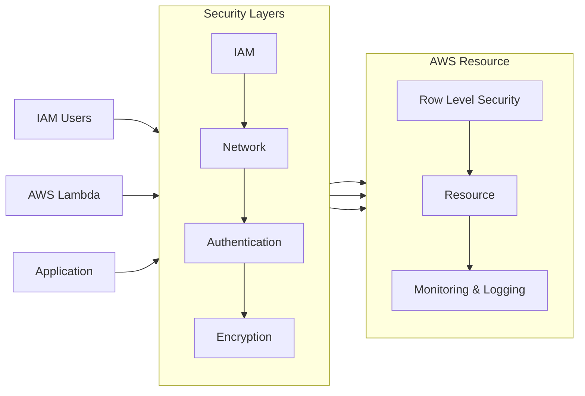

# U4 Data Security and Governance

## 2.0 Limiting Access to Data

## 2.1 IAM Foundations

**Identity and Access Management (IAM)**

- Core service for **managing access** to AWS resources. **Limiting access** based on user roles and needs.

- **Terms**
  - **Principals**: Resources, applications, or users accessing AWS services. Entities requesting access to data.
  - **IAM Users**: Directly map permissions to individual users.
  - **IAM Groups**: Assign permissions to groups of users for easier management.
  - **IAM Policies**:
    - JSON format document.
    - They are crucial for managing access
    - Eg, Policy allows actions like putting, getting objects, or retrieving object versions from a bucket.

- **Permissions**: Granted through IAM policies.

- **Policy Types**:
  - **Identity-Based Policy**: Attached to the principal (e.g., IAM user or role).
  - **Resource-Based Policy**: Attached to the resource.

- **Access Evaluation**:
     1. Check for **deny rules** in any policy.
     2. If no deny rule, check for **allow rules**.
     3. Access granted if at least one policy allows it.

**Programmatic Access Risks**

- **Static Access Keys**: Risk of **keys being leaked** or compromised ⚠️.
- **Solution**: Use IAM Identity Center to avoid long-lasting access keys.

**IAM Identity Center**

- offers a more secure alternative to static access keys.
- Maps **permission sets to IAM Roles** not to users. Users get temporary sso login.
- **Single Sign-On**: Provides temporary access keys for the duration of a session.
- **Benefits**: Simplifies management and reduces security risks.

**IAM Roles**

- Facilitate **temporary access** for AWS services and users.
- **Usage**: For temporary access to AWS resources by AWS services, applications, or users through IAM Identity Center.

## 2.2 Accessing Private Data Stores

_Networking Scenarios for granting access to private resources in AWS._

In the above diagram, consider you have setup level 1, that is proper IAM policies to connect. Then you need second thing setup, that is, proper network connection.

Here, understand that S3 and Lambda are public services. They are not part of your private subnet. S3 is not in private subnet. Lambda has no fix VPC, rather it runs on AWS managed VPC. Hence they have access to public internet and same time do not have access to private subnet. While, EC2 and RDS are on your private network and are disconnected from public internet. You do need IAM permission but on top of that you also need proper network setup to allow the connections to correctly connect:

- S3 to private EC2
- Lambda to private RDS
- Lambda to S3
- from EC2 in one private Subnet to RDS in another private subnet.

**Network Connectivity for Private Resources**

- Private resources need to talk to each other without using public internet.
- For this you need to configure the network security.
- You can use Security groups and NACL to define this connectivity. Or more importantly to troubleshoot it if connection fails.

- Examples of internal resources that need connectivity:
  - **Private Database (e.g., RDS)**: Hosted in private subnets.
  - **Private Compute Services (e.g., EC2)**: Also in private subnets.
  - **AWS Lambda**: Need to grant access to private resources.

- Inbound rule and outbound rule for a security group define
  - what port is allowed
  - what protocol is allowed
  - What IP address / range is it allowed on
  - eg,
    - `198.51.100.0/24 TCP 22` allows SSH from internal range of IP
    - `0.0.0.0 all all` will allow all connection from all IP (internet)
    - `HTTP TCP 80 0.0.0.0/0 DENY` will deny any traffic on port 80 with protocol TCP.

- **Security Groups**:
  - Applied at the **instance level**. Just like firewall for the instance itself.
  - Stateful, for allowed inbound traffic, the response is also allowed.
  - Only define allow rules. What not allowed is denied by default.
  - Order of rules don't matter. they are all applied at once.

- **Network Access Control Lists (NACLs)**:
  - Applied at the **subnet level**.
  - **Stateless**, inbound traffic and outbound need explicit permission.
  - Can define allow rules and deny rules.
  - Rules are applied in order

**Connecting Private EC2 Instances to Private RDS**

- **Private Resources**: No public route through an internet gateway.
- Steps to check:
  1. Ensure that **route table** is properly routing traffic within your VPC.
  2. Ensure database traffic is **allowed at NACL** level within your VPC.
  3. Ensure there is **inbound** rule on database-security-group that allows request traffic from instance-security-group.
  4. Ensure there is **Outbound** rule on instance-security-group that allows request traffic to database-security-group.

**Connecting Private EC2 to S3**

- EC2 is on private subnet and S3 are by default on your VPC.
- EC2 to S3 via internet is slow, expensive and insecure.
- You can connect internally by making, **Gateway Endpoints**.
- **Gateway Endpoints** are **private end points** for S3 or DynamoDB that **permit private traffic** within the **same region**. It keeps traffic within AWS and avoiding public internet.

**Connecting Lambda to Private RDS**

- Lambda is not on fixed VPC. If not on your VPC it cannot connect to your Private RDS.
- While configuring Lambda, you can set them to have access to one of your private VPC.
  - Lambda still resided in AWS Managed Subnet.
  - But will be given an **Elastic Subnet** that will allow network to your private subnet.
- **Elastic Network Interface**: Allows Lambda functions to route requests to private resources.

**Connecting Lambda to S3**

- **IAM Permissions**: Ensure Lambda functions have appropriate IAM permissions (identity-based or resource-based policy) to access S3 buckets. Rest all is managed by AWS.

**Differences between Security Groups and NACLs**:

|         | Security Group              | NACL                                |
| ------- | --------------------------- | ----------------------------------- |
| Applied | Instance                    | Subnet                              |
| State   | Stateful                    | Stateless                           |
| Traffic | Both Side if one is allowed | Each side needs explicit permission |
| Rules   | Only define whats allowed   | Can define allow and deny           |
| Order   | Unordered, all at once      | Applied in order                    |

**Troubleshooting Connectivity Issues**

- **Check Routes**: Ensure proper routing from EC2 to RDS.
- **NACL Rules**: Verify if NACL is blocking traffic.
- **Security Group Rules**: Ensure inbound and outbound rules are correct for the instance and database.

**Summary**

- **EC2 to RDS**: Ensure proper security group and NACL configurations.
- **Private Subnet to S3**: Use gateway endpoints for secure and cost-effective access.
- **Lambda Functions**:
  - **Access to Private Resources**: Configure VPC access.
  - **Access to S3**: Ensure IAM permissions are correctly set.

**Next Steps**: Proceed to the next lesson for further topics in data security and networking.

## 2.3 Understanding IAM and Basic Network Security in the Cloud

lab

## 2.4 Intro to Secrets Manager and Parameter Store

In the above diagram, consider you have setup level 1 and 2, that is proper IAM policies, and proper network setup. Then you need to setup third thing, that is, proper **Authentication**.

**Overview**

- Authentication methods for accessing AWS databases, specifically RDS.

**Key Concepts**

**Authentication Methods for RDS**

1. **IAM Authentication**:
   - Available for MariaDB, MySQL, and PostgreSQL.
   - **Limitations**: May **not handle very high connection** rates efficiently
   - Reduces read/write performance.

2. **Password Authentication**:
   - Uses hardcoded master username and password set during RDS database creation.
   - This is not secure as it may expose password as plain text.
   - To overcome this, use **AWS Secrets Manager**

**AWS Services for Secrets Management**

1. **Parameter Store**:
   - **Allows optional encryption** of key-value parameters.
   - **Programmatically access** key-value pairs
   - Requires **manual updates** to parameters.
   - **Cost**: 10,000 parameters for free.
   - **Use case**: Suitable for centralized configuration and less sensitive information.

2. **Secrets Manager**:
   - Always encrypted, with automatic secret rotation.
   - **Cost**: $0.40 per secret per month.
   - **Use Case**: Best for sensitive data requiring high security and rotation. Ideal for high-security secrets and automatic rotation.
   - **Exam Tip**: When security is top priority use secrets manager.

**Integration with RDS**

- **Secrets Manager**: Direct integration with RDS for automatic credential rotation.

**Accessing Secrets Programmatically**

- Make lambda function
- Give it IAM access to secrets and secrets manager.
- Define secret's name and region.
- Initialize BOTO session and client.
- Retrieve secrets using `get_secret_value` function.

**Summary**

- **Authentication**: Choose IAM or password authentication based on database and connection needs.
- **Secrets Management**:
  - **Parameter Store**: For general configurations and optional encryption.
  - **Secrets Manager**: For high-security credentials and automatic rotation.
- **Integration**: Secrets Manager integrates with RDS for secure, managed credential handling.

## 2.5 Using AWS Secrets Manager for Storing and Rotating Database Credentials

lab

## 2.6 Securing Data Using Lake Formation

IAM, Network, Authentication setup works for most use cases but may be **problematic when dealing with Data Lake**. For this AWS has created `AWS Lake Formation`. This manages the security using:

- IAM
- Row Level Security
- Monitoring and Logging

It does not use much use of Networking, Authentication, Encryption.

Data Lake is usually made of following services:

- S3 Buckets
- Data Catalog (in Glue)
- Data Analytics (in Athena)

So now, each principal (user, service) need access to each of these resources. This will lead to create separate permission for each user for each resource, which becomes unmanageable. This is where "AWS Lake Formation" comes in. One permission can give access to all services in Lake.

**Overview**

- **Focus**: Using AWS Lake Formation for managing permissions and access in data lakes.

1. **AWS Lake Formation**
   - Simplifies the management of IAM permissions, granular permissions, and monitoring for data lakes.
   - **Features**:
     - Centralizes access to all components of the data lake.
     - Applies permissions across services within the data lake, not just per service.

2. **Permissions Management**
   - **IAM Permissions**: Define actions principals can take.
   - **Lake Formation Permissions**: Determine what data these actions apply to, using fine-grained permissions.

3. **Fine-Grained Permissions**
   - **RDBMS Syntax**: Used for restricting access at the database, table, or column level.
   - **Example**:
     - **Data Analyst**: Grants access to specific tables (e.g., Food Item Sales) using IAM and Lake Formation permissions.
     - **Data Lake Administrator**: Has broader access to manage and grant permissions to other users.

4. **Cross-Account Access**
   - **Functionality**: Allows granting permissions to principals in different AWS accounts.
   - **Use Case**: Centralized data lake accessed by multiple accounts within an organization.

5. **Event Logging**
   - **CloudTrail Integration**: Tracks API actions within the data lake.
   - **Lake Formation**: Simplifies monitoring and auditing of data actions and permission changes.

**Summary**

- **Lake Formation** provides a centralized approach to managing data access and permissions within a data lake.
- **IAM** defines what actions can be taken, while **Lake Formation** specifies which data those actions can access.
- **Fine-Grained Permissions** are managed using RDBMS syntax.
- **Cross-Account Access** and **Event Logging** enhance flexibility and security.

## 2.7 Using Lake Formation Granular Permissions

_Achieving super fine-grained permissions using Lake Formation_

**Key Terms**

- **Data Catalog**
  - **Centralizes data from multiple sources**.
  - Organized into **databases and tables** accessible by analytic services and transformations.

- **Fine-Grained Access Control**
  - Provide tailored **access to specific tables and data** within the catalog.

**Types of Filters**

- **Column Masking Filter**:
  - **Hides** specific **columns** from certain users.
  - Eg, Mask the `shipping address` column in an item orders table.

- **Row Filter Expression**:
  - **Restricts** access to **rows** based on criteria.
  - Eg, Allow an analyst to access only orders from the U.S. by filtering rows where the `country` column equals "U.S."

- **Cell Level Security**:
  - Apply filters to **individual cells** within a table to achieve more granular control.

**Application of Filters**

- Filters can be **combined and applied** at the **table level** when granting access to users or groups.
- **Permissions** can be granted to **individual users** or **groups** with specific filters applied.
- Examples:
  - **U.S. Sales Filter**: Grants access to an analyst focusing on U.S. sales data.
  - **Canada Filter**: Grants access to an analyst focusing on Canadian orders.

**Summary**

- **Lake Formation** allows for detailed permissions management using data catalogs and filters.
- **Filters** provide granular access control at the table level, including column masking, row filtering, and cell level security.
- **Permission Granting**: Filters can be customized and combined to fit specific user needs.
- **Hence**, using filter you can restrict access to table, column, row, or cell for user / group by making use of data catalog and filter.

## 3.0 Ensuring Data Encryption and Masking

## 3.1 Protecting PII and Masking Columns

_Protecting Personally Identifiable Information (PII) and masking data in AWS services, specifically S3 and Redshift_

**S3 Data Masking (Data Lake)**

- Protecting PII across multiple S3 buckets and accounts using Amazon Macie.
- **Amazon Macie**:
  - Scans S3 buckets for PII and provides alerts or automated actions.
  - Can be set up at the organizational level to cover all S3 buckets in the organization.

**Amazon Redshift Data Masking**

- Protecting PII in data warehouses from exposure to analysts and data engineers.
- It can be done in three ways:

  1. **Column-Level Masking**:
     - Mask columns by **adjusting grants** for `SELECT` and `UPDATE` privileges. That is, you can grant access to only select/update only certain column in a table.
     - Masking can be applied to **individual columns within tables**.

  2. **Row-Level Security (RLS) Policies**:
     - Limits **access to specific rows** based on user or role.
     - Create and apply RLS policies to control row access.
     - **Example**: A policy to restrict access to rows based on user roles.

  3. **Dynamic Data Masking**:
     - Masks part or all of a column's data **at query time**.
     - **Benefit**: Does not consume extra space or impact queries that do not involve masked data.
     - **Example**: Masking a credit card number to show only the last four digits.

**Summary**

- **S3**: Use Amazon Macie for scanning and protecting PII across S3 buckets and accounts.
- **Redshift**:
  - **Column-Level Masking**: Apply masking through access control grants.
  - **Row-Level Security**: Use RLS policies to restrict access to specific rows.
  - **Dynamic Data Masking**: Configure to mask data dynamically at query time based on user roles and permissions.

## 3.2 Data Encryption Options

_Encryption methods for protecting data at rest and in transit in AWS_

**Types of Encryption**

1. **Data at Rest**: Data stored in S3 buckets, EBS drives in EC2, or local storage on a device.
2. **Data in Transit**: Data being transferred over networks, encrypted using TLS (Transport Layer Security), used in HTTPS.

**Encryption Methods**

- **Client-Side Encryption**:
  - Data is **encrypted by the application** before sending it to S3.
  - The **application manages** the encryption key.
  - Data never leaves the application in an unencrypted state.

- **Server-Side Encryption**:
  - Data is sent to S3 in an unencrypted form and **encrypted once it reaches S3**.
  - **Lower operational overhead** as AWS manages encryption.

**Server-Side Encryption Options in S3**

1. **S3-Managed Keys (SSE-S3)**:
   - Enabled by **default** for S3 buckets.
   - Uses 256-bit Advanced Encryption Standard (**AES-256**).
   - Each object is encrypted with a unique key.

2. **AWS Key Management Service (KMS) Keys (SSE-KMS)**:
   - Provides **more granular** access control over key permissions.
   - Key policies can be **managed and tracked via CloudTrail**.
   - Requires specifying KMS as the encryption type and providing the key ID.

3. **Customer-Provided Keys (SSE-C)**:
   - **Full control** over encryption keys, which can be managed on-premises or in other clouds.
   - Requires sending the encryption algorithm and Base64-encoded key with **each request**.
   - **Risk**: Keys are **compromised** if sent over an unsecured network.

**Encrypting Data in Amazon Redshift**

- **KMS Encryption**:
  - Use AWS-managed or customer-managed KMS keys.
  - **Performance Impact**: Encryption affects database performance. Must be enabled upon launch or through migration.
  - **Possible downtime** during migration to an encrypted cluster.

**Encrypting Data in AWS Glue**

- **Data in Transit**: Ensure data is encrypted using TLS when transferred.
- **Data at Rest**: Use KMS or S3-managed keys for encryption of data catalog and stored data.

**Access Permissions for Encrypted Data**

- **Requirements**: Users must have permissions not only to access the data but also to encrypt and decrypt it.

**Summary**

- **S3 Encryption**: Choose between S3-managed keys, KMS keys, or customer-provided keys based on security needs.
- **Redshift Encryption**: Use KMS for encryption; consider performance implications and manage encryption at database launch or migration.
- **AWS Glue Encryption**: Secure data in transit with TLS and data at rest with KMS or S3-managed keys. Ensure users have appropriate encryption permissions.

## 4.0 Data Privacy and Governance

_cloudTrail and CloudWatch for Audit, Monitoring and Governance_

## 4.1 Preparing Logs for Audit: Tracking API Calls via CloudTrail

_Data privacy and governance, specifically tracking and auditing access with CloudTrail_

- **CloudTrail Overview**
  - **Records API calls** made within your AWS account.
  - Provides a **trail of all actions** taken, useful for auditing activities.

- **Storing CloudTrail Logs**
  1. **S3 Bucket**: Store logs in an S3 bucket and use tools like Amazon Athena to query and analyze logs.
  2. **CloudTrail Lake**: A managed solution for storing, querying, and filtering CloudTrail logs by event types.

- **Centralized Log Management**
  - In an org, you can have multiple accounts generating logs, you need to analyze them all together, for this case you can create a separate account for centralized storing and analysing log trail.
  - **Best Practice**: Use a centralized account to aggregate CloudTrail logs from multiple accounts.
  - **Advantages**:
    - Easier management of permissions and security.
    - Simplifies access control and prevents accidental deletion or tampering.
    - Enables cross-account log analysis.

- **Access Control for Centralized Logs**
  - **Storage**: Logs are centrally stored in a **dedicated account**.
  - **Security**: **Restrict access** to logs and ensure they are secure and tamper-proof.
  - **Analytics**: Grant access to analytics services like **Amazon Athena** for querying centralized logs.

**Summary**

- **CloudTrail**: Essential for tracking API activity and auditing in AWS.
- **Log Storage**: Use S3 for flexibility or CloudTrail Lake for a managed solution.
- **Centralized Logging**: Recommended for managing logs from multiple accounts and simplifying access and security.

## 4.2 Using AWS Config and CloudTrail

Lab

## 4.3 CloudWatch Alarms and Logs

_Using CloudWatch for monitoring resource performance and application logs_

- **CloudWatch Overview**
  - **Monitors** resource **performance** and application logs.
  - **Complementary to CloudTrail**: While CloudTrail tracks API activity, CloudWatch focuses on **performance metrics** and logs.

- **Log Collection and Management**
  - **Log Groups**: Collect CloudWatch logs into log groups.
  - **Subscriptions**: Subscribe services to log events from specific log groups or across an entire account.
  - **Streaming and Filtering**: Stream entire log groups or filter to capture specific event types.

- **Metrics and Alarms**
  - **Metric Filters**: Attach to log groups to define alarms based on metrics.
  - **Alarms**: Triggered when metrics exceed defined thresholds for a certain period.
  - **Notifications**: Use SNS notifications or automated actions in response to alarms (e.g., email alerts for DDL commands in Redshift).

- **Real-Time Analysis**
  - **Amazon OpenSearch**: Use for near real-time analysis of CloudWatch logs.

- **CloudWatch vs. CloudTrail**
  - **CloudTrail**: Records all API activity for auditing.
  - **CloudWatch**: Monitors resource performance and captures application logs.
  - **Use Cases**:
    - **CloudTrail**: Tracking and auditing actions.
    - **CloudWatch**: Resource monitoring and performance metrics.

- **Log Storage and Cost Management**
  - **Cost Considerations**: CloudWatch logs can become **expensive over time**.
  - **Archiving**: **Backup** CloudWatch logs to **Amazon S3** for cost savings.
  - **Analysis**: Analyze archived logs with **Amazon Athena**.

- **Log Retention**
  - **Default Setting**: CloudWatch logs are stored indefinitely by default.
  - **Recommendation**: Adjust log retention settings to avoid unnecessary storage costs.

**Summary**

- **CloudWatch**: Essential for monitoring and managing resource performance and logs.
- **Cost Management**: Backup logs to S3 to manage costs effectively.
- **Retention Settings**: Adjust default log retention to control expenses.

## 4.4 Sharing Data Across Redshift Clusters

_Sharing data across Redshift clusters using datashares_

**Redshift Datashare**

- **Definition**: A datashare allows you to share Redshift data objects **across clusters**.
- **Components**: Can include databases, tables, user-defined functions, materialized views, or schemas.

**Sharing Data**

- **Creation**: Define and **create a datashare** in the Redshift console.
- **Inclusion**: Add objects like **schemas and tables** to the datashare.
- **Granting Access**: Grant usage of the datashare to specific Redshift clusters.
- **Access Types**: Shared clusters will have **read-only access** to the datashare objects.

**Sharing Capabilities**

- **Cluster Types**: Share across different types of Redshift clusters.
- **Availability Zones/Regions**: Share **across** different availability **zones** and AWS **regions**.
- **Accounts**: Share datashares **across** different AWS **accounts**.

**Automatic Updates**

- **Live Data**: Datashares provide **real-time access** to live data from the source cluster. **No need for manual refreshes** to update data.

**Example Commands**

**Summary**

- **Datashare Functionality**: Facilitates data sharing across clusters, regions, and accounts.
- **Access Control**: Grants read-only access to shared data.
- **Real-Time Data**: Ensures up-to-date data access without manual refreshes.

## 5.0 Conclusion

## 5.1 Summary

## 5.2 Data Security and Governance: Exam Tips

**Key Scenarios and Solutions**

1. **Connecting EC2 to Private RDS Instance**
   - **Issue**: Unable to connect an EC2 instance to a private RDS instance.
   - **Troubleshooting Steps**:
     - Verify routing and IAM permissions.
     - Check security group settings:
       - **RDS Security Group**: Should allow inbound traffic from the EC2 security group.
       - **EC2 Security Group**: Should allow outbound traffic to the RDS security group.
     - Also verify Network ACL (NACL) settings to ensure they allow database traffic.

2. **Accessing Sensitive Data in Redshift**
   - **Scenario**: Redshift database contains Personally Identifiable Information (PII) that should not be exposed.
   - **Solutions**:
     - **Column Masking**: Mask sensitive columns when granting access.
     - **Row-Level Security (RLS) Policies**: Use RLS to restrict access to specific rows.
     - **Dynamic Data Masking**: Optionally use dynamic data masking to show portions or transformed versions of the data.

3. **Encrypting Data at Rest in S3**
   - **Requirement**: Control over encryption keys and their policies.
   - **Options**:
     - **S3 Managed Keys**: Default but do not allow control over key policies.
     - **KMS Keys**: Provides access to key policies and is easier to manage than customer-provided keys.
     - **Customer-Provided Keys**: Offers full control but requires more management effort.

4. **Sharing Materialized Views Across AWS Accounts**
   - **Scenario**: Share a materialized view from a Redshift cluster with data engineers in another AWS account.
   - **Solution**: Use **Datashares**.
     - Create a datashare and include the materialized view.
     - Grant read-only access to the datashare for the other Redshift cluster, which can be in a different account, region, or cluster type.

**Conclusion**

- **Exam Preparation**: Review these scenarios and solutions to gauge readiness for the Data Engineer Associate exam.
- **Final Advice**: Ensure familiarity with troubleshooting connections, managing sensitive data access, encryption options, and data sharing techniques.

