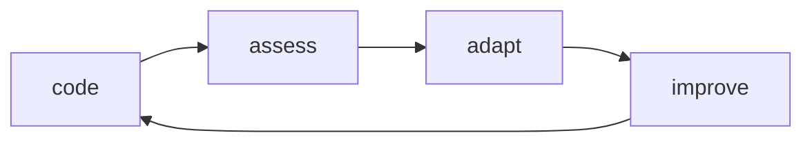
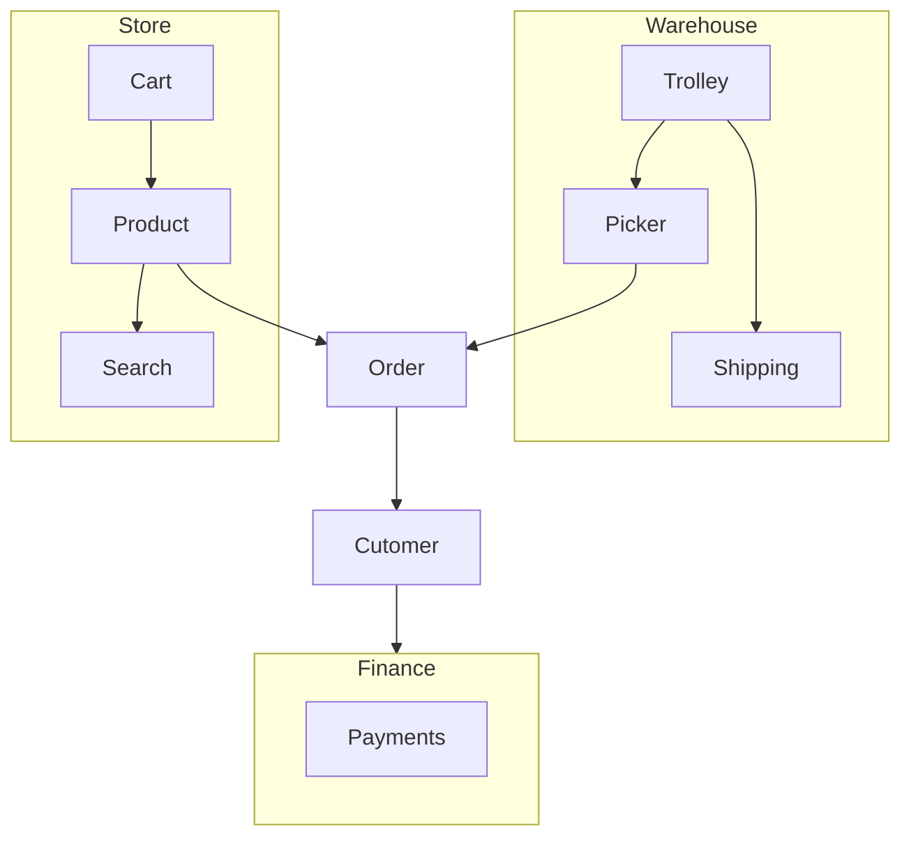
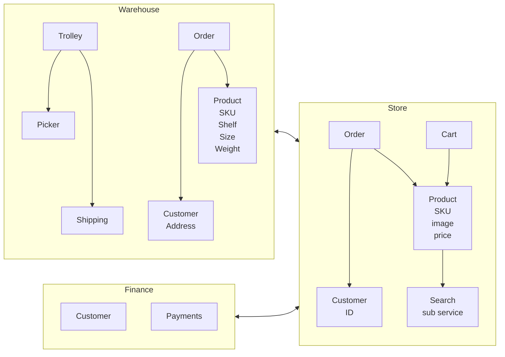
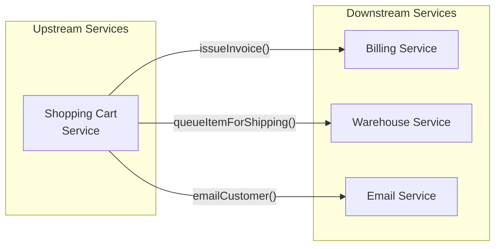
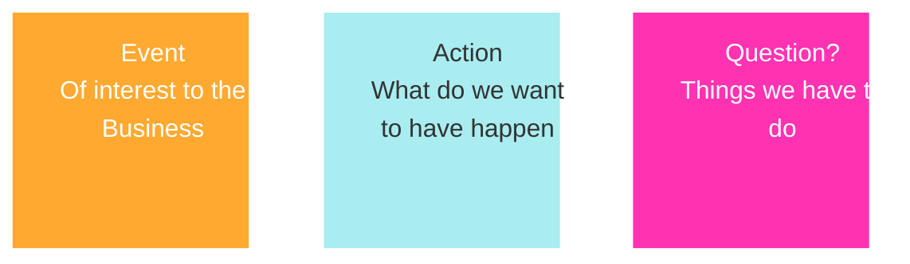
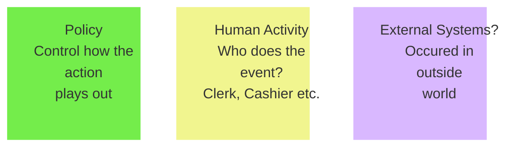

# Software Architecture: Domain-Driven Design

_INSTRUCTOR: Allen Holub | Linkedin Learning_

**Domain-Driven Design** or DDD is good to manage change and agile way of development.

## What is DDD?

**Agile** - The philosophy of DDD is similar to Agile manifesto, "Developers and Business People must work together everyday throughout the project".

**Modeling** - DDD works on model and says that the structure of code models 1-1 to domain you are solving. So it makes sense to business and change is domain can be mapped to change in code.

**Incremental** - Code for MVP (only enough to solve immediate problem), then evolve as you learn more about the problem.

DD, follows the **Agile Cycle**

## Microservices and Monoliths

**Monoliths** have problem with changes, deployment, maintainance.

**Microservives** split it but has to be architectured nicely. It should be

- small: as big as something you can hold in your head
- Independently deployable
- Changing one should have no change required on other
- Modeled around business
- decentralized
- observable - you can see errors
- autonomous - runs on its own

## Bounded Contexts and Entities

Contexts means boundary or scope in business. Eg, for 'A book Company, you have two **contexts**, Warehouse and Store, both are speparate from each other in real world and have different definition, attributes, properties, roles and functions. However, they have similarities too like product, cost etc. To manage this difference and similarities we use DDD which keeps them separate using microservice and links them only via single channel. Lets understand more..

Details / Context | Warehouse | Store
-|-|-
Handles | shipping of books | sales of books
Responsibilities | only ship no sales | only sales no shipping
Ubiquitous Language Properties | Weight, Height | Author, Review, Length, Readability
Ubiquitous Language Actions | Pick books, Box Books | Sell, Shelf, Organize
Actors | Warehouse Manager | Store Cashier
Roles | Ship on time | Balancesheet updates

$$\text{Fig: Monolith Design}$$

In DDD, every entity should be associated with some context and same model in Database may be broken up by context, so in below, Trolley, Product can be **broken** into separate entity based on context like store or warehouse.

$$\text{Fig: Domain Driven Design}$$

Hence, when we get into a domain driven design approach, we're going to **move away** from the relational database thinking of trying to make **giant components**, if you will, that could be used everywhere. It is considered a bad thing in the domain driven design world to have a single product-object for example, a single product component, that could be used in multiple context. Because that product component is going to be **too big**. It's going to be **hard to maintain**. It's going to be containing lots of **internal dependencies** and so forth that you just don't want to have. So, in the **DDD world** there will be two **different product entities**. One that makes sense in the store context, another one which makes sense in the warehouse context and the fact that they're different is good actually. You do not try and put them together. Now this leads to something that's important in microservices that people often don't understand, which is that if we are implementing a DDD design in microservices, we'll have two **different product services**. One product service will be warehouse focused, the other product will be store focused. Those two services will have **completely different databases**. You will not have a single table that contains everything that a product has to have in it. So everything stays context sensitive, context specific, withinside a domain driven design.

## Reactive vs Declarative System

How entities communicate with each other.

In **Monolith System**, entity sends instruction the same way as in real-world, like shopping card issues invoice to billing service and tells warehouse service to ship items. It declares it, hence **Declarative System**, they are all tightly-coupled.

$$\text{Fig: Declarative System in Monolith System}$$

In **Microservice System** these function calls are replaced by Network Calls, which adds a complexity. Upstream serive needs to know downstream service. So any change in downstream affects upstream which is a problem.

Solution is **Reactive Systems** which make **Asynchronous Services**, which takes away the dependecies of communication and relying on other service, rather the service announces, eg, shopping-cart-service announces that order has been placed, now other services may listen to it and do the work. So email-servive sends email, shipping-service ships and billing-service generates invoice. All this is done by **decoupling the services**. So services need not know each other, and hence we can change them or add new downstream service. This is implemented using **publisher-subscriber model**.

In **Publisher-Subscriber Model**, the publishers don't know who the subscribers are and vice-versa. More on implementation details in messegins systems like Kafka, RabbitMQ or ZeroMQ.

## Event Storming

Best way to do DDD is using technique **Event Storming** by _Alberto Brandolini_

It is working with Business People to come up with events that mimic the real world events. Do not do all at once, pick a story, model it and repeat.

**Event** is something that happens at business level that customers care about. Eg, 'Order Submitted', 'Payment Received', 'Nightly Reconciliation Done'. Nightly Reconciliation is different as in real world it might not happen but is an automated event in modelling. Keeping in _past tense_ is good convension.

How to do Event Storming?

Start with a sticky note, write an event, and then arrange these events in timeline. You can start anywhere.

$$\text{Fig: Sticky Note Color and Meaning}$$

You can do this digitally on [miro.com](https://miro.com/) and do these steps:

- Just think you are working in a physical world and see events that are happening, add them.
- Add action that are taking place due to the events.
- Add external Systems in these actions like Payment handler, shipping handler.
- Add human roles who do these actions, like ,cashier, clerk etc. Entities.
- Add questions that you have no answers for, like how to talk to payment gateway.
- Add policies that govern the flow of actions, like cannot ship to certain geo.
- Add context for entities, like cashier is working in warehouse or store.

This will map the whole business process and makes us ready to think if it would be monolith or microservice, but is where we have mapped domain and can begin domain driven development.

Lastly list down all the contexts, eg:

- warehouse
- finance
- order processing
- store
- customer service
- shipping

Then see how entities in contexts talk to each other. This will give a final map.

In case of monolith, these would be classes and objects. In case of microservices these can be individual services.

Next Step: Do this for a project

--------------------------------------------------

## Abreviations

- DDD - Domain Driven Design

## Links

- [Linkedin - Learning Software Architecture Domain Driven Design](https://www.linkedin.com/learning/software-architecture-domain-driven-design/)
